

  

## 
Universidad Peruana de Ciencias Aplicadas

Ingeniería de Software

Periodo 202520

1ACC0238 | Aplicaciones para Dispositivos Móviles

<strong>NRC:</strong> 14649

<strong>Docente:</strong> David Gerardo Quevedo Velasco

# 
Informe del TB2

<strong>Startup:</strong> GigU

<strong>Producto:</strong> GigU

<!-- Nombres de integrantes -->

### Integrantes del equipo:

| Nombres y Apellidos | Código |
|----------------------|--------|
| Allcca Guerrero, Irving Washington Cacho Seminario, Diego Alonso Donayre Alvarez, Adrian Ricardo Fernandez Camayo, Carlos Fredy Oblitas Davila, Mariano Moises | U202213241 U202223990 U202310187 U202320083 U202310222 |

<strong>Noviembre 2025</strong>

# Registro de versiones del informe
| Versión | Fecha | Autores | Descripción |
| :---- | :---- | :---- | :---- |
| TB1 | 18/09/2025 | Irving Allcca Diego Cacho Adrian Donayre Mariano Oblitas Carlos Fernandez | Capítulo I: Presentación Capítulo II: Requirements Elicitation & Analysis Capítulo III: Requirements Specification Capítulo IV: Solution Software Design Avance de Conclusiones, Bibliografía y Anexos |
| TP1 | 10/10/2025 | Irving Allcca Diego Cacho Adrian Donayre Mariano Oblitas Carlos Fernandez | Capítulo III: Requirements Specification Capítulo IV: Solution Software Design Avance de Conclusiones, Bibliografía y Anexos |

Octubre 10, 2025

# Student Outcomes

ABET – EAC - Student Outcome 7: La capacidad de adquirir y aplicar nuevos conocimientos según sea necesario, utilizando estrategias de aprendizaje apropiadas.

**Student Outcome**

| Criterio específico | Acciones realizadas | Conclusiones |
| ----- | ----- | ----- |
| **7.c1. Actualiza conceptos y conocimientos necesarios para su desarrollo profesional y en especial para su proyecto en soluciones de ingeniería de software** | **Irving Allcca** TB1: Profundicé en conceptos como *Candidate Context Discovery* y *Bounded Context: Gigs*, lo que me ayudó a comprender mejor la estructura del sistema. También colaboré en el avance de la presentación del proyecto. TP1:Al desarrollar las vistas buyer\_pull\_detail y buyer\_peek\_seller\_account, profundicé en la implementación de interfaces móviles orientadas a experiencia de usuario. Asimismo, la elaboración del Keynote y grabación del video me permitió reforzar conocimientos en comunicación técnica, esenciales en el ciclo de vida del desarrollo de software.  **Diego Cacho** TB1: Para la TB1, realice diversos puntos relacionados con el bounded context Chat, esto me permitió conocer aún más acerca de nuestro proyecto, teniendo en cuenta el funcionamiento interno de TP1: Implementé el frontend de la pantalla Buyer Account, lo que requirió comprender e integrar componentes específicos del framework móvil. Esto me permitió consolidar mis conocimientos sobre arquitectura cliente-servidor en aplicaciones móviles, además de aplicar conceptos aprendidos sobre gestión de configuración y sistemas organizacionales durante el avance de capítulos teóricos. TB2: Para esta entrega, comenzamos a ver los temas de Flutter para nuestra aplicación, desarrolle la pantalla del Perfil del usuario utilizando estas nuevas tecnologías, además también tuve avances en el documento principal, mas que todo la sección de las Evaluaciones segun Heurísticas. **Adrian Donayre** TB1: Al realizar contenido relacionado al bounded context User aplicando DDD, me permitió pasar de ideas generales a una arquitectura con límites claros, lenguaje ubicuo y reglas de negocio explícitas. TP1:Durante el desarrollo del flujo de Gigs, traduje conceptos abstractos en funcionalidades concretas, aplicando principios de diseño modular y separación de responsabilidades. Además, la documentación del segundo sprint me ayudó a profundizar en técnicas de documentación ágil y seguimiento de procesos, competencias clave en proyectos reales de software. TB2: Durante el TB2, actualicé mis conocimientos en desarrollo móvil al trabajar simultáneamente con Android (Jetpack Compose) y Flutter, dos tecnologías clave en el mercado actual. Al avanzar en el flujo de Gigs en ambas plataformas, profundicé en conceptos como manejo de estado, navegación y estructuras modulares. **Mariano Oblitas** TB1: Revisé conceptos clave de arquitectura de software y *Bounded Contexts*, aplicándolos en la estructuración del proyecto. Además, participé en la creación del repositorio y documentos base, reforzando conocimientos en entornos colaborativos. TP1: La implementación integral de la landing page, login y registro en Android Studio me permitió integrar conocimientos de diseño UX/UI con desarrollo móvil. Asimismo, realicé el despliegue de backend y base de datos, fortaleciendo mis habilidades en DevOps y despliegue continuo, fundamentales en la ingeniería moderna de software. **Carlos Fernandez** TB1: Mediante el aprendizaje previo en cursos anteriores complementé lo aprendido en el desarrollo de bounded context, asi como la adecuada implementación de los diagramas relacionados. TP1:Diseñé wireframes, wireflows y user flows para representar visualmente las interacciones del sistema, reforzando mis habilidades en diseño centrado en el usuario. Posteriormente, desarrollé la vista buyer\_my\_pulls, aplicando principios de integración entre diseño y lógica de presentación, alineados con buenas prácticas de frontend.  | El equipo demostró un avance significativo en la actualización y profundización de conocimientos técnicos esenciales para el desarrollo profesional. Cada integrante reforzó conceptos de Domain-Driven Design (DDD), Bounded Contexts y arquitectura de software, aplicándolos directamente en la estructuración del proyecto. Esto permitió pasar de ideas generales a modelos más claros y organizados, con roles y límites definidos, consolidando la base técnica del trabajo en equipo. Asimismo, el uso de repositorios, documentos colaborativos y presentaciones contribuyó a mejorar la comunicación y la integración de los aportes individuales. El equipo demostró un progreso significativo en la actualización de conocimientos técnicos y habilidades prácticas. Las tareas del TP1 complementaron lo aprendido en el TB1, permitiendo a cada miembro aplicar conceptos como DDD, arquitectura de software y desarrollo móvil. Se evidenció una madurez técnica creciente al integrar diseño, desarrollo y despliegue de componentes del sistema, fortaleciendo así la capacidad del equipo para enfrentar retos reales en la ingeniería de software. |
| **7.c2. Reconoce la necesidad del aprendizaje permanente para el desempeño profesional y el desarrollo de proyectos en soluciones de tecnologías de ingeniería de software** | **Irving Allcca** TB1: Al abordar los contextos del sistema, entendí la importancia de seguir aprendiendo para proponer soluciones más sólidas y adaptadas al desarrollo de software en equipo. TP1: La preparación del Keynote y la grabación del video requirieron explorar nuevas herramientas de presentación técnica. Esto me hizo consciente de la necesidad de seguir aprendiendo formas efectivas de comunicar ideas de software, habilidad clave para el trabajo en equipo y la gestión de proyectos. **Diego Cacho** TB1: El avance realizado en la primera entrega del proyecto me permitió adentrarme a las soluciones de problemas con la tecnología de desarrollo móvil de Android, de esta manera organice diversos puntos y logre comprender más la lógica de GigU en un entorno móvil. TP1: En el proceso de desarrollo de la interfaz Buyer Account, identifiqué limitaciones en mis conocimientos sobre desarrollo móvil, lo que me llevó a investigar sobre componentes y buenas prácticas en Android. Esta experiencia reforzó en mí la importancia de mantener una actitud de aprendizaje continuo frente a nuevas tecnologías. TB2: Esta entrega nos trajo nuevos retos por medio del uso de una plataforma y/o entorno diferente al que estabamos acostumbrados, utilice Flutter para realizar la pantalla de Perfil del usuario, esta tenología nueva resulto interesante y considero que me ayudará al realizar aplicaciones en un futuro. **Adrian Donayre** TB1: En mi desarrollo identifiqué varias tecnologías que son factibles para la elaboración del proyecto. Así reconocí la importancia de mantener un hábito de aprendizaje constante para conocer todo el repertorio de herramientas a mi disposición. TP1:La documentación del sprint me permitió reflexionar sobre la mejora continua del equipo. Identifiqué herramientas ágiles que no dominaba, lo que me motivó a investigarlas y aplicarlas, reconociendo que el aprendizaje permanente es crucial para adaptarme a dinámicas de trabajo técnico colaborativo. TB2: El avance del TB2 reforzó mi comprensión de que el aprendizaje permanente es indispensable en el desarrollo profesional. El contraste entre ambas tecnologías me mostró que no basta con dominar una sola, sino que es necesario adaptarse, investigar y aprender continuamente para ofrecer soluciones de software más completas, eficientes y centradas en el usuario. **Mariano Oblitas** TB1: Al trabajar en los *Pulls* y el avance de diapositivas, identifiqué la necesidad de seguir aprendiendo sobre herramientas y buenas prácticas, lo cual me ayudó a mejorar mi enfoque técnico dentro del proyecto. TP1:Para implementar la landing page y el sistema de autenticación móvil, necesité adquirir conocimientos adicionales sobre diseño responsive, seguridad básica y despliegue en entornos reales. Esto evidenció la necesidad de mantenerme actualizado en un campo en constante evolución como lo es el desarrollo full stack. **Carlos Fernandez** TB1: Para mi participación en este proyecto tuve que reforzar lo aprendido en cursos pasados, así como investigar sobre las adecuadas prácticas que se aplican para el continuo desarrollo como estudiante de Ingeniería de Software. TP1:La construcción de flujos de usuario y su traducción al frontend me exigió investigar nuevas herramientas de diseño y principios de accesibilidad. Este proceso fortaleció mi convicción de que el aprendizaje permanente es vital para crear soluciones tecnológicamente viables y centradas en el usuario. | Se reconoció la importancia del aprendizaje continuo como eje fundamental para el crecimiento profesional. La necesidad de investigar nuevas tecnologías, buenas prácticas y herramientas quedó reflejada en las acciones realizadas: desde la exploración de soluciones móviles hasta la implementación de metodologías de trabajo colaborativo. El equipo asumió que el aprendizaje permanente no solo refuerza los conocimientos previos, sino que también garantiza la capacidad de adaptarse a las demandas del proyecto y a la evolución constante de la ingeniería de software. Se evidenció un compromiso sostenido con el aprendizaje permanente, tanto en lo técnico como en lo metodológico. Las tareas del TP1 llevaron al equipo a dominar nuevas herramientas, investigar sobre mejores prácticas y adaptarse a diversos entornos de desarrollo (web, móvil, diseño). Esta actitud proactiva frente al conocimiento fortalece la capacidad del grupo para adaptarse a entornos dinámicos y demandas tecnológicas cambiantes. |

# Tabla de Contenidos

* [Capítulo I: Presentación](#capítulo-i-presentación)

  * [1.1. Startup Profile](#11-startup-profile)

    * [1.1.1. Descripción de la Startup](#111-descripción-de-la-startup)
    * [1.1.2. Perfiles de integrantes del equipo](#112-perfiles-de-integrantes-del-equipo)
  * [1.2. Solution Profile](#12-solution-profile)

    * [1.2.1. Antecedentes y problemática](#121-antecedentes-y-problemática)
    * [1.2.2. Lean UX Process](#122-lean-ux-process)

      * [1.2.2.1. Lean UX Problem Statements](#1221-lean-ux-problem-statements)
      * [1.2.2.2. Lean UX Assumptions](#1222-lean-ux-assumptions)
      * [1.2.2.3. Lean UX Hypothesis Statements](#1223-lean-ux-hypothesis-statements)
      * [1.2.2.4. Lean UX Canvas](#1224-lean-ux-canvas)
  * [1.3. Segmentos objetivo](#13-segmentos-objetivo)

* [Capítulo II: Requirements Development and Software Solution Design](#capítulo-ii-requirements-development-and-software-solution-design)

  * [2.1. Competidores](#21-competidores)

    * [2.1.1. Análisis competitivo](#211-análisis-competitivo)
    * [2.1.2. Estrategias y tácticas frente a competidores](#212-estrategias-y-tácticas-frente-a-competidores)
  * [2.2. Entrevistas](#22-entrevistas)

    * [2.2.1. Diseño de entrevistas](#221-diseño-de-entrevistas)
    * [2.2.2. Registro de entrevistas](#222-registro-de-entrevistas)
    * [2.2.3. Análisis de entrevistas](#223-análisis-de-entrevistas)
  * [2.3. Needfinding](#23-needfinding)

    * [2.3.1. User Personas](#231-user-personas)
    * [2.3.2. User Task Matrix](#232-user-task-matrix)
    * [2.3.3. User Journey Mapping](#233-user-journey-mapping)
    * [2.3.4. Empathy Mapping](#234-empathy-mapping)
    * [2.3.5. Ubiquitous Language](#235-ubiquitous-language)
  * [2.4. Requirements specification](#24-requirements-specification)

    * [2.4.1. User Stories](#241-user-stories)
    * [2.4.2. Impact Mapping](#242-impact-mapping)
    * [2.4.3. Product Backlog](#243-product-backlog)
  * [2.5. Strategic-Level Domain-Driven Design](#25-strategic-level-domain-driven-design)

    * [2.5.1. EventStorming](#251-eventstorming)

      * [2.5.1.1. Candidate Context Discovery](#2511-candidate-context-discovery)
      * [2.5.1.2. Domain Message Flows Modeling](#2512-domain-message-flows-modeling)
      * [2.5.1.3. Bounded Context Canvases](#2513-bounded-context-canvases)
    * [2.5.2. Context Mapping](#252-context-mapping)
    * [2.5.3. Software Architecture](#253-software-architecture)

      * [2.5.3.1. Software Architecture Context Level Diagrams](#2531-software-architecture-context-level-diagrams)
      * [2.5.3.2. Software Architecture Container Level Diagrams](#2532-software-architecture-container-level-diagrams)
      * [2.5.3.3. Software Architecture Deployment Diagrams](#2533-software-architecture-deployment-diagrams)
  * [2.6. Tactical-Level Domain-Driven Design](#26-tactical-level-domain-driven-design)

    * [2.6.1. Bounded Context 1](#261-bounded-context-1)

      * [2.6.1.1. Domain Layer](#2611-domain-layer)
      * [2.6.1.2. Interface Layer](#2612-interface-layer)
      * [2.6.1.3. Application Layer](#2613-application-layer)
      * [2.6.1.4. Infrastructure Layer](#2614-infrastructure-layer)
      * [2.6.1.5. Bounded Context Software Architecture Component Level Diagrams](#2615-bounded-context-software-architecture-component-level-diagrams)
      * [2.6.1.6. Bounded Context Software Architecture Code Level Diagrams](#2616-bounded-context-software-architecture-code-level-diagrams)

        * [2.6.1.6.1. Bounded Context Domain Layer Class Diagrams](#26161-bounded-context-domain-layer-class-diagrams)
        * [2.6.1.6.2. Bounded Context Database Design Diagram](#26162-bounded-context-database-design-diagram)
  
    * [2.6.2. Bounded Context 2](#262-bounded-context-2)

      * [2.6.2.1. Domain Layer](#2621-domain-layer)
      * [2.6.2.2. Interface Layer](#2622-interface-layer)
      * [2.6.2.3. Application Layer](#2623-application-layer)
      * [2.6.2.4. Infrastructure Layer](#2624-infrastructure-layer)
      * [2.6.2.5. Bounded Context Software Architecture Component Level Diagrams](#2625-bounded-context-software-architecture-component-level-diagrams)
      * [2.6.2.6. Bounded Context Software Architecture Code Level Diagrams](#2626-bounded-context-software-architecture-code-level-diagrams)

        * [2.6.2.6.1. Bounded Context Domain Layer Class Diagrams](#26261-bounded-context-domain-layer-class-diagrams)
        * [2.6.2.6.2. Bounded Context Database Design Diagram](#26262-bounded-context-database-design-diagram)  

    * [2.6.3. Bounded Context 3](#263-bounded-context-3)

      * [2.6.3.1. Domain Layer](#2631-domain-layer)
      * [2.6.3.2. Interface Layer](#2632-interface-layer)
      * [2.6.3.3. Application Layer](#2633-application-layer)
      * [2.6.3.4. Infrastructure Layer](#2634-infrastructure-layer)
      * [2.6.3.5. Bounded Context Software Architecture Component Level Diagrams](#2635-bounded-context-software-architecture-component-level-diagrams)
      * [2.6.3.6. Bounded Context Software Architecture Code Level Diagrams](#2636-bounded-context-software-architecture-code-level-diagrams)

        * [2.6.3.6.1. Bounded Context Domain Layer Class Diagrams](#26361-bounded-context-domain-layer-class-diagrams)
        * [2.6.3.6.2. Bounded Context Database Design Diagram](#26362-bounded-context-database-design-diagram)

    * [2.6.4. Bounded Context 4](#264-bounded-context-4)

      * [2.6.4.1. Domain Layer](#2641-domain-layer)
      * [2.6.4.2. Interface Layer](#2642-interface-layer)
      * [2.6.4.3. Application Layer](#2643-application-layer)
      * [2.6.4.4. Infrastructure Layer](#2644-infrastructure-layer)
      * [2.6.4.5. Bounded Context Software Architecture Component Level Diagrams](#2645-bounded-context-software-architecture-component-level-diagrams)
      * [2.6.4.6. Bounded Context Software Architecture Code Level Diagrams](#2646-bounded-context-software-architecture-code-level-diagrams)

        * [2.6.4.6.1. Bounded Context Domain Layer Class Diagrams](#26461-bounded-context-domain-layer-class-diagrams)
        * [2.6.4.6.2. Bounded Context Database Design Diagram](#26462-bounded-context-database-design-diagram)  

* [Capítulo III: Solution UI/UX Design](#capítulo-iii-solution-uiux-design)

  * [3.1. Product design](#31-product-design)

    * [3.1.1. Style Guidelines](#311-style-guidelines)

      * [3.1.1.1. General Style Guidelines](#3111-general-style-guidelines)
    * [3.1.2. Information Architecture](#312-information-architecture)

      * [3.1.2.1. Organization Systems](#3121-organization-systems)
      * [3.1.2.2. Labelling Systems](#3122-labelling-systems)
      * [3.1.2.3. SEO Tags and Meta Tags](#3123-seo-tags-and-meta-tags)
      * [3.1.2.4. Searching Systems](#3124-searching-systems)
      * [3.1.2.5. Navigation Systems](#3125-navigation-systems)
    * [3.1.3. Landing Page UI Design](#313-landing-page-ui-design)

      * [3.1.3.1. Landing Page Wireframe](#3131-landing-page-wireframe)
      * [3.1.3.2. Landing Page Mock-up](#3132-landing-page-mock-up)
    * [3.1.4. Mobile Applications UX/UI Design](#314-mobile-applications-uxui-design)

      * [3.1.4.1. Mobile Applications Wireframes](#3141-mobile-applications-wireframes)
      * [3.1.4.2. Mobile Applications Wireflow Diagrams](#3142-mobile-applications-wireflow-diagrams)
      * [3.1.4.3. Mobile Applications Mock-ups](#3143-mobile-applications-mock-ups)
      * [3.1.4.4. Mobile Applications User Flow Diagrams](#3144-mobile-applications-user-flow-diagrams)
      * [3.1.4.5. Mobile Applications Prototyping](#3145-mobile-applications-prototyping)

* [Capítulo IV: Product Implementation & Validation](#capítulo-iv-product-implementation--validation)

  * [4.1. Software Configuration Management](#41-software-configuration-management)

    * [4.1.1. Software Development Environment Configuration](#411-software-development-environment-configuration)
    * [4.1.2. Source Code Management](#412-source-code-management)
    * [4.1.3. Source Code Style Guide & Conventions](#413-source-code-style-guide--conventions)
    * [4.1.4. Software Deployment Configuration](#414-software-deployment-configuration)
  * [4.2. Landing Page & Mobile Application Implementation](#42-landing-page--mobile-application-implementation)

    * [4.2.1. Sprint 1 (TB1. Sprint Review) — Semana 4](#421-sprint-1-tb1-sprint-review--semana-4)

      * [4.2.1.1. Sprint Planning 1](#4211-sprint-planning-1)
      * [4.2.1.2. Sprint Backlog 1](#4212-sprint-backlog-1)
      * [4.2.1.3. Development Evidence for Sprint Review](#4213-development-evidence-for-sprint-review)
      * [4.2.1.4. Testing Suite Evidence for Sprint Review](#4214-testing-suite-evidence-for-sprint-review)
      * [4.2.1.5. Execution Evidence for Sprint Review](#4215-execution-evidence-for-sprint-review)
      * [4.2.1.6. Services Documentation Evidence for Sprint Review](#4216-services-documentation-evidence-for-sprint-review)
      * [4.2.1.7. Software Deployment Evidence for Sprint Review](#4217-software-deployment-evidence-for-sprint-review)
      * [4.2.1.8. Team Collaboration Insights during Sprint](#4218-team-collaboration-insights-during-sprint)
      * [Contenido y entregables específicos del Hito (Semana 4)](#contenido-y-entregables-específicos-del-hito-semana-4)
    * [4.2.2. Sprint 2 (TP1. Stage Review) — Semana 7](#422-sprint-2-tp1-stage-review--semana-7)

      * [4.2.2.1. Sprint Planning 2](#4221-sprint-planning-2)
      * [4.2.2.2. Sprint Backlog 2](#4222-sprint-backlog-2)
      * [4.2.2.3. Development Evidence for Sprint Review](#4223-development-evidence-for-sprint-review)
      * [4.2.2.4. Testing Suite Evidence for Sprint Review](#4224-testing-suite-evidence-for-sprint-review)
      * [4.2.2.5. Execution Evidence for Sprint Review](#4225-execution-evidence-for-sprint-review)
      * [4.2.2.6. Services Documentation Evidence for Sprint Review](#4226-services-documentation-evidence-for-sprint-review)
      * [4.2.2.7. Software Deployment Evidence for Sprint Review](#4227-software-deployment-evidence-for-sprint-review)
      * [4.2.2.8. Team Collaboration Insights during Sprint](#4228-team-collaboration-insights-during-sprint)
      * [Contenido y entregables específicos del Hito (Semana 7)](#contenido-y-entregables-específicos-del-hito-semana-7)
    * [4.2.3. Sprint 3 (TB2. Sprint Review) — Semana 12](#423-sprint-3-tb2-sprint-review--semana-12)

      * [4.2.3.1. Sprint Planning 3](#4231-sprint-planning-3)
      * [4.2.3.2. Sprint Backlog 3](#4232-sprint-backlog-3)
      * [4.2.3.3. Development Evidence for Sprint Review](#4233-development-evidence-for-sprint-review)
      * [4.2.3.4. Testing Suite Evidence for Sprint Review](#4234-testing-suite-evidence-for-sprint-review)
      * [4.2.3.5. Execution Evidence for Sprint Review](#4235-execution-evidence-for-sprint-review)
      * [4.2.3.6. Services Documentation Evidence for Sprint Review](#4236-services-documentation-evidence-for-sprint-review)
      * [4.2.3.7. Software Deployment Evidence for Sprint Review](#4237-software-deployment-evidence-for-sprint-review)
      * [4.2.3.8. Team Collaboration Insights during Sprint](#4238-team-collaboration-insights-during-sprint)
      * [Contenido y entregables específicos del Hito (Semana 12)](#contenido-y-entregables-específicos-del-hito-semana-12)
    * [4.2.4. Sprint 4 (TF1. Release Review) — Semana 15](#424-sprint-4-tf1-release-review--semana-15)

      * [4.2.4.1. Sprint Planning 4](#4241-sprint-planning-4)
      * [4.2.4.2. Sprint Backlog 4](#4242-sprint-backlog-4)
      * [4.2.4.3. Development Evidence for Sprint Review](#4243-development-evidence-for-sprint-review)
      * [4.2.4.4. Testing Suite Evidence for Sprint Review](#4244-testing-suite-evidence-for-sprint-review)
      * [4.2.4.5. Execution Evidence for Sprint Review](#4245-execution-evidence-for-sprint-review)
      * [4.2.4.6. Services Documentation Evidence for Sprint Review](#4246-services-documentation-evidence-for-sprint-review)
      * [4.2.4.7. Software Deployment Evidence for Sprint Review](#4247-software-deployment-evidence-for-sprint-review)
      * [4.2.4.8. Team Collaboration Insights during Sprint](#4248-team-collaboration-insights-during-sprint)
      * [Contenido y entregables específicos del Hito (Semana 15)](#contenido-y-entregables-específicos-del-hito-semana-15)
  * [4.3. Validation Interviews](#43-validation-interviews)

    * [4.3.1. Diseño de Entrevistas](#431-diseño-de-entrevistas)
    * [4.3.2. Registro de Entrevistas](#432-registro-de-entrevistas)
    * [4.3.3. Evaluaciones según heurísticas](#433-evaluaciones-según-heurísticas)

* [Conclusiones y recomendaciones](#conclusiones-y-recomendaciones)

* [Video App Validation](#video-app-validation)

* [Video About the product](#video-about-the-product)

* [Video About the team](#video-about-the-team)

* [Glosario](#glosario)

* [Bibliografía](#bibliografía)

* [Anexos](#anexos)

---

# Capítulo I: Presentación
## 1.1. Startup Profile
### 1.1.1. Descripción de la Startup
Somos GigU, un equipo de estudiantes de la Universidad Peruana de Ciencias Aplicadas comprometidos con la innovación tecnológica y la creación de oportunidades para nuestra comunidad universitaria.

Nuestra misión es ofrecer una plataforma que permita a los estudiantes universitarios ofrecer sus habilidades y conocimientos a través de servicios freelance, generando ingresos adicionales mientras desarrollan experiencia profesional en su campo.

Nuestra visión es convertirnos en la principal plataforma de trabajo freelance para estudiantes en Perú y Latinoamérica, facilitando la conexión entre talento joven y clientes que buscan soluciones creativas y eficientes en múltiples áreas como desarrollo de software, diseño, tutorías, gestión empresarial, entre otros.

Nuestro producto principal es GigU, una plataforma que conecta a estudiantes con clientes interesados en servicios freelance. Los freelancers pueden publicar sus servicios, definir tarifas y cotizar precios de manera inteligente con base en factores como el tiempo estimado de trabajo, la complejidad del servicio y las tarifas del mercado. La plataforma también proporciona comunicación con clientes y procesamiento seguro de pagos.

GigU no solo ayuda a los estudiantes a generar ingresos mientras estudian, sino que también les permite desarrollar habilidades clave como la gestión del tiempo, la negociación, la resolución de problemas y el trato con clientes reales, preparándose así para la vida profesional.

Además, con GigU, los estudiantes tienen una forma flexible, accesible y efectiva de adquirir experiencia laboral y construir una red de clientes y contactos profesionales desde el inicio de su carrera.

### 1.1.2. Perfiles de integrantes del equipo
| Nombre: Oblitas Dávila, Mariano Moisés  |   |
| :---- | :---- |
| **Código:** U202310222 |  |
| **Carrera:** Ingeniería en software |  |
| **Habilidades:** Estudiante de 19 años de Ingeniería de Software en la UPC. Me caracterizo por mi creatividad, eficacia y capacidad para resolver problemas de manera racional. Apasionado por la programación y el desarrollo de software, busco constantemente innovar y aprender nuevas tecnologías. |  || Nombre: Cacho Seminario, Diego Alonso |   |

| Nombre: Cacho Seminario, Diego Alonso  |  |
| :---- | :---- |
| **Código:** U202223990 |  |
| **Carrera:** Ingeniería de Software |  |
| **Habilidades:** Soy estudiante de Ingeniería de Software cursando el 7mo ciclo de mi carrera en la UPC y tengo 20 años. Me considero una persona tranquila y diligente, intentó realizar mis tareas y trabajos lo antes posible para evitar contratiempos en un futuro, especialmente si son actividades que consumen mucho tiempo. Como miembro de equipo buscaré ayudar a mis compañeros cuando lo necesiten, realizando además mis entregas lo más temprano posible. Habilidades en C++, C\#, Python, Unity 2D/3D, html/css/js. |  |

| Nombre: Allca Guerrero, Irving  |   |
| :---- | :---- |
| **Código:** U202213241 |  |
| **Carrera:** Ingeniería en software |  |
| **Habilidades:** Mi nombre es Irving Allca Guerrero, tengo 20 años y actualmente estudio Ingeniería de Software en la UPC, cursando el sexto ciclo de la carrera. Me considero una persona proactiva, con un enfoque orientado a la eficiencia, especialmente al enfrentar proyectos extensos o de alta complejidad. Disfruto trabajar en equipo y siempre busco colaborar y brindar apoyo a mis compañeros. |  || Nombre: Allca Guerrero, Irving |   |

| Nombre: Fernandez Camayo, Carlos Fredy    |  |
|:---------------------------------------------------------------------------------------------------------------------------------------------------------------------------------------------------------------------------------------------------------------------------------------------------------------------------------------------------------------------------------------------------------------------------------|:--------------------------------------------------------------------------|
| **Código:** U202320083                                                                                                                                                                                                                                                                                                                                                                                                           |                                                                           |
| **Carrera:** Ingeniería en software                                                                                                                                                                                                                                                                                                                                                                                              |                                                                           |
| **Habilidades:** Soy estudiante de ingenieria de software, estoy cursando el sexto ciclo de la carrera. Tengo conocimientos en programacion web en frontend y busco el aprendizaje continuo, asi como el trabajar colaborativamente para lograr mejores resultados en los proyectos. Espero poder mejorar en diversas areas de la carrera, asi como aportar adecuadamente al desarrollo de los proyectos donde este envolucrado. |                                                                           || Nombre: Fernandez Camayo, Carlos Fredy |   |

| Nombre: Donayre Alvarez, Adrian  |   |
| :---- | :---- |
| **Código:** U202310187 |  |
| **Carrera:** Ingeniería de software |  |
| **Habilidades:** Con 20 años, me encuentro cursando el sexto ciclo de mi carrera. Una de mis características es que me gusta aprender nuevas tecnologías mientras trabajo en equipo. Asimismo, me considero una persona proactiva, organizada y con facilidad para adaptarme a distintos entornos. Mi objetivo es dar todo de mí en los proyectos para que generen impacto y me permitan seguir creciendo profesionalmente.|  || Nombre: Donayre Alvarez, Adrian |   |

## 1.2. Solution Profile
### 1.2.1. Antecedentes y problemática
##### **¿Cuál es el problema?**  
Muchos estudiantes universitarios enfrentan serias dificultades para generar ingresos y adquirir experiencia profesional mientras cursan sus estudios. Esta carencia de oportunidades laborales adecuadas no solo limita su independencia económica, sino también el desarrollo temprano de habilidades prácticas y su inserción competitiva en el mercado laboral. Según datos del Ministerio de Educación del Perú (2020), aproximadamente el 20% de los estudiantes universitarios de entre 17 y 21 años combina estudios y trabajo de manera simultánea, reflejando que una parte importante de la población estudiantil se ve obligada a buscar ingresos mientras completa su formación. Sin embargo, a pesar de contar con talentos y conocimientos valiosos, la mayoría no dispone de una plataforma accesible, segura y adaptada que les permita ofrecer sus servicios de forma organizada y profesional, especialmente bajo la modalidad freelance.

##### **¿Cuándo ocurre el problema?**  
El problema se presenta a lo largo de toda la etapa universitaria, con mayor énfasis a partir del segundo o tercer año de carrera, cuando los estudiantes ya han adquirido capacidades técnicas, académicas o creativas que podrían ser aplicadas en el ámbito laboral. La necesidad de generar ingresos se intensifica en periodos críticos como matrículas, proyectos finales o gastos personales, momentos en los que la presión financiera se convierte en un factor determinante para su permanencia y rendimiento académico.

##### **¿Dónde ocurre el problema?**  
Esta problemática es evidente en el contexto universitario peruano y latinoamericano, especialmente en instituciones donde las políticas de empleabilidad son limitadas o inexistentes, y donde los programas de prácticas preprofesionales o los vínculos con el mercado freelance son insuficientes o inaccesibles. Asimismo, en el entorno digital persiste la falta de una plataforma centralizada y especializada que facilite a los estudiantes la oferta de servicios freelance de manera organizada, validada y segura.

##### **¿A quién afecta el problema?**  
El problema impacta directamente a estudiantes universitarios que buscan generar ingresos, adquirir experiencia laboral temprana y construir un portafolio real antes de egresar. Esta situación también afecta a microempresas, emprendedores y particulares que requieren servicios profesionales accesibles, confiables y de calidad, y que a menudo no logran encontrar talento joven disponible y verificado en su entorno inmediato.

##### **¿Por qué sucede el problema?**  
El problema radica en la falta de plataformas diseñadas específicamente para conectar estudiantes con clientes potenciales, considerando sus limitaciones de tiempo, experiencia y recursos. Las plataformas freelance tradicionales imponen barreras de entrada significativas, como comisiones elevadas, competencia global desproporcionada y escasa validación académica de perfiles, lo que desalienta la participación de estudiantes y perpetúa su informalidad laboral.

##### **¿Cómo sucede el problema?**  
En ausencia de alternativas formales y especializadas, los estudiantes optan por ofrecer sus servicios a través de redes sociales, contactos personales o plataformas genéricas que no garantizan seguridad, visibilidad ni condiciones laborales justas. Esta informalidad expone a los estudiantes a malas prácticas, incumplimientos de pago, sobreexplotación de tiempo y escaso reconocimiento de sus capacidades, lo que frecuentemente deriva en frustración, desmotivación y experiencias laborales negativas.

##### **¿Cuán grande es el impacto de este problema?**  
El impacto es considerable tanto en el plano individual como en el social. En el Perú, el 85.3% de jóvenes menores de 25 años trabaja en condiciones de informalidad, lo que evidencia una fuerte precarización del empleo juvenil y una limitada protección social (INEI, 2023). Además, la tasa de desempleo en jóvenes de 14 a 24 años alcanza el 10.1%, superando al promedio nacional y posicionando a este grupo como uno de los más vulnerables del mercado laboral (INEI, 2023). Esta realidad afecta directamente su desarrollo personal y profesional, retrasa su independencia económica y limita su proyección laboral futura.

### 1.2.2. Lean UX Process
#### 1.2.2.1. Lean UX Problem Statements
En el contexto universitario peruano, los estudiantes enfrentan grandes desafíos para insertarse en el mercado laboral mientras cursan sus estudios. La mayoría se enfrenta a condiciones de informalidad o desempleo, lo cual limita su desarrollo profesional desde una etapa temprana.  
 Hemos observado que no existen plataformas efectivas y especializadas que conectan directamente a estudiantes universitarios con oportunidades laborales formales, flexibles y alineadas a sus carreras, lo cual perpetúa la falta de experiencia profesional al egresar.  
 ¿Cómo podemos ayudar a los estudiantes universitarios en el Perú a insertarse en el mercado laboral de forma formal, flexible y segura durante su etapa académica, permitiéndoles desarrollar habilidades prácticas, generar ingresos y mejorar su empleabilidad desde los primeros ciclos?

#### 1.2.2.2. Lean UX Assumptions
¿Quién es el usuario?  
 Estudiantes universitarios peruanos, principalmente entre los 17 y 24 años, que buscan generar ingresos y experiencia profesional compatible con sus horarios académicos.

¿Dónde encaja nuestro producto en su vida?  
Gigu se integra como una herramienta esencial para complementar su formación académica con experiencia laboral real, generar ingresos, y conectarse con profesionales, clientes o mentores, sin sacrificar su rendimiento académico.

¿Qué problemas tiene nuestro producto y cómo se pueden resolver?

* Posible desconfianza hacia la formalidad de las oportunidades.  
   → Solución: verificación de empleadores/clientes y contratos inteligentes.

* Dificultad para encontrar tareas relacionadas a su carrera.  
   → Solución: sistema de categorización inteligente por carreras y habilidades.

* Baja retención o uso esporádico.  
   → Solución: gamificación, badges y recompensas por participación activa.

¿Cómo y cuándo es usado nuestro producto?  
El producto es usado principalmente durante los tiempos libres o entre clases. Los estudiantes lo utilizan para buscar encargos, postular a proyectos freelance, recibir feedback, y conectarse con mentores o empresas pequeñas que necesitan apoyo técnico o creativo.

¿Qué características son importantes?

* Perfiles profesionales con historial académico y de proyectos.

* Oportunidades freelance o part-time verificadas.

* Inteligencia artificial para emparejar tareas con habilidades.

* Retroalimentación entre estudiantes y clientes.

* Panel de seguimiento de experiencia acumulada.

* Integración con LinkedIn y portafolios.

* Sistema de reputación y badges.

* Chat seguro entre clientes y postulantes.

* Acceso a micro cursos gratuitos recomendados según proyectos.

¿Cómo debe verse nuestro producto y cómo comportarse?  
 Debe tener un diseño moderno, amigable y responsivo. Su comportamiento debe ser fluido, con tiempos de carga bajos y navegación clara. La experiencia de usuario debe motivar la interacción constante, con notificaciones relevantes y recomendaciones que generen valor real para el usuario.

#### 1.2.2.3. Lean UX Hypothesis Statements
* Creemos que al conectar estudiantes universitarios con oportunidades laborales compatibles con sus carreras y horarios, lograremos que desarrollen experiencia profesional antes de egresar.  
   Sabremos que hemos tenido éxito cuando más del 50% de los usuarios activos complete al menos una tarea remunerada en su primer mes.

* Creemos que implementar un sistema de reputación y gamificación aumentará la participación y compromiso con la plataforma.  
   Sabremos que hemos tenido éxito cuando el tiempo promedio de uso semanal supere los 45 minutos por usuario activo.

* Creemos que ofrecer oportunidades relacionadas a sus habilidades y carrera aumentará su satisfacción y fidelización.  
   Sabremos que hemos tenido éxito cuando al menos el 70% de los usuarios califique la relevancia de las recomendaciones como “alta” o “muy alta”.

#### 1.2.2.4. Lean UX Canvas
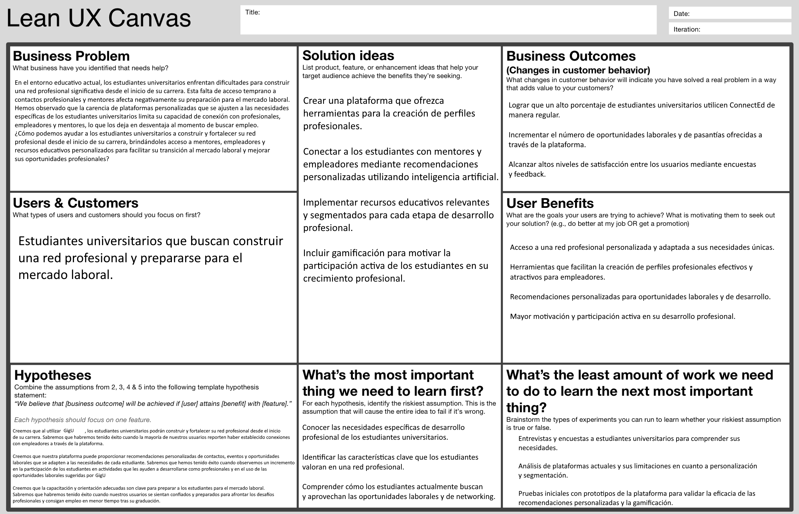

## 1.3. Segmentos objetivo
#### **Estudiantes Universitarios Freelancers**
Estudiantes de cualquier ciclo universitario que buscan ofrecer sus servicios de manera independiente para adquirir experiencia laboral, generar ingresos y construir una red de clientes. Estos estudiantes pueden pertenecer a diversas especialidades como diseño gráfico, programación, marketing digital, redacción, tutorías académicas, entre otros.

Características:
* Buscan oportunidades de trabajo flexible que les permitan combinar sus estudios con el trabajo freelance.
* Necesitan herramientas que los ayuden a promocionar sus habilidades y construir una cartera de clientes.
* Valoran la facilidad de pago y la seguridad en la gestión de contratos.

#### **Personas y Emprendimientos  que buscan contratar servicios freelance**
Individuos o empresas que requieren servicios especializados sin la necesidad de contratar empleados a tiempo completo. Esto incluye emprendedores, startups, pequeñas empresas y particulares que buscan soluciones rápidas y accesibles para sus proyectos.

Características:

* Buscan talento accesible y de calidad para tareas específicas.
* Prefieren plataformas que garanticen la seguridad en la contratación y el cumplimiento del trabajo.
* Valoran las recomendaciones y validaciones de otros clientes para elegir freelancers confiables.

# Capítulo II: Requirements Development and Software Solution Design
## 2.1. Competidores
Los competidores que hemos identificado para GigU son las plataformas freelancer, aunque no existen plataformas que estén 100% enfocadas en estudiantes como lo realiza GigU, si presenta productos con mucha similaridad lo que genera una competencia directa.

### 2.1.1. Análisis competitivo
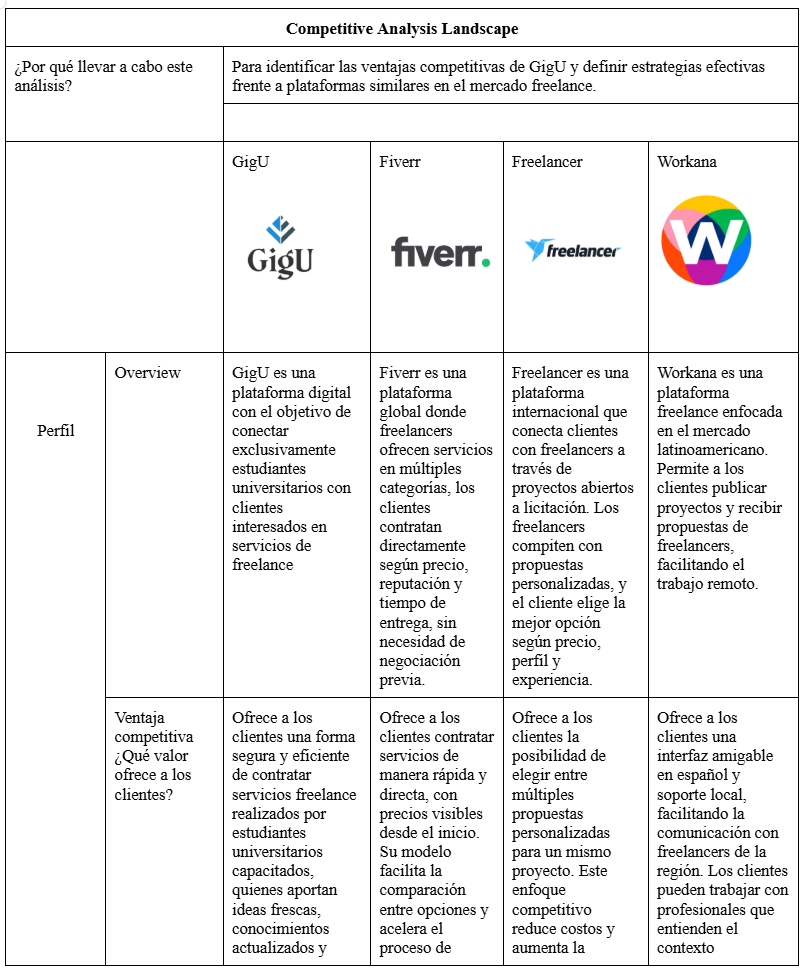
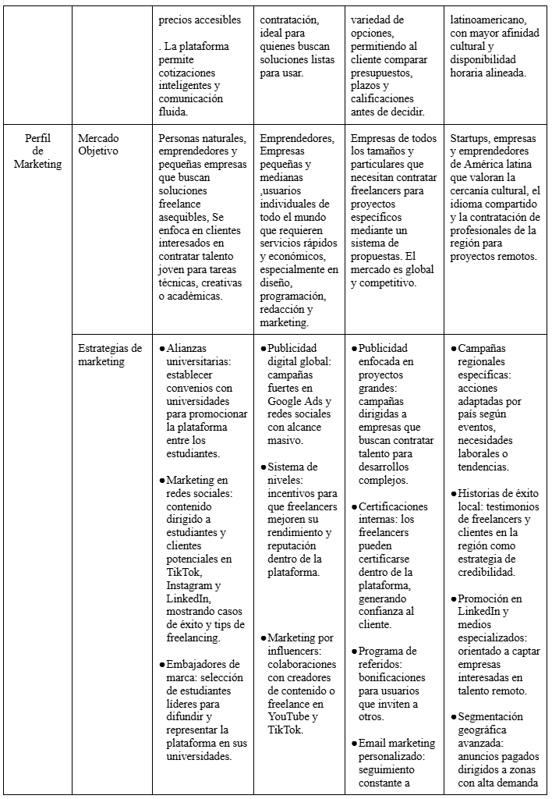
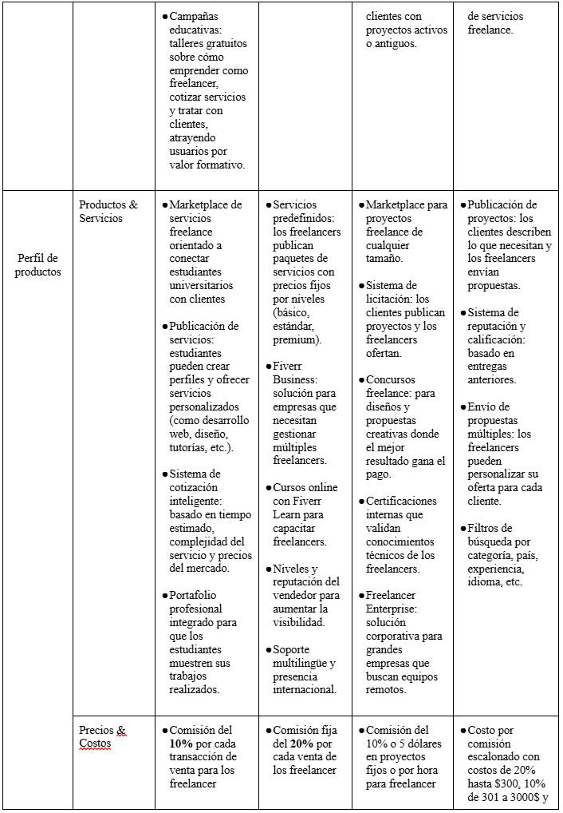
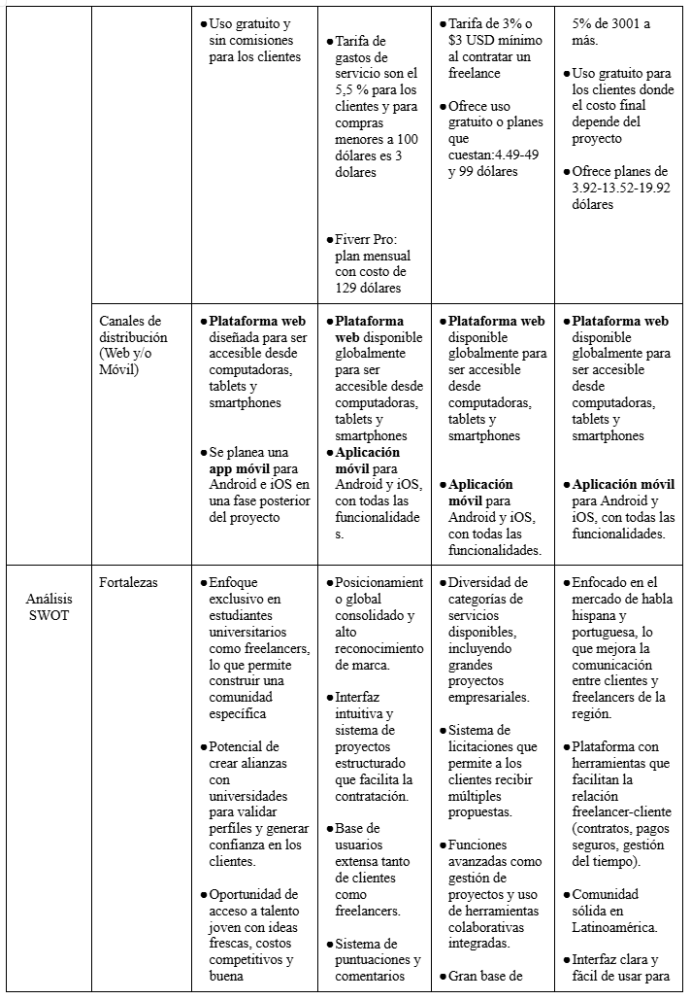
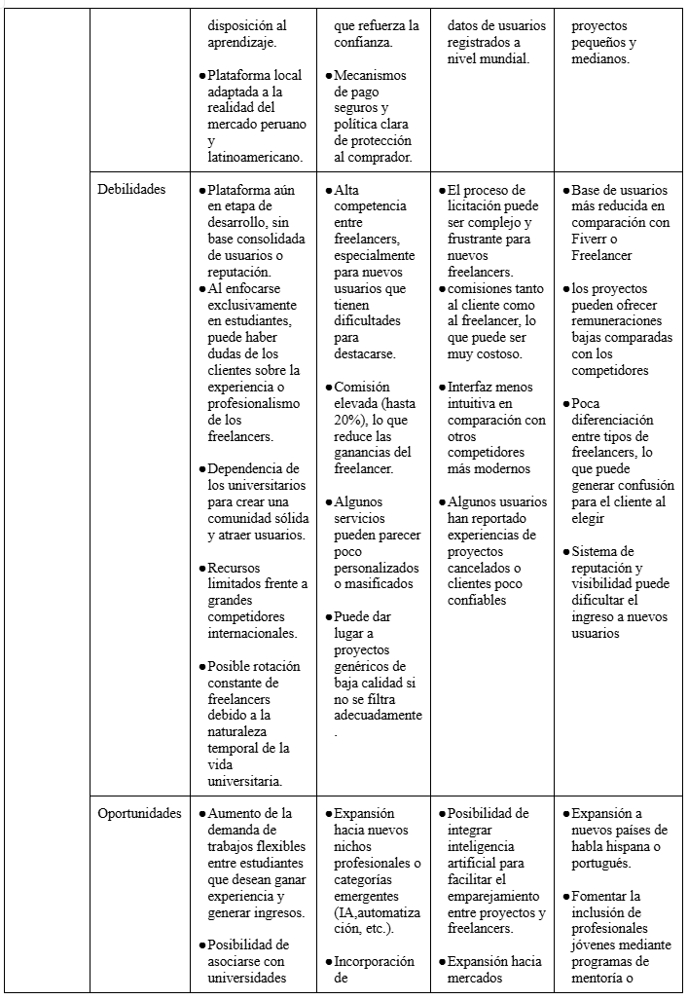
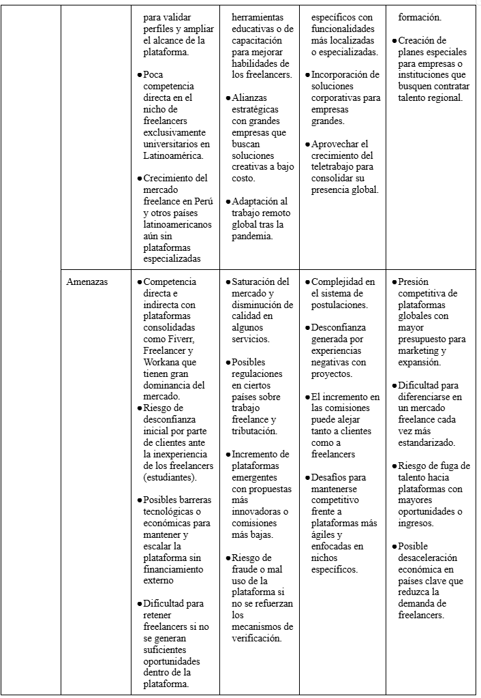

### 2.1.2. Estrategias y tácticas frente a competidores
GigU aplicará una estrategia de diferenciación enfocada en el talento universitario, destacando por su enfoque educativo, precios accesibles y alianzas con instituciones académicas. Frente a los grandes competidores del mercado freelance, GigU se posiciona como una alternativa confiable y de propósito social, conectando clientes con estudiantes verificados. Su valor está en ofrecer soluciones personalizadas, soporte en español y una experiencia centrada en el desarrollo profesional de los jóvenes. Aprovechará las debilidades de otras plataformas como su falta de personalización o enfoque regional, mientras mitiga amenazas como la falta de experiencia estudiantil con garantías y filtros de calidad

## 2.2. Entrevistas
### 2.2.1. Diseño de Entrevistas
**Segmento objetivo 1: Estudiantes Universitarios Freelancers**

¿Cual es tu nombre completo?

¿Cual es tu edad?

¿En donde vives?

¿Has ofrecido tus servicios como freelancer alguna vez? ¿En qué área?

¿Qué te motivó a ofrecer tus servicios de manera independiente?

¿Dónde sueles buscar oportunidades freelance (redes, plataformas, conocidos, etc.)?

¿Qué dificultades has encontrado al intentar conseguir clientes como estudiante?

¿Qué características debería tener una plataforma ideal para ayudarte a encontrar clientes?

¿Qué métodos usas actualmente para cobrar tus servicios? ¿Has tenido problemas con eso?

¿Cuánto tiempo a la semana podrías dedicarle a trabajos freelance?

¿Crees que sería útil tener una app que te sugiera proyectos freelance según tu perfil y habilidades?

¿Qué tan importante es para ti tener una forma segura y automática de cobrar por tu trabajo freelance?

**Segmento objetivo 2: Personas y Emprendimientos que buscan contratar servicios freelance** 

¿Cual es tu nombre completo?

¿Cual es tu edad?

¿En donde vives?

¿Alguna vez has contratado a un freelancer para un proyecto? ¿Cómo fue tu experiencia?

¿Qué tipo de tareas sueles tercerizar o te gustaría tercerizar?

¿Qué canales usas actualmente para encontrar freelancers (plataformas, conocidos, redes)?

¿Qué te haría confiar en un estudiante universitario como freelancer?

¿Qué tan importante es para ti poder ver recomendaciones o validaciones de otros clientes?

¿Te gustaría una plataforma que se encargue de gestionar los pagos y acuerdos con el freelancer, o prefieres hacerlo tú directamente con la persona? 

¿Qué haría que descartes a un freelancer incluso si su precio es atractivo?

¿Qué funcionalidades te gustaría ver en una plataforma para contratar freelancers?

¿Qué tan importante es para ti poder negociar el precio antes de contratar un servicio freelance? ¿Preferirías un precio fijo o la opción de llegar a un acuerdo con el freelancer?

¿Qué factores tomas en cuenta al elegir a un freelancer: precio, portafolio, tiempo de entrega, reputación, otro? ¿Cuál de ellos pesa más para ti al decidir?

### 2.2.2. Registro de Entrevistas
**Segmento objetivo \#1: Estudiantes Universitarios Freelancers** 

istado N°1: Bruno Sebastián Gamarra Torres

* Sexo: Masculino 
* Edad: 23 
* Ubicación en la que vive: Surco 

Acerca de la ista:
 
* Instante en el que inicia: 0:03 minutos
* Duración: 3:44

Resumen:

Bruno Sebastián Gamarra Torres, un joven de 23 años que vive en Surco, ofrece servicios de diseño gráfico y edición de video como freelancer desde hace algunos meses, motivado por la necesidad económica y el deseo de ganar experiencia. Consigue clientes principalmente a través de redes sociales como Instagram y TikTok, pero enfrenta dificultades como la falta de confianza de algunos clientes por ser estudiante. Utiliza Yape, Plin y transferencias para cobrar, aunque a veces sufre retrasos en los pagos. Para él, una plataforma ideal debería permitir dejar reseñas reales, tener chat integrado y un sistema de contratos. 

istado N°2:Werner Lang

Sexo:Masculino

Edad:20

Ubicación en la que vive:San Isidro

Acerca de la entrevista:

Instante en el que inicia: 3:45 minutos

Duración: 9:57 minutos

Resumen:
Para Werner, ofrecer servicios como freelancer en diseño gráfico y desarrollo web le ha permitido aplicar lo aprendido en la universidad mientras genera ingresos extra. Su motivación principal es ganar experiencia profesional antes de egresar, trabajando en proyectos reales para pequeños negocios.
Aunque ha logrado conseguir clientes a través de conocidos, grupos en redes sociales y plataformas como Workana, considera difícil que lo tomen en serio por ser estudiante. Además, la falta de un portafolio sólido y la poca experiencia en negociaciones le han representado retos al momento de cerrar acuerdos.
Actualmente cobra sus servicios mediante Yape o transferencias bancarias, aunque ha tenido problemas con demoras en los pagos o clientes que buscan renegociar. Puede dedicar entre 8 y 12 horas semanales al trabajo freelance, dependiendo de su carga académica.
Werner considera que una plataforma ideal debería facilitar mostrar habilidades, contar con herramientas para cotizar servicios, asegurar pagos y permitir una comunicación fluida con los clientes. También valora que una app como GigU pueda sugerirle proyectos alineados con su perfil, lo que le ayudaría a aprovechar mejor su tiempo y aumentar su productividad.

Entrevistado N°3: Mario André Cacho Seminario

* Sexo: Masculino  
* Edad: 21  
* Ubicación en la que vive: Surco

Acerca de la entrevista:

* Link: [https://youtu.be/hSg2bZ3Jgbc](https://youtu.be/hSg2bZ3Jgbc)   
* Instante en el que inicia: 0:10  
* Duración: 3:26

Resumen:

Para Mario, ofrecer servicios como freelancer en la creación de videos de marketing para pequeñas empresas le ha permitido impulsar su desarrollo personal y profesional. Le motiva expandir su perspectiva trabajando con distintos tipos de negocios. Sin embargo, encuentra complicado conseguir clientes, ya que considera que ser estudiante limita su contratación por parte de empresas que priorizan la experiencia. Por lo general, encuentra oportunidades a través de redes sociales o contactos cercanos, y recibe sus pagos mediante transferencias bancarias directas. Dedica entre 6 y 8 horas semanales al trabajo freelance, equilibrándolo con sus estudios. Cree que una plataforma ideal debería permitir visibilidad a personas de todos los niveles (estudiantes, aficionados, profesionales) y contar con un sistema que sugiera proyectos según habilidades y experiencia. También valora que exista un historial de trabajos realizados y, sobre todo, un sistema de cobros seguro que proteja su esfuerzo.

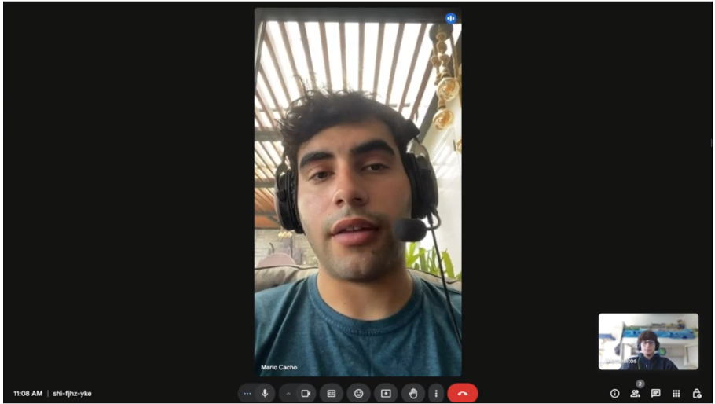

**Segmento objetivo \#2: Personas y Emprendimientos que buscan contratar servicios freelance**

Entrevistada N°1: Yulia Estephania Martinez Martinez

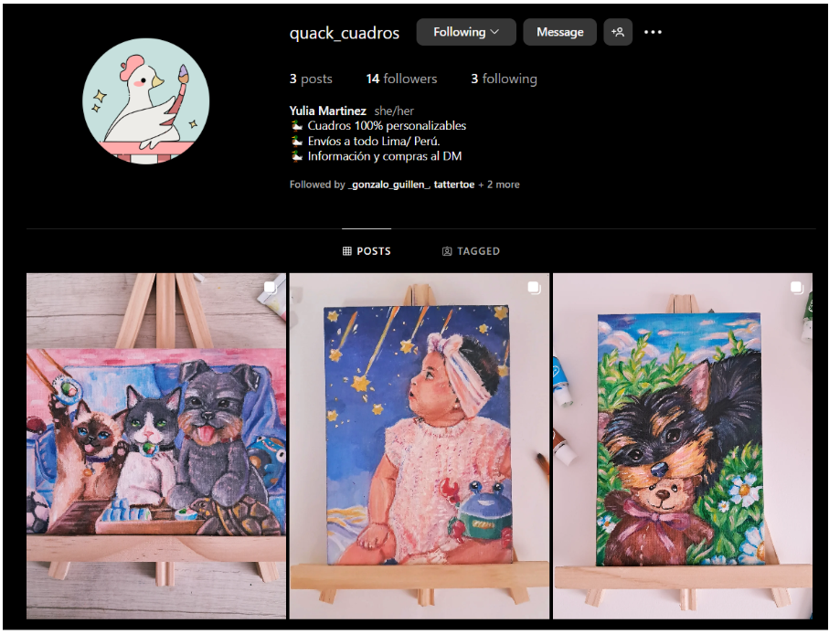

* Sexo: Femenino  
* Edad: 19  
* Ubicación en la que vive: Surco

Acerca de la entrevista:

* Link: [https://youtu.be/MFs44DHr8\_Q](https://youtu.be/MFs44DHr8_Q)  
* Instante en el que inicia: 0:01  
* Duración: 5:46

Resumen::  
Yulia tiene un emprendimiento llamado *Quack\_cuadros*, donde realiza cuadros personalizados al gusto del cliente.  
No ha contratado freelancers aún, pero está interesada en tercerizar tareas como *marketing digital*, especialmente *reels* para redes sociales, y *diseño web*.

Canales actuales para buscar freelancers:  
Usa principalmente Instagram y contactos personales, aunque reconoce que puede no ser totalmente confiable.

Criterios para confiar en un freelancer:

* Para trabajos creativos: portafolio visual.

* Para otros trabajos: currículum vitae.

* Valora recomendaciones y validaciones de otros clientes.

Prefiere que la plataforma gestione pagos y acuerdos, ya que no se le da bien la negociación ni el manejo monetario.

Motivos para descartar a un freelancer:

* Mala calidad de trabajo.

* Falta de responsabilidad.

* Poca puntualidad en entregas.

Características deseadas en una plataforma freelance:

* Perfiles detallados de los freelancers.

* Herramientas de negociación de precios.

* Opciones para reuniones dentro de la plataforma (sin necesidad de apps externas).

* Chats y acuerdos formales.

Prefiere negociar dentro de un rango, ya que no tiene claridad sobre cuánto valen ciertos trabajos y confía en el criterio del freelancer para establecer precios razonables.

Factores de decisión:  
El portafolio es el factor más determinante, seguido del precio. Un trabajo que la impacte positivamente la hace más flexible al pagar.

Entrevistado N°2: Fabrizio Morales

* Sexo: Masculino  
* Edad: 22  
* Ubicación en la que vive: Molina  

**Acerca de la entrevista:**

* Instante en el que inicia: 25:32 minutos
* Duración 31:17 minutos  

## Resumen
Fabrizio Morales es un joven emprendedor que dirige un negocio de venta de vapes. Actualmente contrata freelancers para apoyar en tareas de marketing y ventas, principalmente a través de redes sociales como Facebook y LinkedIn.

## Canales actuales para buscar freelancers
- Utiliza principalmente **Facebook** y **LinkedIn**.
- También recurre a recomendaciones de su círculo cercano.

## Criterios para confiar en un freelancer
- **Trabajos creativos**: Prioriza portafolio visual o ejemplos previos.
- **Otros tipos de tareas**: Revisa el currículum vitae (CV).
- Valora recomendaciones o testimonios de antiguos clientes.
- Prefiere que haya una plataforma que gestione pagos y acuerdos para evitar negociaciones directas.

## Motivos para descartar a un freelancer
- Calidad de trabajo deficiente.
- Falta de responsabilidad.
- Retrasos en las entregas.

## Características deseadas en una plataforma freelance
- Perfiles completos y detallados de freelancers.
- Herramientas de negociación de precios.
- Opciones para realizar reuniones dentro de la plataforma (sin usar apps externas).
- Chats formales con acuerdos visibles.

## Factores de decisión
- El **portafolio visual** es el factor más determinante.
- Si un trabajo lo impacta positivamente, es flexible para pagar un precio mayor al inicialmente previsto.

Link de entrevista https://upcedupe-my.sharepoint.com/:v:/g/personal/u202213241_upc_edu_pe/ERWRYYotMDNKrb9UZXiaV90BczcuHnygJ1UOZNQE1nmmxQ?nav=eyJyZWZlcnJhbEluZm8iOnsicmVmZXJyYWxBcHAiOiJPbmVEcml2ZUZvckJ1c2luZXNzIiwicmVmZXJyYWxBcHBQbGF0Zm9ybSI6IldlYiIsInJlZmVycmFsTW9kZSI6InZpZXciLCJyZWZlcnJhbFZpZXciOiJNeUZpbGVzTGlua0NvcHkifX0&e=v3wSIJ 

#### **2.2.3 Análisis de entrevistas** 

El Segmento 1: Estudiantes Universitarios Freelancers muestra jóvenes motivados principalmente por la necesidad de ganar experiencia y generar ingresos adicionales mientras estudian. Bruno, Werner y Mario coinciden en que conseguir clientes es complicado debido a la falta de confianza de los empleadores hacia estudiantes y a la necesidad de contar con un portafolio sólido. Este patrón revela un insight clave: más allá de la experiencia, los estudiantes perciben que el mayor obstáculo es la desconfianza por parte de los potenciales clientes, lo que resalta la importancia de contar con mecanismos de validación como reseñas, calificaciones o contratos formales dentro de una plataforma.

Los estudiantes utilizan redes sociales y plataformas como Workana para buscar oportunidades, pero estas herramientas no siempre les dan visibilidad suficiente. Aquí se detecta otro insight importante: los freelancers desean que se les conecte con oportunidades según sus habilidades, no solo según su historial o experiencia previa. Esto abre la oportunidad para una plataforma que sugiera proyectos alineados con las competencias específicas del usuario.

Respecto a los pagos, todos prefieren métodos sencillos como Yape y transferencias, aunque han enfrentado problemas con retrasos o falta de cumplimiento por parte de los clientes. Esto sugiere que los métodos de pago informales generan inseguridad, y refuerza la necesidad de que la plataforma incluya un sistema de cobros seguro y automático, que proteja tanto al freelancer como al contratante.

Además del aspecto económico, un insight adicional es que estos jóvenes no solo buscan ganar dinero, sino también construir una reputación profesional y prepararse para su futuro laboral. Por eso, valoran herramientas que les permitan mostrar su trabajo, recibir retroalimentación y desarrollarse profesionalmente.

En resumen, para este segmento, una plataforma ideal debería facilitar contratos, reseñas reales, chats integrados, sugerencias de proyectos alineados a sus habilidades y, sobre todo, asegurar los pagos. Valoran la visibilidad de su talento más allá de la experiencia previa, dándoles la oportunidad de competir en el mercado freelance.

En el Segmento 2: Personas y Emprendimientos que buscan contratar freelancers, encontramos a Yulia y Fabrizio, quienes buscan apoyo externo principalmente para tareas de marketing, diseño y ventas. Ambos muestran una fuerte preocupación por la calidad del trabajo y la responsabilidad del freelancer, siendo esto más determinante incluso que el precio. Aquí emerge un insight relevante: el portafolio visual tiene más peso en la decisión de contratación que el costo del servicio. Si el trabajo los impacta positivamente, están dispuestos a pagar más.

También es evidente que hay una desconfianza natural hacia freelancers sin referencias o validaciones previas. Esto implica que las recomendaciones, testimonios y perfiles detallados son elementos clave para generar confianza y deben estar integrados en cualquier plataforma freelance que busque ser confiable.

En cuanto a la gestión de acuerdos y pagos, varios entrevistados (especialmente Yulia y Fabrizio) manifestaron su preferencia por no tener que negociar ni coordinar pagos directamente con el freelancer, revelando así otro insight clave: existe una necesidad de simplificar el proceso de contratación mediante herramientas automáticas de negociación, acuerdos y pago dentro de la plataforma.

Finalmente, se identificó que el impacto emocional del trabajo recibido también influye en la percepción de valor, lo que lleva a algunos usuarios a pagar más de lo que tenían previsto si el resultado los sorprende positivamente. Esto indica que la creatividad y la presentación del trabajo tienen un rol emocional importante en la toma de decisiones.

En todos los casos, el portafolio visual y las buenas referencias son los factores decisivos para la contratación, y están dispuestos a pagar más si el resultado los impacta positivamente. La plataforma ideal, según este segmento, debería ofrecer perfiles completos, herramientas de negociación, reseñas confiables, chats formales y una forma segura y automatizada de gestionar los pagos y acuerdos.

## 2.3. Needfinding
En esta sección se presentarán los artefactos resultantes del proceso de análisis de la información de la información recolectada de los segmentos objetivos 

**Segmento objetivo \#1: Estudiantes Universitarios Freelancers** 

* Motivaciones Principales:  
- Deseo de desarrollarse profesionalmente y aplicar lo aprendido en la universidad.  
    
- Interés en ganar experiencia real antes de egresar.  
    
- Aspiración a explorar diferentes áreas del mercado y expandir su perspectiva profesional.

* Problemas Identificados:  
- Dificultad para conseguir clientes debido al prejuicio hacia su falta de experiencia por ser estudiantes.  
    
- Escasa visibilidad en plataformas tradicionales y falta de confianza del cliente hacia perfiles jóvenes.  
    
- Problemas con los pagos: demoras, renegociaciones inesperadas y falta de sistemas seguros.

* Requerimientos para una plataforma ideal:  
- Debe permitir mostrar habilidades y portafolio aunque la experiencia sea limitada.  
    
- Incorporar un sistema de sugerencias de proyectos basado en habilidades y perfil.  
    
- Incluir herramientas para cotización automática y segura de precios.  
    
- Contar con un historial de trabajos realizados.  
    
- Sistema de cobros seguro y automatizado.  
    
- Comunicación fluida dentro de la plataforma (sin necesidad de apps externas).

**Segmento objetivo \#2: Personas y Emprendimientos que buscan contratar servicios freelance**

* Motivaciones Principales:  
- Necesidad de externalizar tareas específicas como diseño, marketing o desarrollo web.  
    
- Falta de tiempo o conocimiento técnico para realizar tareas clave del negocio.  
    
- Interés en soluciones flexibles y rápidas que no requieran contratar personal fijo.

* Problemas Identificados:  
- Desconfianza al contratar freelancers por falta de referencias o experiencia.  
    
- Miedo a mala calidad, incumplimiento o poca responsabilidad.  
    
- Inseguridad al negociar precios o gestionar pagos, especialmente en perfiles menos digitales.

* Requerimientos para una plataforma ideal:  
- Perfiles detallados con muestras de trabajo previas.  
    
- Sistema de calificaciones y opiniones verificadas.  
    
- Gestión clara de pagos y acuerdos dentro de la plataforma.  
    
- Funciones como chat interno, reuniones virtuales y acuerdos escritos.  
    
- Posibilidad de negociar dentro de rangos sugeridos o aceptar el precio propuesto si el trabajo lo vale.  
    
- Visualización clara del costo total del proyecto, sin sorpresas.

### 2.3.1. User Personas
User Persona del Usuario estudiante Freelancer
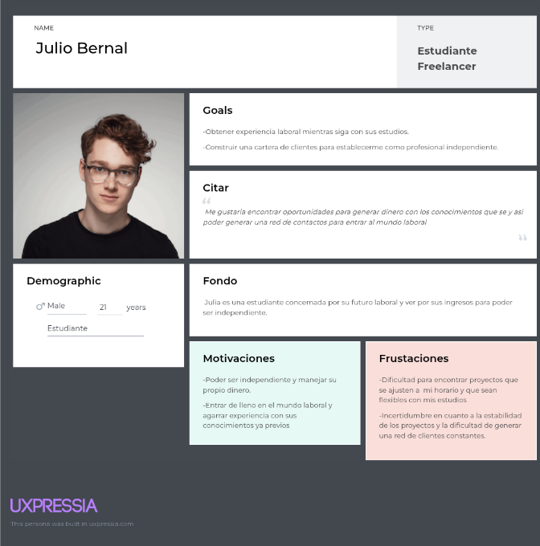
User Persona del Usuario Persona o emprendimiento
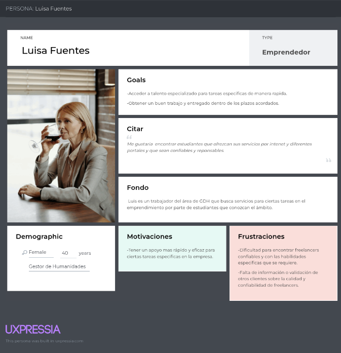

### 2.3.2. User Task Matrix
En esta se presenta el user task matrix, herramienta centrada en los segmentos objetivos que nos permitirá identificar las tareas y objetivos claves de los usuarios.

| USER TASK  | Julio Bernal |  | Luisa Fuentes |  |
| :---- | ----- | :---- | ----- | :---- |
|  | Frequency | Importance | Frequency | Importance |
| Publicar servicios y mostrar habilidades | Often | High | Sometimes | High |
| Cotizar precios fácilmente según tipo de trabajo | Sometimes | High | Often | High |
| Encontrar oportunidades mediante una app centralizada | Sometimes | High | Often  | Medium |
| Procesar pagos seguros a través de la plataforma | Always  | High | Always | High |
| Mostrar historial de trabajos realizados | Sometimes | Medium | Often | Medium |
| Negociar precios dentro de un rango flexible | Sometimes | Medium | Always | High |
| Establecer acuerdos y comunicación en la plataforma | Often | High | Always | High |

### 2.3.3. User Journey Mapping
User Journey estudiante freelance
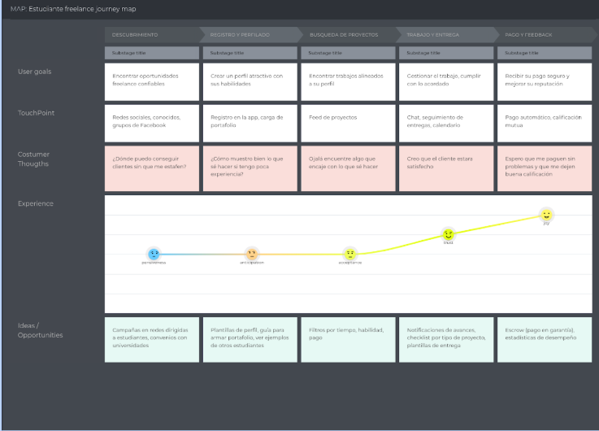

User Journey persona o empresa:
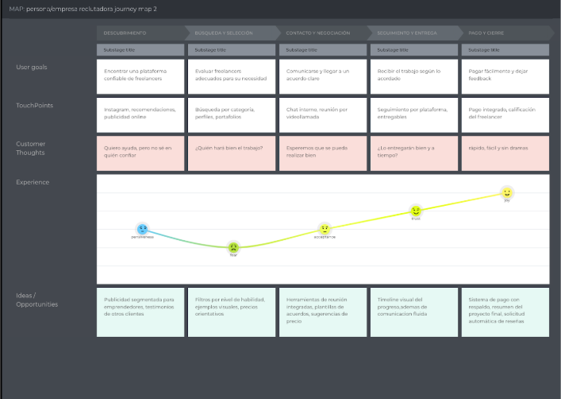

### 2.3.4. Empathy Mapping
En esta sección se presenta el Empathy Mapping, herramienta para crear un perfil detallado de los user personas y desarrollar una comprensión profunda de su perspectiva y experiencia. Para cada user persona, se incluyen cinco elementos clave: lo que el usuario ve, lo que el usuario escucha, lo que el usuario dice, lo que el usuario hace y lo que el usuario siente. Además, se incluyen los pains y gains identificados en base a las preguntas: ¿Qué le preocupa?

Empathy mapping de estudiante freelance:
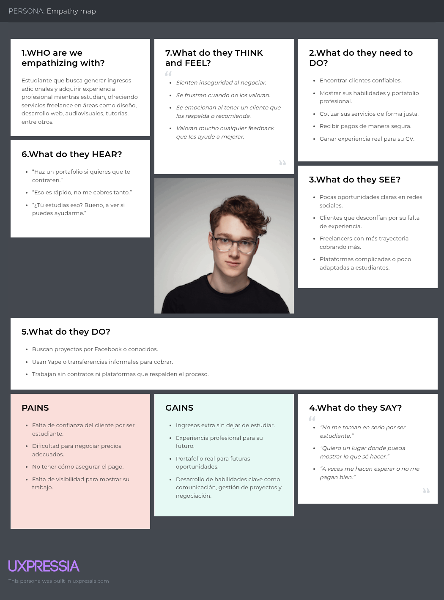

Empathy mapping de persona o empresa:
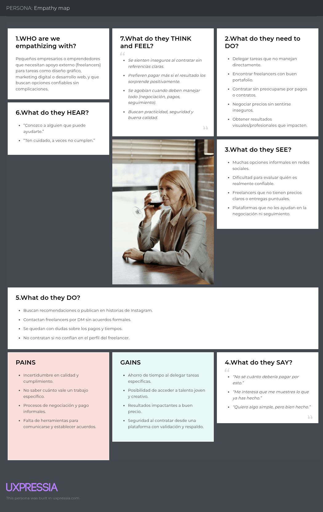

### 2.3.5. Ubiquitous Language

* **Freelancer:** Estudiante que ofrece servicios a través de la plataforma.
* **Cliente:** Persona o emprendimiento que contrata servicios dentro de la plataforma.
* **Servicio:** Habilidad o trabajo ofrecido por un freelancer.
* **Perfil:** Información pública de un freelancer, incluyendo habilidades y experiencia.
* **Proyecto:** Trabajo definido que necesita ser realizado por un freelancer.
* **Solicitud de Proyecto:** Pedido que realiza un cliente para contratar un servicio.
* **Oferta:** Propuesta de precio y condiciones que un freelancer presenta para un proyecto.
* **Acuerdo:** Confirmación del cliente y freelancer sobre las condiciones de un proyecto.
* **Resumen de Servicio:** Descripción formal de lo que se entregará en un proyecto.
* **Entrega:** Resultado final que el freelancer entrega al cliente.
* **Estado del Proyecto:** Etapa actual de un proyecto (pendiente, en progreso, entregado, finalizado).
* **Calificación:** Puntuación que refleja la calidad del servicio entregado.
* **Comentario:** Reseña escrita sobre la experiencia de trabajo en un proyecto.
* **Historial:** Registro de proyectos completados por freelancers y clientes.
* **Notificación:** Mensaje generado por el sistema para informar sobre acciones relevantes.
* **Ámbito:** Categoría profesional que agrupa servicios similares.
* **Método de Pago:** Sistema mediante el cual se realiza la transacción económica.
* **Reputación:** Indicador basado en calificaciones y comentarios de proyectos finalizados.
* **Negociación:** Interacción en la que cliente y freelancer ajustan precio y condiciones.
* **Plataforma:** Espacio digital donde se conectan clientes y freelancers.
* **Gig:** Trabajo o servicio freelance ofrecido por un freelancer, generalmente de naturaleza específica y autónoma.
* **Pull:** Proceso o instancia de negociación directa entre un freelancer y un cliente para acordar detalles, precio y condiciones del gig.

## 2.4. Requirements specification
### 2.4.1. User Stories
* EPICS
Las epics definidas para el proyecto GigU están orientadas a cubrir las necesidades principales tanto de los estudiantes de la UPC como de los usuarios que buscan contratar servicios freelance. Estas epics abordan funcionalidades esenciales para el funcionamiento de la plataforma, asegurando una experiencia fluida y efectiva desde la publicación de habilidades por parte de los estudiantes hasta la contratación por parte de clientes o emprendimientos. Desde la interfaz de la landing page, donde los usuarios conocen la propuesta de valor de GigU, hasta la gestión técnica del backend, frontend y servicios web, las epics actúan como una guía estructurada que facilita el desarrollo progresivo y coherente del sistema, alineándose con los objetivos académicos y de empleabilidad del proyecto.

| Epic / Story ID | Título | Descripción |
| :---: | ----- | ----- |
| EP01 | Navegación en Landing Page | Como visitante de GigU, deseo poder navegar de forma intuitiva por la landing page para conocer los beneficios de contratar o publicar servicios. |
| EP02 | Autenticación y Registro de Usuarios | Como usuario nuevo, deseo registrarme e iniciar sesión utilizando correo o redes sociales para acceder a mi cuenta de manera rápida y segura. |
| EP03 | Recuperación de Contraseña | Como usuario registrado, deseo recuperar mi contraseña fácilmente para poder acceder nuevamente en caso de olvidarla. |
| EP04 | Visualización de Servicios y Beneficios | Como visitante, deseo conocer los tipos de servicios disponibles y cómo funciona GigU para saber cómo puede ayudarme a contratar o ser contratado. |
| EP05 | Soporte y FAQ | Como visitante, deseo acceder a una sección de preguntas frecuentes y soporte para resolver mis dudas de forma autónoma y rápida. |
| EP06 | Gestión de Perfil Freelance | Como estudiante, deseo crear y editar mi perfil público con información, habilidades y precios para que posibles clientes conozcan mis servicios. |
| EP07 | Publicación y Edición de Servicios | Como estudiante, deseo publicar servicios personalizados con precios, plazos y descripciones claras para atraer clientes interesados. |
| EP08 | Búsqueda y Filtro de Freelancers | Como cliente, deseo buscar freelancers y filtrar por habilidades, precio o disponibilidad para encontrar al más adecuado para mi proyecto. |
| EP09 | Sistema de Contratación Directa | Como cliente, deseo contratar directamente a un freelancer desde su perfil para simplificar el proceso de contratación. |
| EP10 | Gestión de Proyectos y Solicitudes | Como freelancer, deseo gestionar las solicitudes recibidas y proyectos activos para poder organizar mejor mi trabajo y tiempos. |
| EP11 | Calificaciones y Opiniones | Como usuario, deseo dejar y ver calificaciones y comentarios sobre los freelancers para tomar decisiones más informadas. |
| EP12 | Sistema de Mensajería Interna | Como usuario, deseo comunicarme directamente dentro de la plataforma con el otro usuario para coordinar detalles antes o durante un proyecto. |
| EP13 | Cálculo Inteligente de Precio del Servicio | Como usuario, deseo que la plataforma sugiera un precio justo basado en la propuesta del freelancer, la oferta del cliente, el tipo y tamaño del servicio, y la experiencia del freelancer, para facilitar acuerdos equilibrados entre ambas partes. |

* User Stories

| Story ID                | User                                                                                                                                                                                                                                                                                                                  | Priority | Epic |
| :---------------------- | :-------------------------------------------------------------------------------------------------------------------------------------------------------------------------------------------------------------------------------------------------------------------------------------------------------------------- | :------- | :--- |
| US01                    | Visitante de GigU                                                                                                                                                                                                                                                                                                     | Alta     | EP01 |
| **Title**               | Navegar de forma intuitiva en la landing page                                                                                                                                                                                                                                                                         |          |      |
| **Description**         | Como visitante de GigU, deseo que la landing page tenga una barra de navegación clara y accesible para encontrar fácilmente las secciones importantes.                                                                                                                                                                |          |      |
|                         |                                                                                                                                                                                                                                                                                                                       |          |      |
| **Acceptance Criteria** | **Escenario 01:** Dado que un visitante está en la landing page, cuando consulta el menú de navegación, entonces el sistema muestra las secciones principales del sitio.  **Escenario 02:** Dado que un visitante navega por la página, cuando cambia de sección, entonces el sistema indica la sección activa. |          |      |

| Story ID                | User                                                                                                                                                                                                                                                                                                                                                                  | Priority | Epic |
| :---------------------- | :-------------------------------------------------------------------------------------------------------------------------------------------------------------------------------------------------------------------------------------------------------------------------------------------------------------------------------------------------------------------- | :------- | :--- |
| US02                    | Visitante                                                                                                                                                                                                                                                                                                                                                             | Alta     | EP01 |
| **Title**               | Acceder rápidamente a funcionalidades clave                                                                                                                                                                                                                                                                                                                           |          |      |
| **Description**         | Como visitante, deseo acceder desde la landing page a secciones clave como publicar proyecto o registrarme para actuar rápidamente.                                                                                                                                                                                                                                   |          |      |
|                         |                                                                                                                                                                                                                                                                                                                                                                       |          |      |
| **Acceptance Criteria** | **Escenario 01:** Dado que un visitante está en la landing page, cuando busca acciones principales, entonces el sistema muestra accesos visibles a funcionalidades clave.  **Escenario 02:** Dado que un visitante selecciona una acción principal, cuando solicita registrarse o publicar un proyecto, entonces el sistema lo dirige al flujo correspondiente. |          |      |

| Story ID                | User                                                                                                                                                                                                                                                                                                                                               | Priority | Epic |
| :---------------------- | :------------------------------------------------------------------------------------------------------------------------------------------------------------------------------------------------------------------------------------------------------------------------------------------------------------------------------------------------- | :------- | :--- |
| US03                    | Visitante de GigU                                                                                                                                                                                                                                                                                                                                  | Alta     | EP01 |
| **Title**               | Navegar por la landing page con menú claro                                                                                                                                                                                                                                                                                                         |          |      |
| **Description**         | Como visitante de GigU, deseo que la landing page tenga una barra de navegación clara para encontrar fácilmente las secciones importantes.                                                                                                                                                                                                         |          |      |
|                         |                                                                                                                                                                                                                                                                                                                                                    |          |      |
| **Acceptance Criteria** | **Escenario 01:** Dado que un visitante accede a la landing page, cuando consulta el menú, entonces el sistema presenta las secciones relevantes de forma estructurada.  **Escenario 02:** Dado que un visitante navega entre secciones, cuando usa el menú, entonces el sistema mantiene coherencia en el orden y nombres de las secciones. |          |      |

| Story ID                | User                                                                                                                                                                                                                                                                                                                              | Priority | Epic |
| :---------------------- | :-------------------------------------------------------------------------------------------------------------------------------------------------------------------------------------------------------------------------------------------------------------------------------------------------------------------------------- | :------- | :--- |
| US04                    | Usuario registrado                                                                                                                                                                                                                                                                                                                | Alta     | EP02 |
| **Title**               | Iniciar sesión como freelancer o cliente                                                                                                                                                                                                                                                                                          |          |      |
| **Description**         | Como usuario registrado, deseo poder iniciar sesión para acceder a mi cuenta y funcionalidades específicas según mi rol.                                                                                                                                                                                                          |          |      |
|                         |                                                                                                                                                                                                                                                                                                                                   |          |      |
| **Acceptance Criteria** | **Escenario 01:** Dado que un usuario proporciona credenciales válidas, cuando el sistema procesa el inicio de sesión, entonces habilita las funcionalidades según su rol.  **Escenario 02:** Dado que un usuario proporciona credenciales incorrectas, cuando intenta autenticarse, entonces el sistema rechaza el acceso. |          |      |

| Story ID                | User                                                                                                                                                                                                                                                                                                                                     | Priority | Epic |
| :---------------------- | :--------------------------------------------------------------------------------------------------------------------------------------------------------------------------------------------------------------------------------------------------------------------------------------------------------------------------------------- | :------- | :--- |
| US05                    | Visitante                                                                                                                                                                                                                                                                                                                                | Alta     | EP02 |
| **Title**               | Registrarse con cuenta de Google                                                                                                                                                                                                                                                                                                         |          |      |
| **Description**         | Como visitante, deseo registrarme con Google para agilizar el proceso de creación de cuenta.                                                                                                                                                                                                                                             |          |      |
|                         |                                                                                                                                                                                                                                                                                                                                          |          |      |
| **Acceptance Criteria** | **Escenario 01:** Dado que un visitante elige registrarse con Google, cuando autoriza el uso de sus datos básicos, entonces el sistema crea su cuenta.  **Escenario 02:** Dado que una cuenta de Google ya está registrada, cuando intenta registrarse nuevamente, entonces el sistema notifica que ya existe una cuenta asociada. |          |      |

| Story ID                | User                                                                                                                                                                                                                                                                                                                              | Priority | Epic |
| :---------------------- | :-------------------------------------------------------------------------------------------------------------------------------------------------------------------------------------------------------------------------------------------------------------------------------------------------------------------------------- | :------- | :--- |
| US06                    | Usuario                                                                                                                                                                                                                                                                                                                           | Alta     | EP03 |
| **Title**               | Solicitar recuperación de contraseña                                                                                                                                                                                                                                                                                              |          |      |
| **Description**         | Como usuario, deseo solicitar la recuperación de mi contraseña para volver a acceder si la olvido.                                                                                                                                                                                                                                |          |      |
|                         |                                                                                                                                                                                                                                                                                                                                   |          |      |
| **Acceptance Criteria** | **Escenario 01:** Dado que un usuario olvidó su contraseña, cuando proporciona un correo registrado, entonces el sistema genera un mecanismo seguro de recuperación.  **Escenario 02:** Dado que ingresa un correo no registrado, cuando solicita recuperar, entonces el sistema informa que no existe una cuenta asociada. |          |      |

| Story ID                | User                                                                                                                                                                                                                                                                    | Priority | Epic |
| :---------------------- | :---------------------------------------------------------------------------------------------------------------------------------------------------------------------------------------------------------------------------------------------------------------------- | :------- | :--- |
| US07                    | Usuario                                                                                                                                                                                                                                                                 | Alta     | EP03 |
| **Title**               | Restablecer contraseña mediante enlace seguro                                                                                                                                                                                                                           |          |      |
| **Description**         | Como usuario, deseo restablecer mi contraseña usando un enlace enviado a mi correo.                                                                                                                                                                                     |          |      |
|                         |                                                                                                                                                                                                                                                                         |          |      |
| **Acceptance Criteria** | **Escenario 01:** Dado que un usuario recibe un enlace válido, cuando accede a él, entonces puede crear una nueva contraseña.  **Escenario 02:** Dado que ingresa una contraseña inválida, cuando intenta registrarla, entonces el sistema notifica la invalidez. |          |      |

| Story ID                | User                                                                                                                                                                                                                                                                                                                      | Priority | Epic |
| :---------------------- | :------------------------------------------------------------------------------------------------------------------------------------------------------------------------------------------------------------------------------------------------------------------------------------------------------------------------ | :------- | :--- |
| US08                    | Visitante                                                                                                                                                                                                                                                                                                                 | Media    | EP04 |
| **Title**               | Conocer los beneficios de GigU                                                                                                                                                                                                                                                                                            |          |      |
| **Description**         | Como visitante, deseo conocer los beneficios de usar GigU para entender por qué debería utilizar la plataforma.                                                                                                                                                                                                           |          |      |
|                         |                                                                                                                                                                                                                                                                                                                           |          |      |
| **Acceptance Criteria** | **Escenario 01:** Dado que un visitante accede a la sección de información, cuando consulta los beneficios, entonces el sistema presenta los principales beneficios de la plataforma.  **Escenario 02:** Dado que selecciona un beneficio, cuando solicita ampliación, entonces recibe más información explicativa. |          |      |

| Story ID                | User                                                                                                                                                                                                                                                                                                                           | Priority | Epic |
| :---------------------- | :----------------------------------------------------------------------------------------------------------------------------------------------------------------------------------------------------------------------------------------------------------------------------------------------------------------------------- | :------- | :--- |
| US09                    | Visitante                                                                                                                                                                                                                                                                                                                      | Media    | EP04 |
| **Title**               | Conocer diferencias entre roles                                                                                                                                                                                                                                                                                                |          |      |
| **Description**         | Como visitante, deseo saber las diferencias entre registrarme como freelancer o cliente para elegir el rol adecuado.                                                                                                                                                                                                           |          |      |
|                         |                                                                                                                                                                                                                                                                                                                                |          |      |
| **Acceptance Criteria** | **Escenario 01:** Dado que un visitante revisa la sección de roles, cuando consulta la información, entonces el sistema muestra comparaciones claras.  **Escenario 02:** Dado que el visitante selecciona un rol, cuando consulta más detalles, entonces el sistema muestra información específica del flujo de ese rol. |          |      |

| Story ID                | User                                                                                                                                                                                                                                                                                                                 | Priority | Epic |
| :---------------------- | :------------------------------------------------------------------------------------------------------------------------------------------------------------------------------------------------------------------------------------------------------------------------------------------------------------------- | :------- | :--- |
| US10                    | Visitante                                                                                                                                                                                                                                                                                                            | Media    | EP04 |
| **Title**               | Ver experiencias de otros usuarios                                                                                                                                                                                                                                                                                   |          |      |
| **Description**         | Como visitante, deseo ver testimonios de usuarios anteriores para confiar en la plataforma.                                                                                                                                                                                                                          |          |      |
|                         |                                                                                                                                                                                                                                                                                                                      |          |      |
| **Acceptance Criteria** | **Escenario 01:** Dado que un visitante accede a la sección de experiencias, cuando visualiza testimonios, entonces el sistema muestra nombre, rol y comentario.  **Escenario 02:** Dado que solicita ver más testimonios, cuando el sistema detecta la acción, entonces muestra más experiencias registradas. |          |      |

| Story ID                | User                                                                                                                                                                                                                                                                                                | Priority | Epic |
| :---------------------- | :-------------------------------------------------------------------------------------------------------------------------------------------------------------------------------------------------------------------------------------------------------------------------------------------------- | :------- | :--- |
| US11                    | Visitante                                                                                                                                                                                                                                                                                           | Media    | EP04 |
| **Title**               | Conocer tipos de servicios disponibles                                                                                                                                                                                                                                                              |          |      |
| **Description**         | Como visitante, deseo conocer los tipos de servicios que puedo contratar o brindar en GigU.                                                                                                                                                                                                         |          |      |
|                         |                                                                                                                                                                                                                                                                                                     |          |      |
| **Acceptance Criteria** | **Escenario 01:** Dado que un visitante consulta la sección de tipos de servicios, cuando selecciona uno, entonces el sistema muestra su descripción.  **Escenario 02:** Dado que desea más información, cuando selecciona detalles, entonces el sistema presenta casos prácticos y ejemplos. |          |      |

| Story ID                | User                                                                                                                                                                                                                                                                                                                  | Priority | Epic |
| :---------------------- | :-------------------------------------------------------------------------------------------------------------------------------------------------------------------------------------------------------------------------------------------------------------------------------------------------------------------- | :------- | :--- |
| US12                    | Visitante                                                                                                                                                                                                                                                                                                             | Media    | EP05 |
| **Title**               | Acceder a preguntas frecuentes                                                                                                                                                                                                                                                                                        |          |      |
| **Description**         | Como visitante, deseo ver una sección de preguntas frecuentes para resolver dudas comunes sin ayuda externa.                                                                                                                                                                                                          |          |      |
|                         |                                                                                                                                                                                                                                                                                                                       |          |      |
| **Acceptance Criteria** | **Escenario 01:** Dado que un visitante accede a FAQ, cuando consulta las preguntas, entonces el sistema muestra un listado con respuestas.  **Escenario 02:** Dado que selecciona una pregunta, cuando visualiza o cierra la respuesta, entonces el sistema muestra u oculta la información según corresponda. |          |      |

| Story ID                | User                                                                                                                                                                                                                                                                                                              | Priority | Epic |
| :---------------------- | :---------------------------------------------------------------------------------------------------------------------------------------------------------------------------------------------------------------------------------------------------------------------------------------------------------------- | :------- | :--- |
| US13                    | Usuario                                                                                                                                                                                                                                                                                                           | Media    | EP05 |
| **Title**               | Buscar información dentro de preguntas frecuentes                                                                                                                                                                                                                                                                 |          |      |
| **Description**         | Como usuario, deseo buscar palabras clave en la sección de FAQ para encontrar respuestas más rápido.                                                                                                                                                                                                              |          |      |
|                         |                                                                                                                                                                                                                                                                                                                   |          |      |
| **Acceptance Criteria** | **Escenario 01:** Dado que un usuario busca información, cuando ingresa una palabra clave, entonces el sistema muestra las preguntas relacionadas.  **Escenario 02:** Dado que la búsqueda no tiene coincidencias, cuando el sistema procesa el término, entonces informa que no se encontraron resultados. |          |      |

| Story ID                | User                                                                                                                                                                                                                                                                                                                      | Priority | Epic |
| :---------------------- | :------------------------------------------------------------------------------------------------------------------------------------------------------------------------------------------------------------------------------------------------------------------------------------------------------------------------ | :------- | :--- |
| US14                    | Usuario                                                                                                                                                                                                                                                                                                                   | Media    | EP05 |
| **Title**               | Enviar un ticket de soporte                                                                                                                                                                                                                                                                                               |          |      |
| **Description**         | Como usuario, deseo enviar un mensaje de soporte si no encuentro mi duda en la FAQ para recibir asistencia personalizada.                                                                                                                                                                                                 |          |      |
|                         |                                                                                                                                                                                                                                                                                                                           |          |      |
| **Acceptance Criteria** | **Escenario 01:** Dado que un usuario no encuentra solución, cuando proporciona la información necesaria, entonces el sistema registra el ticket.  **Escenario 02:** Dado que los datos están incompletos, cuando intenta registrar el ticket, entonces el sistema rechaza el envío e informa los campos faltantes. |          |      |

| Story ID                | User                                                                                                                                                                                                                                                                                                                                                                | Priority | Epic |
| :---------------------- | :------------------------------------------------------------------------------------------------------------------------------------------------------------------------------------------------------------------------------------------------------------------------------------------------------------------------------------------------------------------ | :------- | :--- |
| US15                    | Estudiante                                                                                                                                                                                                                                                                                                                                                          | Alta     | EP06 |
| **Title**               | Crear perfil freelance                                                                                                                                                                                                                                                                                                                                              |          |      |
| **Description**         | Como estudiante, deseo crear mi perfil freelance con mi nombre, carrera y universidad para que los clientes conozcan mi identidad profesional.                                                                                                                                                                                                                      |          |      |
|                         |                                                                                                                                                                                                                                                                                                                                                                     |          |      |
| **Acceptance Criteria** | **Escenario 01:** Dado que un estudiante accede a la creación de perfil, cuando proporciona información válida como nombre, carrera y universidad, entonces el sistema registra el perfil y lo deja disponible.  **Escenario 02:** Dado que el estudiante completa el registro, cuando el sistema valida los datos, entonces confirma la creación del perfil. |          |      |

| Story ID                | User                                                                                                                                                                                                                                                                                                                        | Priority | Epic |
| :---------------------- | :-------------------------------------------------------------------------------------------------------------------------------------------------------------------------------------------------------------------------------------------------------------------------------------------------------------------------- | :------- | :--- |
| US16                    | Freelancer                                                                                                                                                                                                                                                                                                                  | Alta     | EP06 |
| **Title**               | Añadir habilidades y descripción personal                                                                                                                                                                                                                                                                                   |          |      |
| **Description**         | Como freelancer, deseo añadir habilidades y una descripción personal para destacar mis fortalezas.                                                                                                                                                                                                                          |          |      |
|                         |                                                                                                                                                                                                                                                                                                                             |          |      |
| **Acceptance Criteria** | **Escenario 01:** Dado que un freelancer edita su perfil, cuando añade habilidades y descripción válida, entonces el sistema almacena la información.  **Escenario 02:** Dado que el freelancer actualiza sus habilidades, cuando consulta su perfil público, entonces el sistema muestra la información actualizada. |          |      |

| Story ID                | User                                                                                                                                                                                                                                                                                                                                        | Priority | Epic |
| :---------------------- | :------------------------------------------------------------------------------------------------------------------------------------------------------------------------------------------------------------------------------------------------------------------------------------------------------------------------------------------ | :------- | :--- |
| US17                    | Freelancer                                                                                                                                                                                                                                                                                                                                  | Alta     | EP06 |
| **Title**               | Establecer tarifas por servicio                                                                                                                                                                                                                                                                                                             |          |      |
| **Description**         | Como freelancer, deseo establecer mis tarifas por tipo de servicio para que los clientes conozcan mis precios.                                                                                                                                                                                                                              |          |      |
|                         |                                                                                                                                                                                                                                                                                                                                             |          |      |
| **Acceptance Criteria** | **Escenario 01:** Dado que un freelancer asigna una tarifa válida, cuando el sistema valida el valor ingresado, entonces registra el precio y lo muestra públicamente.  **Escenario 02:** Dado que el freelancer ingresa un valor fuera de rango, cuando intenta guardarlo, entonces el sistema rechaza la tarifa e informa el error. |          |      |

| Story ID                | User                                                                                                                                                                                                                                                                                                                          | Priority | Epic |
| :---------------------- | :---------------------------------------------------------------------------------------------------------------------------------------------------------------------------------------------------------------------------------------------------------------------------------------------------------------------------- | :------- | :--- |
| US18                    | Freelancer                                                                                                                                                                                                                                                                                                                    | Media    | EP06 |
| **Title**               | Subir portafolio de proyectos                                                                                                                                                                                                                                                                                                 |          |      |
| **Description**         | Como freelancer, deseo subir muestras de trabajos anteriores para demostrar mi experiencia a los clientes.                                                                                                                                                                                                                    |          |      |
|                         |                                                                                                                                                                                                                                                                                                                               |          |      |
| **Acceptance Criteria** | **Escenario 01:** Dado que un freelancer proporciona archivos o enlaces válidos, cuando el sistema valida el contenido, entonces lo almacena y muestra en su perfil.  **Escenario 02:** Dado que intenta subir un archivo no permitido, cuando el sistema valida el tipo, entonces rechaza la carga e informa el error. |          |      |

| Story ID                | User                                                                                                                                                                                                                                                                                                    | Priority | Epic |
| :---------------------- | :------------------------------------------------------------------------------------------------------------------------------------------------------------------------------------------------------------------------------------------------------------------------------------------------------ | :------- | :--- |
| US19                    | Freelancer                                                                                                                                                                                                                                                                                              | Alta     | EP06 |
| **Title**               | Actualizar perfil freelance                                                                                                                                                                                                                                                                             |          |      |
| **Description**         | Como freelancer, deseo poder actualizar mi perfil cuando quiera para mantener mi información al día.                                                                                                                                                                                                    |          |      |
|                         |                                                                                                                                                                                                                                                                                                         |          |      |
| **Acceptance Criteria** | **Escenario 01:** Dado que un freelancer modifica datos válidos, cuando el sistema los valida, entonces actualiza la información públicamente.  **Escenario 02:** Dado que el perfil es actualizado, cuando consulta su vista pública, entonces los cambios se muestran sin procesos adicionales. |          |      |

| Story ID                | User                                                                                                                                                                                                                                                                                | Priority | Epic |
| :---------------------- | :---------------------------------------------------------------------------------------------------------------------------------------------------------------------------------------------------------------------------------------------------------------------------------- | :------- | :--- |
| US20                    | Freelancer                                                                                                                                                                                                                                                                          | Alta     | EP07 |
| **Title**               | Publicar un servicio personalizado                                                                                                                                                                                                                                                  |          |      |
| **Description**         | Como freelancer, deseo publicar un servicio con título, descripción y precio para ofrecerlo a potenciales clientes.                                                                                                                                                                 |          |      |
|                         |                                                                                                                                                                                                                                                                                     |          |      |
| **Acceptance Criteria** | **Escenario 01:** Dado que un freelancer completa los datos del servicio, cuando el sistema los valida, entonces registra la publicación.  **Escenario 02:** Dado que falta un campo obligatorio, cuando intenta guardar, entonces el sistema indica la información faltante. |          |      |

| Story ID                | User                                                                                                                                                                                                                                                                       | Priority | Epic |
| :---------------------- | :------------------------------------------------------------------------------------------------------------------------------------------------------------------------------------------------------------------------------------------------------------------------- | :------- | :--- |
| US21                    | Freelancer                                                                                                                                                                                                                                                                 | Media    | EP07 |
| **Title**               | Establecer plazos de entrega                                                                                                                                                                                                                                               |          |      |
| **Description**         | Como freelancer, deseo definir el tiempo de entrega estimado para que el cliente tenga expectativas claras.                                                                                                                                                                |          |      |
|                         |                                                                                                                                                                                                                                                                            |          |      |
| **Acceptance Criteria** | **Escenario 01:** Dado que un freelancer define un plazo, cuando el sistema valida el valor, entonces lo registra y muestra públicamente.  **Escenario 02:** Dado que el plazo está registrado, cuando el servicio se consulta, entonces incluye los días estimados. |          |      |

| Story ID                | User                                                                                                                                                                                                                                                                                 | Priority | Epic |
| :---------------------- | :----------------------------------------------------------------------------------------------------------------------------------------------------------------------------------------------------------------------------------------------------------------------------------- | :------- | :--- |
| US22                    | Freelancer                                                                                                                                                                                                                                                                           | Media    | EP07 |
| **Title**               | Editar servicios publicados                                                                                                                                                                                                                                                          |          |      |
| **Description**         | Como freelancer, deseo editar mis servicios publicados para corregir errores o actualizar precios.                                                                                                                                                                                   |          |      |
|                         |                                                                                                                                                                                                                                                                                      |          |      |
| **Acceptance Criteria** | **Escenario 01:** Dado que un freelancer modifica la información de un servicio, cuando el sistema la valida, entonces actualiza la publicación.  **Escenario 02:** Dado que el servicio es editado, cuando un usuario lo consulta, entonces visualiza la versión actualizada. |          |      |

| Story ID                | User                                                                                                                                                                                                                                                                                                                      | Priority | Epic |
| :---------------------- | :------------------------------------------------------------------------------------------------------------------------------------------------------------------------------------------------------------------------------------------------------------------------------------------------------------------------ | :------- | :--- |
| US23                    | Freelancer                                                                                                                                                                                                                                                                                                                | Media    | EP07 |
| **Title**               | Pausar o eliminar servicios publicados                                                                                                                                                                                                                                                                                    |          |      |
| **Description**         | Como freelancer, deseo pausar o eliminar mis servicios cuando ya no desee ofrecerlos.                                                                                                                                                                                                                                     |          |      |
|                         |                                                                                                                                                                                                                                                                                                                           |          |      |
| **Acceptance Criteria** | **Escenario 01:** Dado que un freelancer decide pausar o eliminar un servicio, cuando el sistema procesa la acción, entonces lo retira de la vista pública.  **Escenario 02:** Dado que el servicio está pausado o eliminado, cuando el freelancer revisa su listado, entonces el sistema muestra su estado actual. |          |      |

| Story ID                | User                                                                                                                                                                                                                                                                                                       | Priority | Epic |
| :---------------------- | :--------------------------------------------------------------------------------------------------------------------------------------------------------------------------------------------------------------------------------------------------------------------------------------------------------- | :------- | :--- |
| US24                    | Freelancer                                                                                                                                                                                                                                                                                                 | Media    | EP07 |
| **Title**               | Añadir imágenes o archivos al servicio                                                                                                                                                                                                                                                                     |          |      |
| **Description**         | Como freelancer, deseo subir imágenes o archivos a mis servicios para facilitar la comprensión del cliente.                                                                                                                                                                                                |          |      |
|                         |                                                                                                                                                                                                                                                                                                            |          |      |
| **Acceptance Criteria** | **Escenario 01:** Dado que un freelancer sube archivos permitidos, cuando el sistema valida el contenido, entonces los muestra asociados al servicio.  **Escenario 02:** Dado que sube múltiples imágenes, cuando el servicio se visualiza, entonces el sistema permite recorrerlas secuencialmente. |          |      |

| Story ID                | User                                                                                                                                                                                                                                                                                                 | Priority | Epic |
| :---------------------- | :--------------------------------------------------------------------------------------------------------------------------------------------------------------------------------------------------------------------------------------------------------------------------------------------------- | :------- | :--- |
| US25                    | Cliente                                                                                                                                                                                                                                                                                              | Alta     | EP08 |
| **Title**               | Buscar freelancers por palabra clave                                                                                                                                                                                                                                                                 |          |      |
| **Description**         | Como cliente, deseo buscar freelancers usando palabras clave para encontrar rápidamente lo que necesito.                                                                                                                                                                                             |          |      |
|                         |                                                                                                                                                                                                                                                                                                      |          |      |
| **Acceptance Criteria** | **Escenario 01:** Dado que un cliente ingresa una palabra clave, cuando el sistema procesa la búsqueda, entonces muestra freelancers relacionados.  **Escenario 02:** Dado que ingresa múltiples palabras, cuando el sistema filtra, entonces muestra coincidencias con al menos una de ellas. |          |      |

| Story ID                | User                                                                                                                                                                                                                                                                                                                 | Priority | Epic |
| :---------------------- | :------------------------------------------------------------------------------------------------------------------------------------------------------------------------------------------------------------------------------------------------------------------------------------------------------------------- | :------- | :--- |
| US26                    | Cliente                                                                                                                                                                                                                                                                                                              | Alta     | EP08 |
| **Title**               | Filtrar freelancers por habilidad                                                                                                                                                                                                                                                                                    |          |      |
| **Description**         | Como cliente, deseo filtrar freelancers según sus habilidades para encontrar al más apto para mi proyecto.                                                                                                                                                                                                           |          |      |
|                         |                                                                                                                                                                                                                                                                                                                      |          |      |
| **Acceptance Criteria** | **Escenario 01:** Dado que el cliente selecciona una habilidad, cuando el sistema filtra, entonces muestra solo freelancers que la tengan registrada.  **Escenario 02:** Dado que selecciona varias habilidades, cuando el sistema filtra, entonces muestra freelancers que cumplan con al menos una de ellas. |          |      |

| Story ID                | User                                                                                                                                                                                                                                                                              | Priority | Epic |
| :---------------------- | :-------------------------------------------------------------------------------------------------------------------------------------------------------------------------------------------------------------------------------------------------------------------------------- | :------- | :--- |
| US27                    | Cliente                                                                                                                                                                                                                                                                           | Media    | EP08 |
| **Title**               | Filtrar por rango de precios                                                                                                                                                                                                                                                      |          |      |
| **Description**         | Como cliente, deseo establecer un rango de precios para ver freelancers dentro de mi presupuesto.                                                                                                                                                                                 |          |      |
|                         |                                                                                                                                                                                                                                                                                   |          |      |
| **Acceptance Criteria** | **Escenario 01:** Dado que el cliente define un rango, cuando el sistema filtra, entonces muestra freelancers dentro del presupuesto.  **Escenario 02:** Dado que no existen coincidencias, cuando el sistema completa el filtrado, entonces informa que no hay resultados. |          |      |

| Story ID                | User                                                                                                                                                                                                                                                                                                                    | Priority | Epic |
| :---------------------- | :---------------------------------------------------------------------------------------------------------------------------------------------------------------------------------------------------------------------------------------------------------------------------------------------------------------------- | :------- | :--- |
| US28                    | Cliente                                                                                                                                                                                                                                                                                                                 | Media    | EP08 |
| **Title**               | Filtrar freelancers por experiencia                                                                                                                                                                                                                                                                                     |          |      |
| **Description**         | Como cliente, deseo filtrar freelancers según su nivel de experiencia para elegir al adecuado.                                                                                                                                                                                                                          |          |      |
|                         |                                                                                                                                                                                                                                                                                                                         |          |      |
| **Acceptance Criteria** | **Escenario 01:** Dado que un cliente selecciona un nivel, cuando el sistema procesa el filtro, entonces muestra freelancers con dicho nivel.  **Escenario 02:** Dado que el freelancer tiene nivel registrado, cuando aparece en los resultados, entonces el sistema muestra su nivel en la tarjeta informativa. |          |      |

| Story ID                | User                                                                                                                                                                                                                                                                                     | Priority | Epic |
| :---------------------- | :--------------------------------------------------------------------------------------------------------------------------------------------------------------------------------------------------------------------------------------------------------------------------------------- | :------- | :--- |
| US29                    | Cliente                                                                                                                                                                                                                                                                                  | Media    | EP08 |
| **Title**               | Ordenar resultados de búsqueda                                                                                                                                                                                                                                                           |          |      |
| **Description**         | Como cliente, deseo ordenar resultados por relevancia o calificación para comparar perfiles.                                                                                                                                                                                             |          |      |
|                         |                                                                                                                                                                                                                                                                                          |          |      |
| **Acceptance Criteria** | **Escenario 01:** Dado que un cliente elige un criterio de ordenamiento, cuando el sistema procesa la solicitud, entonces reordena los resultados.  **Escenario 02:** Dado que cambia el criterio, cuando se muestran los resultados, entonces se mantienen los filtros aplicados. |          |      |

| Story ID                | User                                                                                                                                                                                                                                                                                                            | Priority | Epic |
| :---------------------- | :-------------------------------------------------------------------------------------------------------------------------------------------------------------------------------------------------------------------------------------------------------------------------------------------------------------- | :------- | :--- |
| US30                    | Cliente                                                                                                                                                                                                                                                                                                         | Alta     | EP09 |
| **Title**               | Contratar desde el perfil del freelancer                                                                                                                                                                                                                                                                        |          |      |
| **Description**         | Como cliente, deseo contratar a un freelancer directamente desde su perfil para ahorrar tiempo al iniciar una negociación.                                                                                                                                                                                      |          |      |
|                         |                                                                                                                                                                                                                                                                                                                 |          |      |
| **Acceptance Criteria** | **Escenario 01:** Dado que un cliente consulta el perfil del freelancer, cuando envía una solicitud de contratación, entonces el sistema registra la solicitud.  **Escenario 02:** Dado que la contratación fue iniciada, cuando el sistema la procesa, entonces se registra en el historial del cliente. |          |      |

| Story ID                | User                                                                                                                                                                                                                                                                                                           | Priority | Epic |
| :---------------------- | :------------------------------------------------------------------------------------------------------------------------------------------------------------------------------------------------------------------------------------------------------------------------------------------------------------- | :------- | :--- |
| US31                    | Cliente                                                                                                                                                                                                                                                                                                        | Media    | EP09 |
| **Title**               | Confirmación de contratación exitosa                                                                                                                                                                                                                                                                           |          |      |
| **Description**         | Como cliente, deseo recibir confirmación del sistema y por correo al contratar a un freelancer.                                                                                                                                                                                                                |          |      |
|                         |                                                                                                                                                                                                                                                                                                                |          |      |
| **Acceptance Criteria** | **Escenario 01:** Dado que la contratación es procesada, cuando el sistema finaliza el registro, entonces muestra una confirmación en pantalla.  **Escenario 02:** Dado que la contratación fue exitosa, cuando el sistema envía la notificación, entonces el cliente recibe un correo con los detalles. |          |      |

| Story ID                | User                                                                                                                                                                                                                                                                                 | Priority | Epic |
| :---------------------- | :----------------------------------------------------------------------------------------------------------------------------------------------------------------------------------------------------------------------------------------------------------------------------------- | :------- | :--- |
| US32                    | Freelancer                                                                                                                                                                                                                                                                           | Media    | EP09 |
| **Title**               | Aceptar o rechazar solicitud de contrato                                                                                                                                                                                                                                             |          |      |
| **Description**         | Como freelancer, deseo aceptar o rechazar solicitudes de contratación para gestionar mi disponibilidad.                                                                                                                                                                              |          |      |
|                         |                                                                                                                                                                                                                                                                                      |          |      |
| **Acceptance Criteria** | **Escenario 01:** Dado que un freelancer recibe una solicitud, cuando consulta los detalles, entonces puede aceptarla o rechazarla.  **Escenario 02:** Dado que rechaza una solicitud, cuando registra la acción, entonces el sistema almacena el motivo si fue proporcionado. |          |      |

| Story ID                | User                                                                                                                                                                                                                                                                                                | Priority | Epic |
| :---------------------- | :-------------------------------------------------------------------------------------------------------------------------------------------------------------------------------------------------------------------------------------------------------------------------------------------------- | :------- | :--- |
| US33                    | Cliente                                                                                                                                                                                                                                                                                             | Media    | EP09 |
| **Title**               | Ver historial de contrataciones                                                                                                                                                                                                                                                                     |          |      |
| **Description**         | Como cliente, deseo ver un historial de mis contrataciones para tener un registro de mis actividades.                                                                                                                                                                                               |          |      |
|                         |                                                                                                                                                                                                                                                                                                     |          |      |
| **Acceptance Criteria** | **Escenario 01:** Dado que el cliente ha realizado contrataciones, cuando accede al historial, entonces el sistema muestra la lista con fechas y estados.  **Escenario 02:** Dado que selecciona una contratación, cuando solicita más información, entonces el sistema muestra los detalles. |          |      |

| Story ID                | User                                                                                                                                                                                                                                                                                                                                           | Priority | Epic |
| :---------------------- | :--------------------------------------------------------------------------------------------------------------------------------------------------------------------------------------------------------------------------------------------------------------------------------------------------------------------------------------------- | :------- | :--- |
| US34                    | Freelancer                                                                                                                                                                                                                                                                                                                                     | Alta     | EP10 |
| **Title**               | Visualizar proyectos activos                                                                                                                                                                                                                                                                                                                   |          |      |
| **Description**         | Como freelancer, deseo ver una lista de mis proyectos activos para organizar mi trabajo.                                                                                                                                                                                                                                                       |          |      |
|                         |                                                                                                                                                                                                                                                                                                                                                |          |      |
| **Acceptance Criteria** | **Escenario 01:** Dado que existen proyectos activos, cuando el freelancer accede al listado, entonces el sistema muestra los proyectos con su información relevante.  **Escenario 02:** Dado que existen múltiples proyectos, cuando el freelancer solicita ordenarlos, entonces el sistema permite ordenarlos por criterios definidos. |          |      |

| Story ID                | User                                                                                                                                                                                                                                                                                            | Priority | Epic |
| :---------------------- | :---------------------------------------------------------------------------------------------------------------------------------------------------------------------------------------------------------------------------------------------------------------------------------------------- | :------- | :--- |
| US35                    | Freelancer                                                                                                                                                                                                                                                                                      | Alta     | EP10 |
| **Title**               | Gestionar solicitudes recibidas                                                                                                                                                                                                                                                                 |          |      |
| **Description**         | Como freelancer, deseo revisar y gestionar solicitudes de nuevos proyectos para aceptar las que se ajusten a mi disponibilidad.                                                                                                                                                                 |          |      |
|                         |                                                                                                                                                                                                                                                                                                 |          |      |
| **Acceptance Criteria** | **Escenario 01:** Dado que el freelancer tiene solicitudes pendientes, cuando accede al panel, entonces el sistema muestra los detalles de cada solicitud.  **Escenario 02:** Dado que acepta o rechaza una solicitud, cuando el sistema procesa la acción, entonces actualiza su estado. |          |      |

| Story ID                | User                                                                                                                                                                                                                                                                             | Priority | Epic |
| :---------------------- | :------------------------------------------------------------------------------------------------------------------------------------------------------------------------------------------------------------------------------------------------------------------------------- | :------- | :--- |
| US36                    | Freelancer                                                                                                                                                                                                                                                                       | Media    | EP10 |
| **Title**               | Marcar proyecto como finalizado                                                                                                                                                                                                                                                  |          |      |
| **Description**         | Como freelancer, deseo marcar un proyecto como finalizado para indicar que mi trabajo fue completado.                                                                                                                                                                            |          |      |
|                         |                                                                                                                                                                                                                                                                                  |          |      |
| **Acceptance Criteria** | **Escenario 01:** Dado que un freelancer concluye un proyecto, cuando lo marca como finalizado, entonces el sistema actualiza su estado.  **Escenario 02:** Dado que un proyecto está finalizado, cuando el cliente lo consulta, entonces visualiza su estado actualizado. |          |      |

| Story ID                | User                                                                                                                                                                                                                                                                                                | Priority | Epic |
| :---------------------- | :-------------------------------------------------------------------------------------------------------------------------------------------------------------------------------------------------------------------------------------------------------------------------------------------------- | :------- | :--- |
| US37                    | Cliente                                                                                                                                                                                                                                                                                             | Media    | EP10 |
| **Title**               | Ver estado del proyecto                                                                                                                                                                                                                                                                             |          |      |
| **Description**         | Como cliente, deseo ver el estado de mis proyectos en curso para saber si están en espera, en proceso o finalizados.                                                                                                                                                                                |          |      |
|                         |                                                                                                                                                                                                                                                                                                     |          |      |
| **Acceptance Criteria** | **Escenario 01:** Dado que el cliente consulta sus proyectos, cuando accede al listado, entonces el sistema muestra su estado actual.  **Escenario 02:** Dado que un proyecto cambia de estado, cuando el cliente consulta su historial, entonces el sistema muestra los cambios registrados. |          |      |

| Story ID                | User                                                                                                                                                                                                                                                                          | Priority | Epic |
| :---------------------- | :---------------------------------------------------------------------------------------------------------------------------------------------------------------------------------------------------------------------------------------------------------------------------- | :------- | :--- |
| US38                    | Cliente                                                                                                                                                                                                                                                                       | Media    | EP11 |
| **Title**               | Calificar al freelancer                                                                                                                                                                                                                                                       |          |      |
| **Description**         | Como cliente, deseo calificar al freelancer al finalizar un proyecto para compartir mi experiencia.                                                                                                                                                                           |          |      |
|                         |                                                                                                                                                                                                                                                                               |          |      |
| **Acceptance Criteria** | **Escenario 01:** Dado que un proyecto finalizó, cuando el cliente registra una calificación con comentario, entonces el sistema guarda la reseña.  **Escenario 02:** Dado que ya calificó, cuando consulta el proyecto, entonces visualiza la calificación registrada. |          |      |

| Story ID                | User                                                                                                                                                                                                                                                                                                                             | Priority | Epic |
| :---------------------- | :------------------------------------------------------------------------------------------------------------------------------------------------------------------------------------------------------------------------------------------------------------------------------------------------------------------------------- | :------- | :--- |
| US39                    | Cliente                                                                                                                                                                                                                                                                                                                          | Media    | EP11 |
| **Title**               | Ver calificaciones del freelancer                                                                                                                                                                                                                                                                                                |          |      |
| **Description**         | Como cliente, deseo ver las calificaciones que otros usuarios han dejado a un freelancer antes de contratarlo.                                                                                                                                                                                                                   |          |      |
|                         |                                                                                                                                                                                                                                                                                                                                  |          |      |
| **Acceptance Criteria** | **Escenario 01:** Dado que un cliente visita un perfil, cuando consulta la sección de calificaciones, entonces visualiza el promedio y comentarios existentes.  **Escenario 02:** Dado que un comentario tiene más contenido, cuando el cliente solicita verlo completo, entonces el sistema muestra la versión extendida. |          |      |

| Story ID                | User                                                                                                                                                                                                                                                                                                               | Priority | Epic |
| :---------------------- | :----------------------------------------------------------------------------------------------------------------------------------------------------------------------------------------------------------------------------------------------------------------------------------------------------------------- | :------- | :--- |
| US40                    | Cliente                                                                                                                                                                                                                                                                                                            | Baja     | EP11 |
| **Title**               | Editar calificación después de un proyecto                                                                                                                                                                                                                                                                         |          |      |
| **Description**         | Como cliente, deseo editar una calificación si cometí un error o si el freelancer mejoró tras retroalimentación.                                                                                                                                                                                                   |          |      |
|                         |                                                                                                                                                                                                                                                                                                                    |          |      |
| **Acceptance Criteria** | **Escenario 01:** Dado que el cliente escribió una reseña, cuando solicita editarla, entonces el sistema permite cambiar puntuación y comentario.  **Escenario 02:** Dado que la reseña es modificada, cuando otros usuarios la visualizan, entonces el sistema muestra que fue editada y registra la fecha. |          |      |

| Story ID                | User                                                                                                                                                                                                                                                                                                            | Priority | Epic |
| :---------------------- | :-------------------------------------------------------------------------------------------------------------------------------------------------------------------------------------------------------------------------------------------------------------------------------------------------------------- | :------- | :--- |
| US41                    | Freelancer                                                                                                                                                                                                                                                                                                      | Media    | EP11 |
| **Title**               | Calificar al cliente                                                                                                                                                                                                                                                                                            |          |      |
| **Description**         | Como freelancer, deseo calificar al cliente luego de terminar un proyecto para informar a otros freelancers sobre su comportamiento.                                                                                                                                                                            |          |      |
|                         |                                                                                                                                                                                                                                                                                                                 |          |      |
| **Acceptance Criteria** | **Escenario 01:** Dado que un proyecto terminó, cuando el freelancer registra una calificación y comentario, entonces el sistema guarda la reseña.  **Escenario 02:** Dado que la calificación fue registrada, cuando el freelancer revisa su historial, entonces visualiza que ya calificó ese proyecto. |          |      |

| Story ID                | User                                                                                                                                                                                                                                                                                       | Priority | Epic |
| :---------------------- | :----------------------------------------------------------------------------------------------------------------------------------------------------------------------------------------------------------------------------------------------------------------------------------------- | :------- | :--- |
| US42                    | Usuario                                                                                                                                                                                                                                                                                    | Alta     | EP12 |
| **Title**               | Enviar mensaje a usuario desde perfil                                                                                                                                                                                                                                                      |          |      |
| **Description**         | Como usuario, deseo enviar un mensaje a otro usuario desde su perfil para coordinar detalles.                                                                                                                                                                                              |          |      |
|                         |                                                                                                                                                                                                                                                                                            |          |      |
| **Acceptance Criteria** | **Escenario 01:** Dado que un usuario accede al perfil de otro, cuando inicia una conversación, entonces el sistema crea el canal de mensajería.  **Escenario 02:** Dado que se recibe un mensaje, cuando el sistema registra la llegada, entonces notifica dentro de la plataforma. |          |      |

| Story ID                | User                                                                                                                                                                                                                                                                                                        | Priority | Epic |
| :---------------------- | :---------------------------------------------------------------------------------------------------------------------------------------------------------------------------------------------------------------------------------------------------------------------------------------------------------- | :------- | :--- |
| US43                    | Usuario                                                                                                                                                                                                                                                                                                     | Media    | EP12 |
| **Title**               | Ver historial de conversaciones                                                                                                                                                                                                                                                                             |          |      |
| **Description**         | Como usuario, deseo ver mi historial de conversaciones previas para recordar acuerdos importantes.                                                                                                                                                                                                          |          |      |
|                         |                                                                                                                                                                                                                                                                                                             |          |      |
| **Acceptance Criteria** | **Escenario 01:** Dado que el usuario tiene conversaciones previas, cuando accede a la sección de mensajes, entonces el sistema muestra la lista de chats recientes.  **Escenario 02:** Dado que revisa un chat antiguo, cuando navega hacia arriba, entonces el sistema carga el historial completo. |          |      |

| Story ID                | User                                                                                                                                                                                                                                                                          | Priority | Epic |
| :---------------------- | :---------------------------------------------------------------------------------------------------------------------------------------------------------------------------------------------------------------------------------------------------------------------------- | :------- | :--- |
| US44                    | Usuario                                                                                                                                                                                                                                                                       | Media    | EP12 |
| **Title**               | Recibir notificación de nuevo mensaje                                                                                                                                                                                                                                         |          |      |
| **Description**         | Como usuario, deseo recibir una notificación cuando me envíen un nuevo mensaje para no perder comunicación importante.                                                                                                                                                        |          |      |
|                         |                                                                                                                                                                                                                                                                               |          |      |
| **Acceptance Criteria** | **Escenario 01:** Dado que se recibe un mensaje, cuando el sistema lo registra, entonces genera una notificación visible.  **Escenario 02:** Dado que el usuario está dentro del chat, cuando se envía un mensaje nuevo, entonces aparece automáticamente sin recargar. |          |      |

| Story ID                | User                                                                                                                                                                                                                                                                        | Priority | Epic |
| :---------------------- | :-------------------------------------------------------------------------------------------------------------------------------------------------------------------------------------------------------------------------------------------------------------------------- | :------- | :--- |
| US45                    | Usuario                                                                                                                                                                                                                                                                     | Media    | EP12 |
| **Title**               | Bloquear o reportar usuario desde el chat                                                                                                                                                                                                                                   |          |      |
| **Description**         | Como usuario, deseo bloquear o reportar a otra persona si recibo mensajes inapropiados o spam.                                                                                                                                                                              |          |      |
|                         |                                                                                                                                                                                                                                                                             |          |      |
| **Acceptance Criteria** | **Escenario 01:** Dado que un usuario reporta a otro, cuando especifica un motivo válido, entonces el sistema registra el reporte.  **Escenario 02:** Dado que un usuario bloquea a otro, cuando el sistema procesa la acción, entonces impide futuras interacciones. |          |      |

| Story ID                | User                                                                                                                                                                                                                                                                                                     | Priority | Epic |
| :---------------------- | :------------------------------------------------------------------------------------------------------------------------------------------------------------------------------------------------------------------------------------------------------------------------------------------------------- | :------- | :--- |
| US46                    | Usuario                                                                                                                                                                                                                                                                                                  | Alta     | EP13 |
| **Title**               | Recibir sugerencia automática de precio                                                                                                                                                                                                                                                                  |          |      |
| **Description**         | Como usuario, deseo recibir una sugerencia automática de precio basada en variables del servicio.                                                                                                                                                                                                        |          |      |
|                         |                                                                                                                                                                                                                                                                                                          |          |      |
| **Acceptance Criteria** | **Escenario 01:** Dado que el usuario especifica tipo de servicio y nivel de experiencia, cuando el sistema procesa los datos, entonces genera una sugerencia automática.  **Escenario 02:** Dado que el usuario cambia parámetros, cuando el sistema recalcula, entonces actualiza la sugerencia. |          |      |

| Story ID                | User                                                                                                                                                                                                                                                                                                                      | Priority | Epic |
| :---------------------- | :------------------------------------------------------------------------------------------------------------------------------------------------------------------------------------------------------------------------------------------------------------------------------------------------------------------------ | :------- | :--- |
| US47                    | Usuario                                                                                                                                                                                                                                                                                                                   | Media    | EP13 |
| **Title**               | Ajustar manualmente el precio sugerido                                                                                                                                                                                                                                                                                    |          |      |
| **Description**         | Como usuario, deseo modificar manualmente el precio sugerido para adaptarlo a mis condiciones.                                                                                                                                                                                                                            |          |      |
|                         |                                                                                                                                                                                                                                                                                                                           |          |      |
| **Acceptance Criteria** | **Escenario 01:** Dado que existe una sugerencia, cuando el usuario ingresa un nuevo valor, entonces el sistema lo registra sin afectar la lógica base.  **Escenario 02:** Dado que el usuario ya modificó el precio, cuando consulta nuevamente la sección, entonces el sistema muestra el valor manual ingresado. |          |      |

| Story ID                | User                                                                                                                                                                                                                                                                                                  | Priority | Epic |
| :---------------------- | :---------------------------------------------------------------------------------------------------------------------------------------------------------------------------------------------------------------------------------------------------------------------------------------------------- | :------- | :--- |
| US48                    | Usuario                                                                                                                                                                                                                                                                                               | Baja     | EP13 |
| **Title**               | Ver detalle del cálculo del precio                                                                                                                                                                                                                                                                    |          |      |
| **Description**         | Como usuario, deseo ver una explicación breve de cómo se calculó el precio sugerido.                                                                                                                                                                                                                  |          |      |
|                         |                                                                                                                                                                                                                                                                                                       |          |      |
| **Acceptance Criteria** | **Escenario 01:** Dado que existe una sugerencia, cuando el usuario solicita ver detalles, entonces el sistema muestra los factores utilizados.  **Escenario 02:** Dado que se muestran factores, cuando el usuario solicita más información de uno, entonces el sistema explica su influencia. |          |      |

| Story ID                | User                                                                                                                                                                                                                                                                                                                | Priority | Epic |
| :---------------------- | :------------------------------------------------------------------------------------------------------------------------------------------------------------------------------------------------------------------------------------------------------------------------------------------------------------------ | :------- | :--- |
| US49                    | Usuario                                                                                                                                                                                                                                                                                                             | Media    | EP13 |
| **Title**               | Comparar propuesta y oferta                                                                                                                                                                                                                                                                                         |          |      |
| **Description**         | Como usuario, deseo comparar mi propuesta y la oferta de la otra parte para facilitar un acuerdo.                                                                                                                                                                                                                   |          |      |
|                         |                                                                                                                                                                                                                                                                                                                     |          |      |
| **Acceptance Criteria** | **Escenario 01:** Dado que ambas partes ingresan valores, cuando el usuario solicita compararlos, entonces el sistema muestra una tabla comparativa.  **Escenario 02:** Dado que hay diferencia significativa, cuando el sistema analiza los datos, entonces sugiere continuar negociación o ajustar valores. |          |      |

| Story ID                | User                                                                                                                                                                                                                                                                                                                  | Priority | Epic |
| :---------------------- | :-------------------------------------------------------------------------------------------------------------------------------------------------------------------------------------------------------------------------------------------------------------------------------------------------------------------- | :------- | :--- |
| US50                    | Usuario                                                                                                                                                                                                                                                                                                               | Baja     | EP13 |
| **Title**               | Consultar historial de precios similares                                                                                                                                                                                                                                                                              |          |      |
| **Description**         | Como usuario, deseo ver precios históricos de servicios similares para tomar decisiones informadas.                                                                                                                                                                                                                   |          |      |
|                         |                                                                                                                                                                                                                                                                                                                       |          |      |
| **Acceptance Criteria** | **Escenario 01:** Dado que existen datos históricos, cuando el usuario solicita verlos, entonces el sistema muestra un listado o gráfico.  **Escenario 02:** Dado que el usuario cambia de categoría, cuando el sistema actualiza los datos, entonces muestra información correspondiente a la nueva categoría. |          |      |

| Story ID                | User                                                                                                                                                                                                                                                                                      | Priority | Epic |
| :---------------------- | :---------------------------------------------------------------------------------------------------------------------------------------------------------------------------------------------------------------------------------------------------------------------------------------- | :------- | :--- |
| SP01                    | Equipo de desarrollo                                                                                                                                                                                                                                                                      | Media    | EP02 |
| **Title**               | Investigación de autenticación con Google                                                                                                                                                                                                                                                 |          |      |
| **Description**         | Como equipo de desarrollo, deseo investigar cómo integrar Google OAuth 2.0 para permitir registro e inicio de sesión seguro.                                                                                                                                                              |          |      |
|                         |                                                                                                                                                                                                                                                                                           |          |      |
| **Acceptance Criteria** | **Escenario 01:** Dado que se revisa la documentación, cuando se analizan los requisitos, entonces se documentan los pasos de integración.  **Escenario 02:** Dado que se desarrolla un prototipo, cuando se completa el flujo, entonces se valida que el token generado es seguro. |          |      |

| Story ID                | User                                                                                                                                                                                                                                                                                                 | Priority | Epic |
| :---------------------- | :--------------------------------------------------------------------------------------------------------------------------------------------------------------------------------------------------------------------------------------------------------------------------------------------------- | :------- | :--- |
| SP02                    | Equipo de desarrollo                                                                                                                                                                                                                                                                                 | Media    | EP03 |
| **Title**               | Recuperación segura de contraseña                                                                                                                                                                                                                                                                    |          |      |
| **Description**         | Como equipo de desarrollo, deseo investigar mecanismos seguros de recuperación de contraseña mediante enlaces temporales.                                                                                                                                                                            |          |      |
|                         |                                                                                                                                                                                                                                                                                                      |          |      |
| **Acceptance Criteria** | **Escenario 01:** Dado que se revisan buenas prácticas, cuando se analiza la documentación, entonces se define la estrategia recomendada.  **Escenario 02:** Dado que se genera un prototipo de envío de correo, cuando el usuario recibe el enlace, entonces este expira según configuración. |          |      |

| Story ID                | User                                                                                                                                                                                                                                                                            | Priority | Epic |
| :---------------------- | :------------------------------------------------------------------------------------------------------------------------------------------------------------------------------------------------------------------------------------------------------------------------------ | :------- | :--- |
| SP03                    | Equipo de desarrollo                                                                                                                                                                                                                                                            | Media    | EP08 |
| **Title**               | Investigación de motores de búsqueda y filtros                                                                                                                                                                                                                                  |          |      |
| **Description**         | Como equipo de desarrollo, deseo investigar motores de búsqueda eficientes para mejorar la experiencia de encontrar freelancers.                                                                                                                                                |          |      |
|                         |                                                                                                                                                                                                                                                                                 |          |      |
| **Acceptance Criteria** | **Escenario 01:** Dado que se revisan alternativas, cuando se documentan pros y contras, entonces se incluye una recomendación técnica.  **Escenario 02:** Dado que se desarrolla un prototipo, cuando se ejecuta en un dataset, entonces se mide el tiempo de respuesta. |          |      |

| Story ID                | User                                                                                                                                                                                                                                                                             | Priority | Epic |
| :---------------------- | :------------------------------------------------------------------------------------------------------------------------------------------------------------------------------------------------------------------------------------------------------------------------------- | :------- | :--- |
| SP04                    | Equipo de desarrollo                                                                                                                                                                                                                                                             | Media    | EP12 |
| **Title**               | Investigación de mensajería en tiempo real                                                                                                                                                                                                                                       |          |      |
| **Description**         | Como equipo de desarrollo, deseo investigar opciones para implementar mensajería en tiempo real.                                                                                                                                                                                 |          |      |
|                         |                                                                                                                                                                                                                                                                                  |          |      |
| **Acceptance Criteria** | **Escenario 01:** Dado que se revisan tecnologías, cuando se comparan, entonces el informe incluye la mejor opción.  **Escenario 02:** Dado que se crea un prototipo básico, cuando dos usuarios intercambian mensajes, entonces estos se reciben sin refrescar la página. |          |      |

| Story ID                | User                                                                                                                                                                                                                                                                               | Priority | Epic |
| :---------------------- | :--------------------------------------------------------------------------------------------------------------------------------------------------------------------------------------------------------------------------------------------------------------------------------- | :------- | :--- |
| SP05                    | Equipo de desarrollo                                                                                                                                                                                                                                                               | Media    | EP13 |
| **Title**               | Investigación para cálculo inteligente de precios                                                                                                                                                                                                                                  |          |      |
| **Description**         | Como equipo de desarrollo, deseo investigar modelos para sugerir precios justos evaluando variables y reglas.                                                                                                                                                                      |          |      |
|                         |                                                                                                                                                                                                                                                                                    |          |      |
| **Acceptance Criteria** | **Escenario 01:** Dado que se analizan variables, cuando se desarrolla un prototipo, entonces devuelve un precio sugerido.  **Escenario 02:** Dado que se documenta la investigación, cuando se presentan resultados, entonces se incluye complejidad y enfoque recomendado. |          |      |

| Story ID                | User                                                                                                                                                                                                                                                                                             | Priority | Epic |
| :---------------------- | :----------------------------------------------------------------------------------------------------------------------------------------------------------------------------------------------------------------------------------------------------------------------------------------------- | :------- | :--- |
| SP06                    | Equipo de desarrollo                                                                                                                                                                                                                                                                             | Media    | EP06 |
| **Title**               | Gestión de archivos y portafolio                                                                                                                                                                                                                                                                 |          |      |
| **Description**         | Como equipo de desarrollo, deseo investigar almacenamiento seguro de imágenes y archivos para portafolios multimedia.                                                                                                                                                                            |          |      |
|                         |                                                                                                                                                                                                                                                                                                  |          |      |
| **Acceptance Criteria** | **Escenario 01:** Dado que se evalúan proveedores de nube, cuando se documentan costos y seguridad, entonces se elige la opción más viable.  **Escenario 02:** Dado que se construye un prototipo, cuando un usuario carga una imagen, entonces esta es accesible mediante una URL segura. |          |      |

| Story ID                | User                                                                                                                                                                                                                                                                  | Priority | Epic |
| :---------------------- | :-------------------------------------------------------------------------------------------------------------------------------------------------------------------------------------------------------------------------------------------------------------------- | :------- | :--- |
| SP07                    | Equipo de desarrollo                                                                                                                                                                                                                                                  | Alta     | EP09 |
| **Title**               | Contratación directa y pagos                                                                                                                                                                                                                                          |          |      |
| **Description**         | Como equipo de desarrollo, deseo investigar opciones de integración de pagos para habilitar contrataciones directas.                                                                                                                                                  |          |      |
|                         |                                                                                                                                                                                                                                                                       |          |      |
| **Acceptance Criteria** | **Escenario 01:** Dado que se revisan APIs de pago, cuando se comparan, entonces se documentan dependencias y requisitos legales.  **Escenario 02:** Dado que se desarrolla un prototipo, cuando el cliente confirma, entonces se genera un registro de prueba. |          |      |

| Story ID                | User                                                                                                                                                                                                                                                                                             | Priority | Epic |
| :---------------------- | :----------------------------------------------------------------------------------------------------------------------------------------------------------------------------------------------------------------------------------------------------------------------------------------------- | :------- | :--- |
| SP08                    | Equipo de desarrollo                                                                                                                                                                                                                                                                             | Media    | EP11 |
| **Title**               | Sistema de calificaciones y opiniones                                                                                                                                                                                                                                                            |          |      |
| **Description**         | Como equipo de desarrollo, deseo investigar formas seguras y eficientes de almacenar calificaciones evitando fraudes.                                                                                                                                                                            |          |      |
|                         |                                                                                                                                                                                                                                                                                                  |          |      |
| **Acceptance Criteria** | **Escenario 01:** Dado que se diseña un esquema de BD, cuando se prueba, entonces soporta calificaciones con comentarios vinculados a proyectos finalizados.  **Escenario 02:** Dado que se documentan riesgos, cuando se presenta el informe, entonces se incluyen medidas de mitigación. |          |      |

### 2.4.2. Impact Mapping

Se realizaron los siguientes cuadros en la herramienta Miro, el link original puede ser observado aquí: [LINK Impact Mapping](https://miro.com/app/board/uXjVIE5Pk5Q=/?share_link_id=296495865120)

**Impact Map Segmento 1:** Estudiantes Universitarios Freelancers  
El impact map de GigU para los estudiantes universitarios freelancers busca proporcionar un sistema robusto con alta posibilidad de personalización para la expresión creativa y profesional de los freelancers con la posibilidad de subir portafolios completos, publicar diversos tipos de servicios y editar o personalizar los perfiles junto a los servicios del freelancer.  
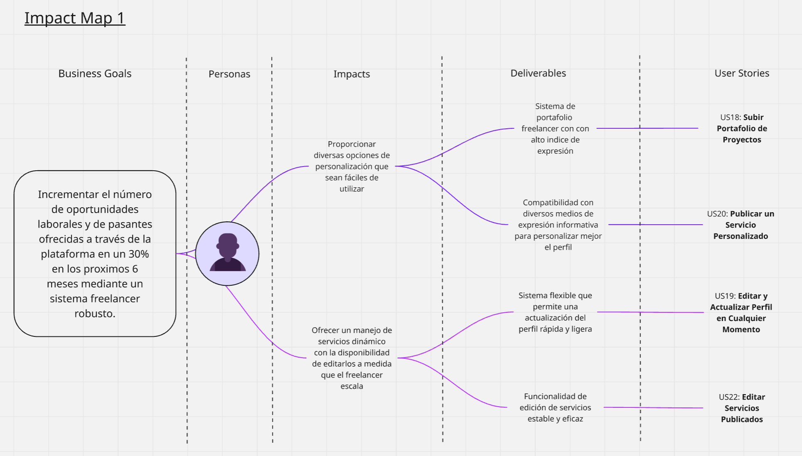

**Impact Map Segmento 2:** Personas y Emprendimientos que buscan contratar servicios freelance  
El impact map de GigU para las personas y emprendimientos que buscan contratar servicios freelance busca optimizar el proceso del contratado de freelancers por medio de un sistema de búsqueda completo que permite encontrar al freelancer indicado teniendo en cuenta sus servicios disponibles, la media de costos que propone y su nivel de experiencia.  
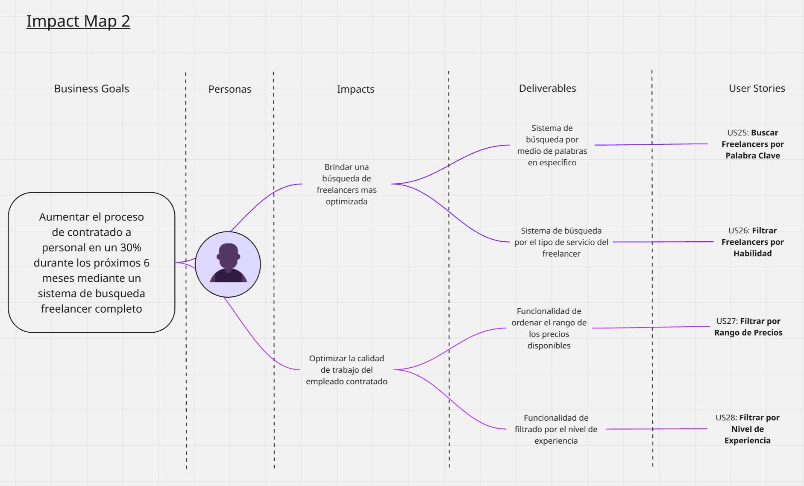

### 2.4.3. Product Backlog
Se utilizó la escala Fibonacci para la estimación de los Story Points. En total se tuvieron **197** Story Points.

| # Orden | User Story ID | Título                                                      | Story Points |
| :-----: | :-----------: | ----------------------------------------------------------- | :----------: |
|  **1**  |    **US01**   | Navegación intuitiva en la landing page                     |       3      |
|  **2**  |    **US02**   | Acceso rápido a funcionalidades clave                       |       3      |
|  **3**  |    **US03**   | Registro con correo y contraseña                            |       3      |
|  **4**  |    **US04**   | Iniciar sesión como freelancer o cliente                    |       5      |
|  **5**  |    **US05**   | Registro con Google                                         |       2      |
|  **6**  |    **US06**   | Solicitar recuperación de contraseña                        |       2      |
|  **7**  |    **US07**   | Restablecer contraseña vía correo                           |       2      |
|  **8**  |    **US12**   | Acceso a preguntas frecuentes (FAQ)                         |       3      |
|  **9**  |    **US13**   | Búsqueda dentro de preguntas frecuentes                     |       3      |
|  **10** |    **US14**   | Envío de ticket de soporte                                  |       3      |
|  **11** |    **US08**   | Conocer los beneficios de GigU                              |       1      |
|  **12** |    **US11**   | Detalles sobre tipos de servicios                           |       5      |
|  **13** |    **US10**   | Experiencias de otros usuarios                              |       5      |
|  **14** |    **US09**   | Diferencias entre roles (Freelancer / Cliente)              |       8      |
|  **15** |    **US25**   | Buscar freelancers por palabra clave                        |       3      |
|  **16** |    **US26**   | Filtrar freelancers por habilidad                           |       3      |
|  **17** |    **US29**   | Ordenar resultados por relevancia o calificación            |       3      |
|  **18** |    **US27**   | Filtrar por rango de precios                                |       5      |
|  **19** |    **US28**   | Filtrar por nivel de experiencia                            |       5      |
|  **20** |    **US30**   | Contratar desde el perfil del freelancer                    |       5      |
|  **21** |    **US31**   | Confirmación de contratación exitosa                        |       3      |
|  **22** |    **US24**   | Añadir imágenes o archivos al servicio (previo a contratar) |       3      |
|  **23** |    **US33**   | Historial de contrataciones realizadas                      |       2      |
|  **24** |    **US34**   | Visualizar proyectos activos                                |       5      |
|  **25** |    **US37**   | Seguimiento del estado del proyecto                         |       5      |
|  **26** |    **US32**   | Aceptar o rechazar una solicitud de contrato                |       3      |
|  **27** |    **US35**   | Gestionar solicitudes recibidas                             |       3      |
|  **28** |    **US36**   | Marcar proyecto como finalizado                             |       3      |
|  **29** |    **US38**   | Calificar al freelancer al finalizar el proyecto            |       3      |
|  **30** |    **US39**   | Ver calificaciones en perfil de freelancer                  |       5      |
|  **31** |    **US41**   | Calificar al cliente                                        |       5      |
|  **32** |    **US40**   | Editar calificación después del proyecto                    |       5      |
|  **33** |    **US42**   | Enviar mensaje a usuario desde perfil                       |       3      |
|  **34** |    **US43**   | Ver historial de conversaciones                             |       2      |
|  **35** |    **US44**   | Notificaciones de nuevos mensajes                           |       1      |
|  **36** |    **US45**   | Bloquear o reportar usuario desde chat                      |       2      |
|  **37** |    **US15**   | Creación de perfil freelance                                |       5      |
|  **38** |    **US16**   | Añadir habilidades y descripción personal                   |       8      |
|  **39** |    **US17**   | Establecer tarifas por servicio                             |       8      |
|  **40** |    **US18**   | Subir portafolio de proyectos                               |       5      |
|  **41** |    **US19**   | Editar y actualizar perfil en cualquier momento             |       3      |
|  **42** |    **US20**   | Publicar un servicio personalizado                          |       5      |
|  **43** |    **US21**   | Establecer plazos de entrega                                |       5      |
|  **44** |    **US22**   | Editar servicios publicados                                 |       5      |
|  **45** |    **US23**   | Pausar o eliminar servicios publicados                      |       5      |
|  **46** |    **US46**   | Sugerencia de precio inteligente                            |       8      |
|  **47** |    **US47**   | Ajuste manual sobre precio sugerido                         |       5      |
|  **48** |    **US48**   | Detalle del cálculo del precio sugerido                     |       5      |
|  **49** |    **US49**   | Comparación entre propuesta y oferta                        |       3      |
|  **50** |    **US50**   | Historial de precios de servicios similares                 |       2      |

## 2.5. Strategic-Level Domain-Driven Design
En esta sección nos reunimos todo el equipo para realizar una lluvia de ideas sobre los eventos que ocurrirían en la aplicación. Primero se empezó por poner en una pizarra todos los eventos del dominio que se nos ocurrieran que podría tener la aplicación. Después empezamos a agregar los comandos que desencadenan los eventos. Finalmente ya se agregaron los demás elementos como actores, políticas, aggregates, sistemas externos, y modelos de lectura. Poco a poco al hacer esto se empezaron a formar pequeños flujos de eventos que nos servirían para los siguientes puntos.

### 2.5.1. EventStorming

[Link a whiteboard](https://whiteboard.cloud.microsoft/me/whiteboards/p/c3BvOmh0dHBzOi8vdXBjZWR1cGUtbXkuc2hhcmVwb2ludC5jb20vcGVyc29uYWwvdTIwMjMxMDIyMl91cGNfZWR1X3Bl/b\!i3wi0-Zp10KBwpP2dsOQxmvYYHS7x91ChgL6joND6JV9EG89oq6-SbVk8MnpMmcp/01ACQWLUFEKBLQEIPVLNCLWIJVGURYAICY)

#### 2.5.1.1. Candidate Context Discovery
Nuestro equipo optó por aplicar la técnica **“start-with-simple”**, dado que esta se centra en reconocer aquellas partes del sistema que, desde la perspectiva funcional, del usuario o de la infraestructura, tienen una relación clara y natural entre sí. Esta aproximación resulta especialmente adecuada en sistemas cuya lógica ya se encuentra bien comprendida.  
A partir de este enfoque, hemos logrado identificar 5 **Bounded Context**.  
   
User:  
Este contexto abarca la **gestión y administración de cuenta** de los usuarios en la plataforma. Incluye procesos como el registro, autenticación, edición de información personal y configuración del perfil. Los *sellers* pueden actualizar su portafolio y datos de contacto, mientras que los *buyers* acceden a los perfiles de los sellers y confirman cambios relevantes. Se trata del núcleo de **Identity and Access Management (IAM)**, asegurando que la información de los usuarios se mantenga consistente y actualizada.  

Chat:  
Este contexto está orientado a la **comunicación síncrona** entre *buyers* y *sellers*. A través de este módulo, los usuarios pueden redactar, enviar y recibir mensajes directos. La función principal es facilitar la **interacción y negociación** en torno a servicios o proyectos, constituyendo un canal clave de coordinación. Garantiza que los mensajes se entreguen correctamente y mantiene la trazabilidad de la comunicación.  

Portafolio:  
El portafolio actúa como el espacio donde los *sellers* pueden **gestionar y exhibir sus trabajos destacados**. Las acciones contemplan añadir, editar o actualizar proyectos que reflejen sus competencias y experiencia. Por su parte, los *buyers* tienen la posibilidad de consultar los portafolios de los sellers como criterio de decisión. Este contexto asegura que la información creativa y profesional sea accesible, actualizada y confiable.  

Gig:  
Este contexto gestiona todo el ciclo de vida de un **gig** o propuesta de servicio. Incluye desde la **creación de un gig**, la elección por parte del *buyer*, la negociación de la oferta (incluyendo ajustes de precio y condiciones) hasta la aceptación o rechazo por parte del *seller/freelancer*.  

Pull:  
Este contexto se ocupa de la **formalización y cierre del acuerdo** entre *buyer* y *seller*. Incluye aceptar o rechazar ofertas, realizar el pago, entregar el servicio y confirmar si el resultado fue satisfactorio. Una vez todo está completado, la pull se marca como finalizada. Aquí se asegura que la **transacción quede registrada y validada**.  

#### 2.5.1.2. Domain Message Flows Modeling
En esta sección se presentan los **Domain Message Flows** de GigU, elaborados a partir de la técnica de **Domain Storytelling** y del brainstorming realizado previamente. El objetivo es describir cómo los diferentes **bounded contexts** de la plataforma (User, Portfolio, Gig, Pull y Chat), así como servicios externos como el proveedor de pagos, **intercambian mensajes y eventos de dominio** para dar soporte a los principales flujos de negocio a través de eventos clave que representan acciones del negocio.

* User **➔** Portfolio

Cuando un usuario actualiza su perfil en el contexto **User (IAM)**, la información sincronizada (nombre, foto, datos relevantes) se envía a **Portfolio** para reflejar los cambios en la vista del seller. Los buyers pueden acceder a estos portafolios para evaluar a los freelancers.  
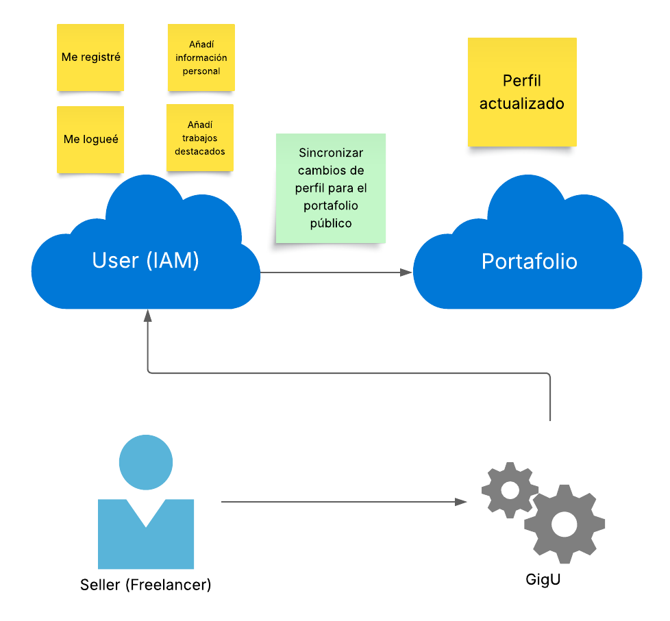

* Gig **➔** Pull

Al seleccionarse un gig, el contexto **Gig** envía la información necesaria a **Pull** para crear una nueva negociación (Pull) con la oferta inicial. Esto permite que buyer y seller comiencen el proceso contractual.  
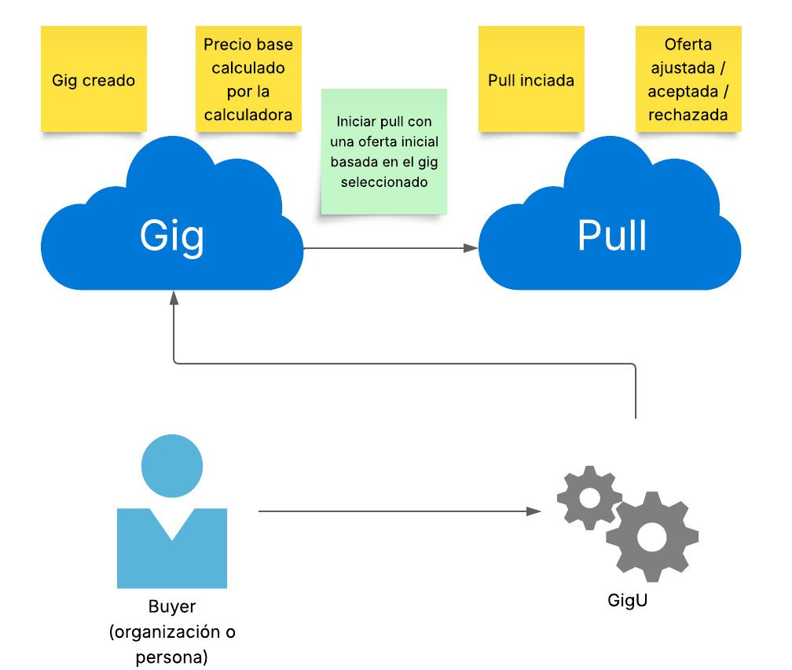

* Pull **➔** Chat

Cada vez que se inicia una **Pull** o se ajusta una oferta, en el contexto **Chat**, se abre un hilo de conversación entre buyer y seller. Aquí se coordina y queda trazabilidad de las negociaciones.  
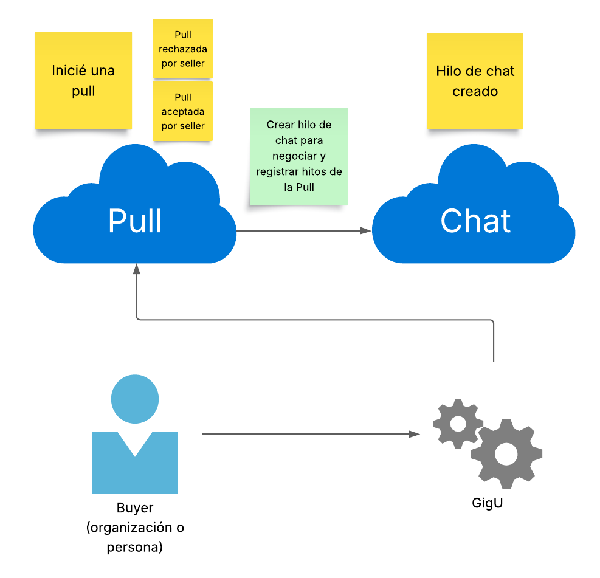

* Gig **➔** Payment provider

Cuando el buyer completa su método de pago en **Gig**, se envía información al **Payment Provider** para autorizar y capturar el pago. En caso de reembolso, el mismo flujo actualiza el estado del **Pull**.  
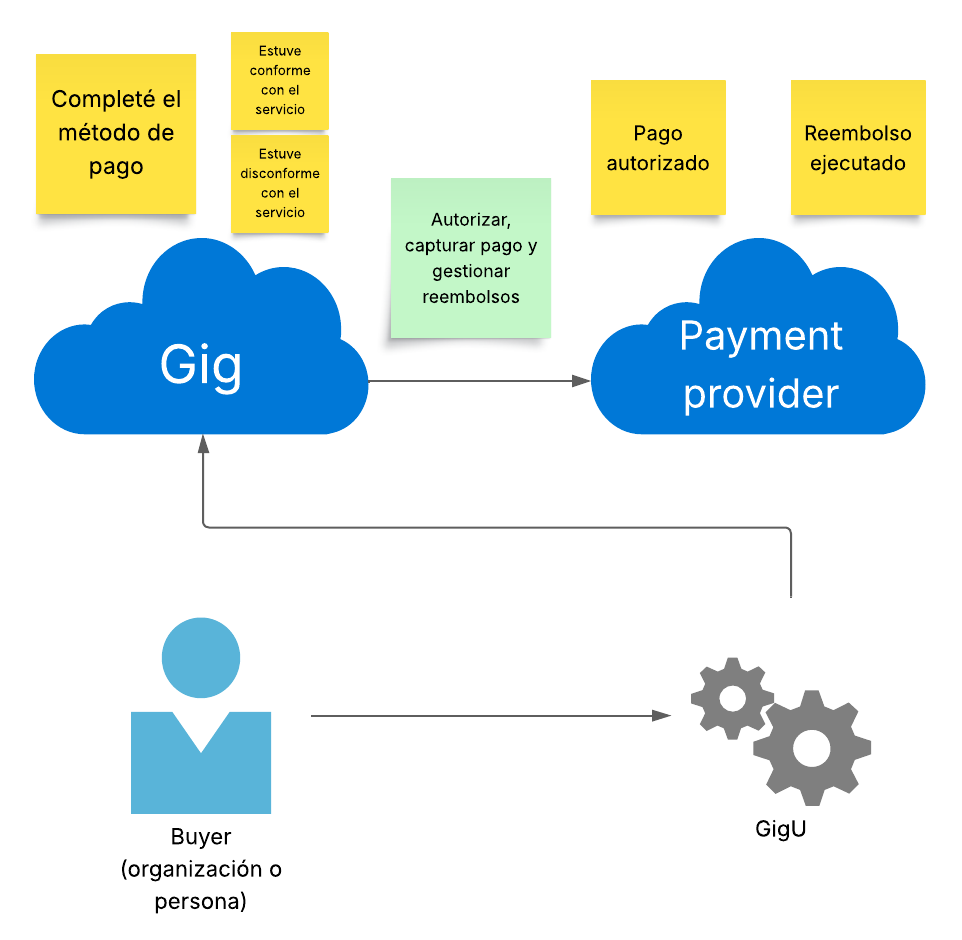

* Portafolio **➔** Gig

Desde el **Portfolio**, los buyers pueden explorar los trabajos destacados de un seller. Al elegir un proyecto, se redirige la información al contexto **Gig**, donde el buyer puede acceder al detalle del servicio ofrecido.  
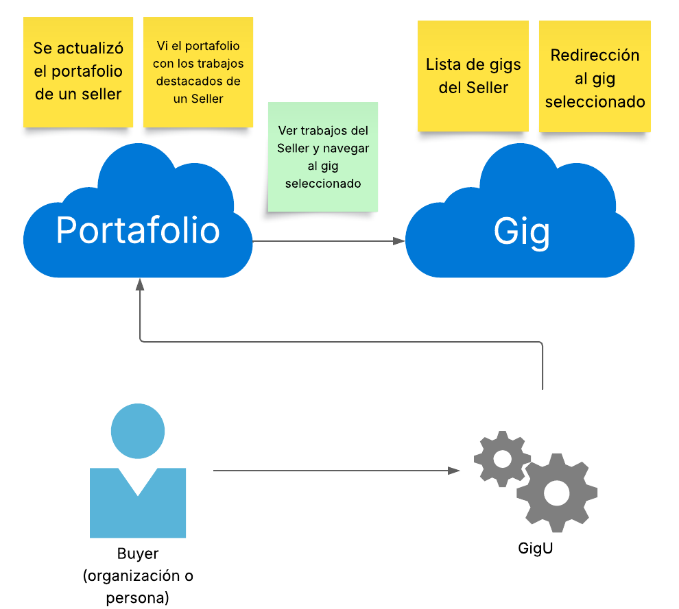

* Pull **➔** User

Al completarse una **Pull**, el contexto notifica a **User (IAM)** para actualizar métricas de calificación del seller y del buyer. Esta información se muestra en el perfil público.  
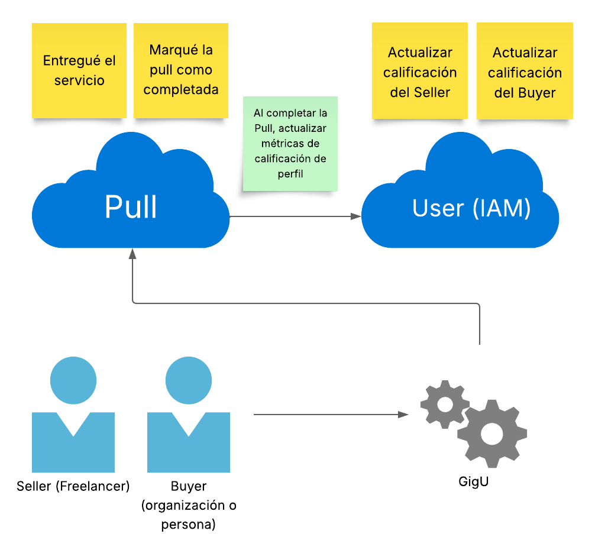

#### 2.5.1.3. Bounded Context Canvases
Esta sección del documento detalla el trabajo realizado por el equipo para estructurar los bounded contexts identificados durante el proceso. La construcción de estos contextos se llevó a cabo de manera iterativa, asegurando que cada uno reflejara con precisión los principios de diseño y el conocimiento del dominio.
Para cada bounded context, se siguió una serie de pasos clave:
* Definición General del Contexto: Se establecieron claramente el propósito y los límites de cada contexto, garantizando su alineación con el ámbito del negocio.
* Identificación de Reglas de Negocio y Lenguaje Ubicuo: Se documentaron las principales reglas de negocio y se definió un lenguaje común para facilitar la comunicación entre los miembros del equipo.
* Análisis de Capacidades: Se evaluaron las funcionalidades necesarias que debía ofrecer cada contexto.
* Organización en Capas: Cuando fue pertinente, se estructuraron las capacidades en capas para mejorar la claridad y mantenibilidad del diseño.
* Identificación de Dependencias: Se analizaron las relaciones con otros contextos y sistemas externos, mapeando las dependencias relevantes.
* Revisión del Diseño: Se validó la arquitectura propuesta, priorizando un bajo acoplamiento y su alineación con los objetivos estratégicos del negocio.

Gracias a esta metodología, el equipo logró definir bounded contexts robustos y coherentes, cada uno cumpliendo un rol específico dentro de la arquitectura general del sistema.

**Bounded Context Gig:**
Este bounded context encapsula la gestión integral de los Gigs, entendidos como las propuestas de servicio que los sellers ofrecen dentro de la plataforma. Define los límites funcionales para administrar todo su ciclo de vida: desde la creación y publicación inicial de un gig, pasando por su exploración y selección por parte de los buyers, hasta la fase de negociación de condiciones (precio, plazos y características) y la aceptación o rechazo por el seller/freelancer.

El contexto modela al Gig como la entidad raíz del dominio, con atributos y reglas de negocio que garantizan la consistencia de la información publicada y su validez dentro de la plataforma. Asimismo, se establece un lenguaje ubicuo claro, donde términos como Gig, seller, buyer, category, price, deliveryDays y extraFeatures forman parte del vocabulario común entre los equipos técnicos y de negocio, favoreciendo la cohesión y la comunicación dentro del dominio de contratación basada en servicios freelance.

**Bounded Context Pull:**
Este bounded context encapsula el proceso de negociación entre un buyer y un seller sobre un Gig, estructurando el ciclo completo desde la apertura de una oferta hasta su cierre como transacción completada. Define claramente los límites funcionales del contexto, asegurando su independencia y cohesión dentro del dominio de contratación basada en Gigs.

El contexto modela el Pull como una entidad central con reglas de negocio específicas para manejar la evolución del precio y los cambios de estado de la negociación. Se establece un lenguaje ubicuo preciso que incluye términos como Pull, Gig, priceInit, priceUpdate y state, facilitando la comunicación técnica y de negocio.

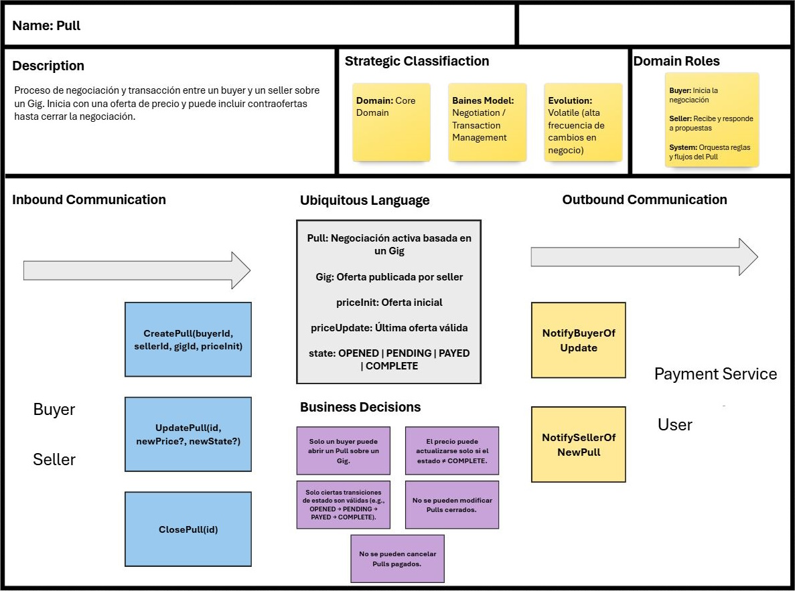

**Bounded Context Chat:**
Este bounded context encapsula el proceso de comunicación en tiempo real entre un buyer y un seller dentro de la plataforma GigU, estructurando el ciclo completo de envío, recepción y lectura de mensajes. Define claramente los límites funcionales del contexto, asegurando su independencia y cohesión como un soporte esencial en las interacciones entre usuarios durante la contratación de servicios freelance.

El contexto modela el Chat como una entidad central con reglas de negocio específicas para garantizar la validez de los mensajes, el control de estados de lectura y la persistencia confiable de la comunicación. Se establece un lenguaje ubicuo preciso que incluye términos como Chat, senderId, receiverId, content, sentAt e isRead, facilitando la comunicación técnica y de negocio.

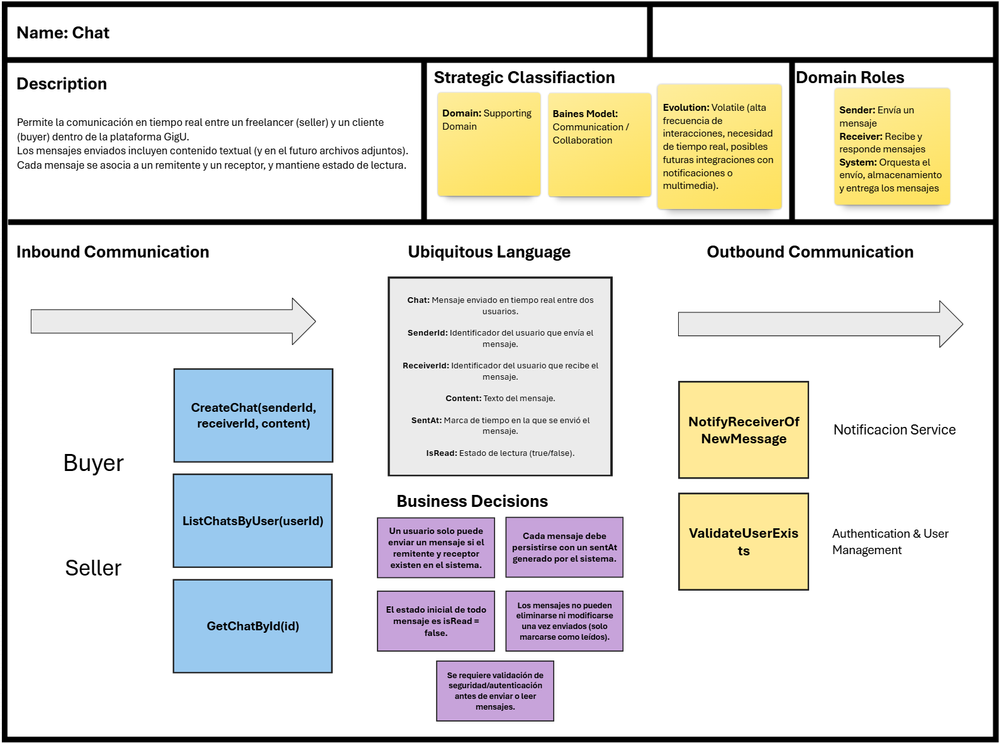

**Bounded Context User:**
El Bounded Context Canvas del User (IAM) encapsula la gestión de identidad y perfil dentro de GigU, estructurando el ciclo completo desde el registro y autenticación hasta la lectura y actualización del perfil público. Este define quién puede crear cuentas, cómo se valida la unicidad del email, qué datos conforman el perfil, cuál es el rol activo y cómo se mantiene el rating del usuario.

El contexto modela la UserAccount como entidad central con reglas específicas para proteger credenciales (password hash), controlar cambios sensibles (email único), actualizar información pública y publicar eventos para comunicarlos con otros BCs. Su lenguaje ubicuo incluye términos como UserAccount, Profile, Role, Rating, profilePicture, bio, createdAt/updatedAt y Auth, sirviendo como base de confianza para las interacciones entre compradores y freelancers en GigU.

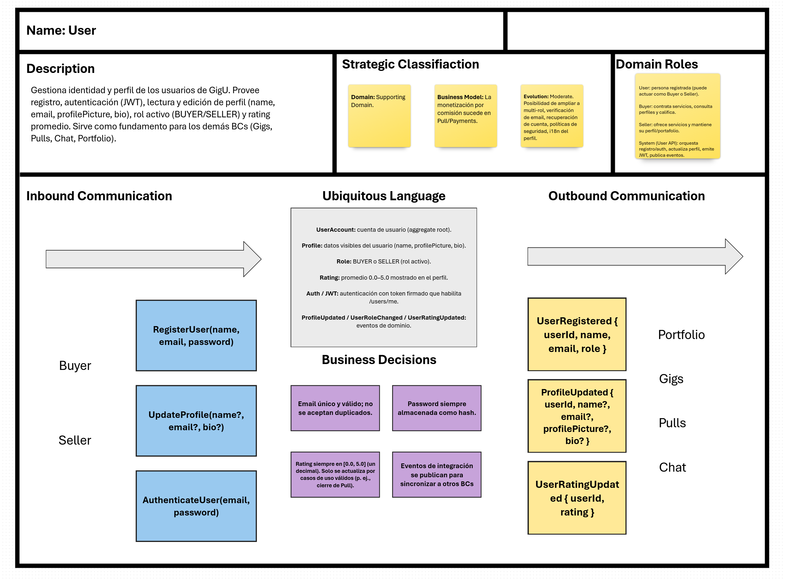

**Bounded Context Portfolio:**

El Bounded Context Canvas del Portfolio BC es una representación estructurada que define el alcance y los límites del subdominio
encargado de la gestión de portafolios dentro de la plataforma GigU. Este canvas describe cómo los sellers construyen y administran 
sus portafolios con proyectos y medios asociados, mientras que los buyers los consultan junto con reseñas para evaluar la reputación y 
experiencia antes de contratar. Además, refleja sus interacciones con otros sistemas mediante comunicaciones entrantes y salientes, el
lenguaje ubicuo que uniformiza conceptos clave como Portfolio, Project y Review, y las decisiones de negocio que gobiernan la creación,
actualización e indexación de proyectos. En conjunto, proporciona una visión estratégica y táctica que asegura la alineación entre negocio,
tecnología y dominio.

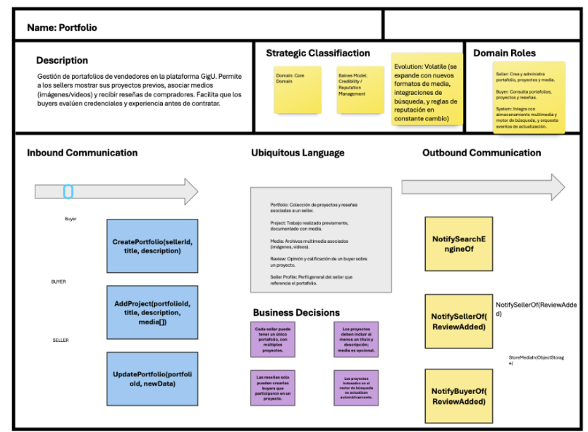

### 2.5.2. Context Mapping
Para esta sección se analizaron las relaciones entre cada Bounded Contexts para asignar los patrones de context mapping a cada uno.

1. **User ➔ Portafolio / Gig / Pulls / Chats**

**Descripción:**  
El contexto User actúa como Identity Provider (proveedor de identidad). Todos los demás contextos dependen de él para identificar de manera confiable a los usuarios.

* Portafolio usa User para asociar trabajos previos y habilidades al perfil del freelancer.

* Gig usa User para definir quién publica un servicio y quién lo contrata.

* Pulls depende de User para vincular qué cliente abrió un pull y a qué freelancer se dirige.

* Chats utiliza User para garantizar la autenticidad de los remitentes y destinatarios en la mensajería.

**Patrón aplicado:** Supplier-Consumer.  
User es el Supplier de identidad y metadatos, los demás contextos son Consumers.

2. **Portafolio ➔ Gig**

**Descripción:**  
Un Gig publicado puede estar enriquecido con información del Portafolio del freelancer (ejemplo: reseñas, casos de estudio, proyectos realizados). Esto genera confianza en el cliente.  
Patrón aplicado: Conformist.  
El contexto Gig se adapta al modelo de datos expuesto por Portafolio, sin imponer modificaciones, para mantener consistencia.

3. **Gig ➔ Pulls**

**Descripción:**  
Un Pull (propuesta/solicitud de servicio) depende de los Gig creados por freelancers. El cliente abre un Pull seleccionando un Gig como base.  
Patrón aplicado: Upstream-Downstream (Customer-Supplier).

* Gig es el Upstream que provee el catálogo de servicios.

* Pulls es el Downstream que consume esa información para generar solicitudes concretas.

4. **Pulls ➔ Chats**

**Descripción:**  
Cuando un Pull es creado, se habilita un canal de comunicación en Chats entre el cliente y el freelancer.  
**Patrón aplicado:** Published Language.  
Pulls publica un evento (ejemplo: “Pull creado”), que Chats entiende en un lenguaje compartido para iniciar la conversación.

5. **Gig & Pulls ➔ Chats**

**Descripción:**  
Ambos contextos (Gig y Pulls) pueden generar la necesidad de abrir un canal de comunicación en Chats:

* Desde un Gig, un cliente puede iniciar un chat directo con el freelancer.

* Desde un Pull, se crea un chat automático para negociar términos.

**Patrón aplicado:** Anticorruption Layer (ACL).  
El Chats traduce los modelos de Gig y Pulls a su propia representación de conversación, evitando dependencias directas que lo acoplen a sus estructuras internas.

**Preguntas estratégicas de reflexión**

¿Qué pasaría si separamos la gestión de identidad (User) en un servicio externo?  
Podría integrarse con un proveedor de terceros (ej. Google OAuth), pero perderíamos control sobre lógica propia (roles académicos, validación de estudiante UPC).

¿Qué ocurriría si unificamos Gig y Portafolio?  
Aunque ambos giran en torno al freelancer, el Portafolio es histórico y validación, mientras que el Gig es transaccional (ofertas activas). Unificarlos complicaría la escalabilidad.

¿Deberíamos fusionar Pulls y Chats?  
No. Aunque están relacionados, Pulls define la negociación formal de un servicio, mientras que Chats se limita a comunicación. Fusionarlos diluiría responsabilidades.

¿Qué pasaría si creamos un contexto independiente de Calificaciones/Reviews?  
Sería viable en el futuro. Actualmente, se almacenan como parte del Portafolio, pero separar este contexto podría facilitar la analítica avanzada.

**Conclusión del análisis**

* No se crean nuevos bounded contexts adicionales en esta etapa.  
    
* User actúa como Supplier central de identidad.  
    
* Gig provee catálogo de servicios y es consumido por Pulls y Chats.  
    
* Portafolio enriquece la credibilidad de Gig.  
    
* Pulls orquesta solicitudes y habilita comunicación en Chats.  
    
* Chats actúa como un servicio aislado con capas de traducción, manteniendo bajo acoplamiento con Gig y Pulls.

El diagrama de context mapping resultante muestra a User como núcleo de identidad, y a Gig, Pulls, Portafolio y Chats interactuando en torno a él con patrones claros de consumo y publicación.

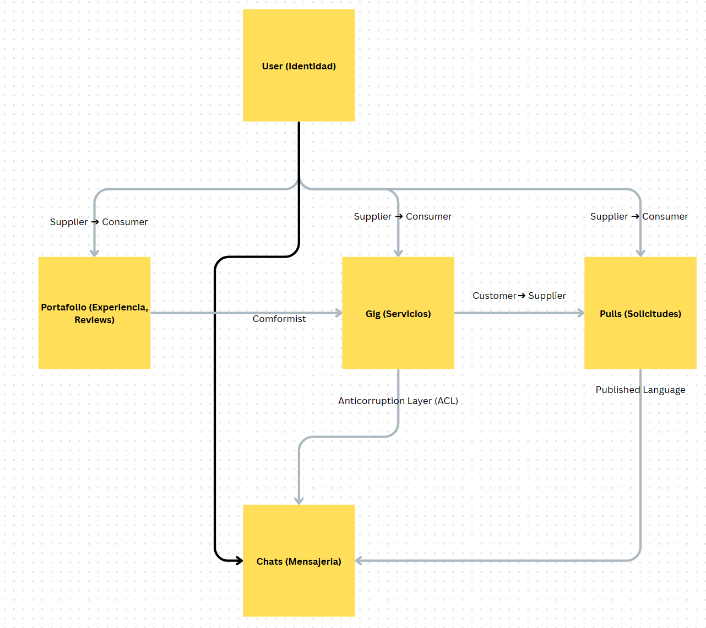

### 2.5.3. Software Architecture
#### 2.5.3.1. Software Architecture Context Level Diagrams
**Objetivo:**  
Mostrar el sistema GigU como un sistema central rodeado por sus actores (usuarios) y sistemas externos con los que interactúa.

 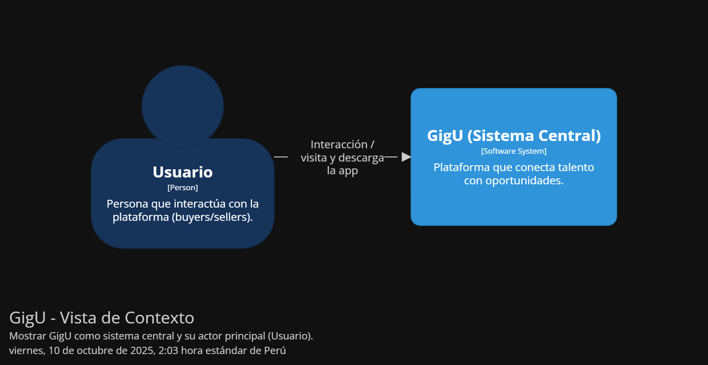

**Contenedores:**  
- **Landing Page:** Página web estática para presentación y redireccionamiento (al Play Store o App links).  
- **Aplicación Móvil (Android - Flutter):** Interfaz principal para interacción de usuarios, desarrollada en Android Studio con Flutter. Incluye almacenamiento local (SQLite/Shared Preferences) y acceso a recursos del dispositivo (cámara, ubicación, etc.).  
- **API RESTful:** Backend en ASP.NET Core que maneja la lógica de negocio, integra con servicios externos y persiste información.  
- **Base de Datos:** MySQL que almacena toda la información del sistema.  

**Relaciones:**  
- Los usuarios interactúan con la Landing Page y principalmente con la Aplicación Móvil.  
- La Aplicación Móvil se comunica con el API RESTful para todas las operaciones.  
- El API RESTful accede a la Base de Datos para lectura y escritura.  
- El API también integra servicios externos para validaciones, autenticación y notificaciones.

#### 2.5.3.2. Software Architecture Container Level Diagrams
**Objetivo:**  
Descomponer el sistema en contenedores tecnológicos y mostrar sus interacciones principales.

   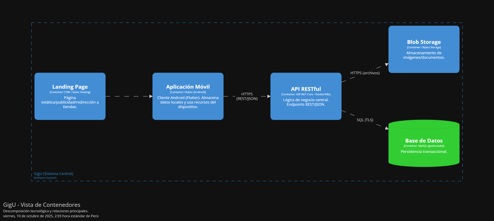

**Contenedores:**  
- **Landing Page:** Servida desde CDN para distribución global y alta disponibilidad.  
- **Aplicación Móvil (Android - Flutter):** Aplicación cliente instalada en dispositivos, conectada a la API vía HTTPS.  
- **API RESTful (ASP.NET Core):** Desplegada en contenedores (Docker/Kubernetes).  
- **Base de Datos MySQL:** Servicio gestionado con réplicas y backups.  
- **Blob Storage:** Para almacenar imágenes, documentos y archivos de usuarios.  

**Relaciones:**  
- La Aplicación Móvil consume los endpoints de la API a través de HTTPS.  
- La API interactúa con la Base de Datos, Blob Storage y Servicios Externos.  
- La Landing Page sirve como punto de entrada y redirección.  

#### 2.5.3.3. Software Architecture Deployment Diagrams
**Objetivo:**  
Representar la distribución física del sistema, mostrando cómo los diferentes contenedores de software (Landing Page, Aplicación Móvil, API RESTful y Base de Datos) se despliegan en la infraestructura y cómo se comunican entre sí, incluyendo servicios externos.

   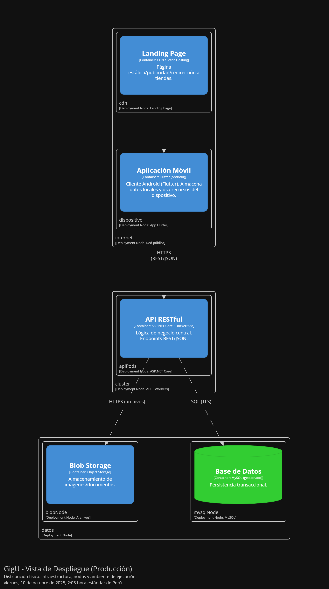

**Nodos principales:**  
- **Android Device (App Flutter):** Aplicación instalada en el dispositivo del usuario, con almacenamiento local y acceso a recursos del teléfono.  
- **CDN / Static Hosting (Landing Page):** Distribución global de la página de aterrizaje y recursos estáticos.  
- **Load Balancer / Reverse Proxy (WAF):** Encargado de balancear tráfico, gestionar certificados TLS y aplicar reglas de seguridad.  
- **API RESTful (ASP.NET Core en contenedores Docker/Kubernetes):** Lógica central desplegada en clúster escalable con soporte a workers de segundo plano.  
- **Base de Datos MySQL:** Persistencia de información con réplicas y respaldos automáticos.  
- **Blob Storage:** Almacenamiento de archivos (imágenes, documentos).  

**Relaciones:**  
- La Aplicación Móvil se conecta al API a través del Load Balancer / Reverse Proxy mediante HTTPS.  
- El API se comunica con la Base de Datos, el Blob Storage y con los Servicios Externos usando conexiones seguras (TLS).  
- Los usuarios acceden a la Landing Page vía HTTPS.  

**Decisiones tecnológicas:**  
- **Aplicación Móvil (Android - Flutter):** multiplataforma con un único código base que permite despliegue en Android y potencial extensión a iOS.  
- **Contenedores (Docker/Kubernetes):** despliegue portable y escalable del API.  
- **Azure Database for MySQL:** servicio gestionado con backups automáticos y alta disponibilidad.  
- **Azure Storage:** almacenamiento masivo de archivos.  
- **CDN:** optimización de tiempos de carga y protección frente a ataques.  
- **Seguridad:** comunicación cifrada TLS, gestión de secretos en KeyVault y firewall de aplicaciones web.

## 2.6. Tactical-Level Domain-Driven Design
## 2.6.1. Bounded Context 1

El Bounded Context de **Gigs** representa el catálogo de servicios freelance ofrecidos en la plataforma.  
Este contexto se encarga de la gestión completa del ciclo de vida de los gigs, incluyendo su creación, búsqueda, filtrado, actualización y eliminación.  
Un **Gig** es un servicio específico que un freelancer (*seller*) ofrece a los compradores (*buyers*) de la plataforma.  

### 2.6.1.1. Domain Layer  

El **Domain Layer** encapsula la lógica principal de negocio de los Gigs. Incluye la entidad raíz **Gig**, sus invariantes, reglas de negocio y servicios de dominio.  

#### Aggregate  

| Nombre | Categoría | Descripción |
|--------|-----------|-------------|
| Gig | Entity (Aggregate Root) | Representa un servicio freelance ofrecido por un seller. Contiene toda la información necesaria para que un buyer pueda evaluar y adquirir el servicio. |

#### Attributes  

| Nombre | Tipo de dato | Visibilidad | Descripción |
|--------|-------------|-------------|-------------|
| Id | int | Public | Identificador único del Gig. |
| Image | string | Public | Imagen del gig en formato base64. |
| Title | string | Public | Título descriptivo del gig (máx. 200 caracteres). |
| Description | string | Public | Descripción detallada del servicio (máx. 2000 caracteres). |
| SellerId | UUID | Public | Identificador del vendedor que ofrece el gig. |
| Price | decimal | Public | Precio del servicio (debe ser mayor a 0). |
| Tags | List<string> | Public | Lista de etiquetas para categorización y búsqueda. |
| Category | string | Public | Categoría principal del gig (máx. 100 caracteres). |
| DeliveryDays | int | Public | Días de entrega del servicio (1–365 días). |
| IsResponsive | bool | Public | Indica si el gig incluye diseño responsive. |
| RevisionCount | int | Public | Número de revisiones incluidas (por defecto 3). |
| PageCount | int | Public | Número de páginas del servicio. |
| ExtraFeatures | List<string> | Public | Lista de características adicionales del servicio. |
| CustomAnimations | bool | Public | Indica si incluye animaciones personalizadas. |
| CreatedAt | DateTime | Public | Fecha de creación del gig. |

#### Methods  

| Nombre | Tipo de retorno | Visibilidad | Descripción |
|--------|----------------|-------------|-------------|
| Gig(constructor) | Gig | Public | Inicializa un Gig con los parámetros básicos requeridos. |

#### Domain Services  

| Nombre | Categoría | Descripción |
|--------|-----------|-------------|
| IGigDomainService | Domain Service Interface | Define las operaciones de lógica de negocio para gigs. |
| GigDomainService | Domain Service | Implementa las reglas de negocio y validaciones del dominio. |

#### Domain Service Methods  

| Nombre | Tipo de retorno | Visibilidad | Descripción |
|--------|----------------|-------------|-------------|
| ValidateGigOwnership(gigId: int, sellerId: int) | Boolean | Public | Valida que un gig pertenezca a un seller específico. |
| IsCategoryValid(category: string) | Boolean | Public | Valida que la categoría esté en la lista de categorías permitidas. |
| IsUserActiveFreelancer(sellerId: int) | Boolean | Public | Verifica que el usuario sea un freelancer activo. |
| ValidateGigRequirements(gigId: int) | Boolean | Public | Valida los requisitos mínimos del gig. |
| AreTagsValid(tags: List<string>) | Boolean | Public | Valida que las etiquetas sean válidas. |
| ValidateExtraFeatures(features: List<string>) | Boolean | Public | Valida que las características extra sean permitidas. |

#### Repository Interface  

| Nombre | Categoría | Descripción |
|--------|-----------|-------------|
| IGigRepository | Repository Interface | Define las operaciones de persistencia para la entidad Gig. |

#### Repository Methods  

| Nombre | Tipo de retorno | Visibilidad | Descripción |
|--------|----------------|-------------|-------------|
| GetById(id: int) | GigResource | Public | Obtiene un gig por su identificador. |
| Create(gig: Gig) | GigResource | Public | Crea un nuevo gig en el repositorio. |
| Update(gig: Gig) | GigResource | Public | Actualiza un gig existente. |
| Delete(id: int) | Boolean | Public | Elimina un gig del repositorio. |
| Exists(id: int) | Boolean | Public | Verifica si un gig existe. |
| GetAll(...) | IEnumerable<Gig> | Public | Obtiene todos los gigs con paginación y ordenamiento. |
| GetBySellerId(sellerId: int, ...) | IEnumerable<Gig> | Public | Obtiene gigs por vendedor. |
| GetByCategory(category: string, ...) | IEnumerable<Gig> | Public | Obtiene gigs por categoría. |
| Search(searchTerm: string, ...) | IEnumerable<Gig> | Public | Busca gigs por término de búsqueda. |
| GetByTags(tags: List<string>, ...) | IEnumerable<Gig> | Public | Obtiene gigs por etiquetas. |
| GetWithCustomAnimations(...) | IEnumerable<Gig> | Public | Obtiene gigs con animaciones personalizadas. |

#### Commands  

| Nombre | Categoría | Descripción |
|--------|-----------|-------------|
| CreateGigCommand | Command | Comando para crear un nuevo gig. |
| UpdateGigCommand | Command | Comando para actualizar un gig existente. |

#### Queries  

| Nombre | Categoría | Descripción |
|--------|-----------|-------------|
| GetGigByIdQuery | Query | Consulta para obtener un gig por ID. |
| GetAllGigsQuery | Query | Consulta para obtener todos los gigs con filtros. |
| GetGigsBySellerIdQuery | Query | Consulta para obtener gigs por vendedor. |
| GetGigsByCategoryQuery | Query | Consulta para obtener gigs por categoría. |
| GetGigsByTagsQuery | Query | Consulta para obtener gigs por etiquetas. |

#### Exceptions  

| Nombre | Categoría | Descripción |
|--------|-----------|-------------|
| GigNotFoundException | Exception | Excepción lanzada cuando no se encuentra un gig. |
| GigValidationException | Exception | Excepción lanzada cuando falla la validación de un gig. |

#### Validators  

| Nombre | Categoría | Descripción |
|--------|-----------|-------------|
| CreateGigCommandValidator | Validator | Validador para comandos de creación de gigs. |
| UpdateGigCommandValidator | Validator | Validador para comandos de actualización de gigs. |

### 2.6.1.2. Interface Layer  

| Nombre | Categoría | Descripción |
|--------|-----------|-------------|
| GigController | Controller | Controlador REST que gestiona todas las operaciones de gigs. |

#### Controller Attributes  

| Nombre | Tipo de dato | Visibilidad | Descripción |
|--------|--------------|-------------|-------------|
| _gigCommandService | GigCommandService | Private | Servicio de comandos para operaciones de escritura. |
| _gigQueryService | GigQueryService | Private | Servicio de consultas para operaciones de lectura. |

#### Endpoints  

| Ruta | Método | Descripción |
|------|--------|-------------|
| /api/v1/gig | GET | Lista todos los gigs con filtros y paginación. |
| /api/v1/gig/{id} | GET | Obtiene un gig específico por ID. |
| /api/v1/gig/seller/{sellerId} | GET | Lista gigs de un vendedor específico. |
| /api/v1/gig/category/{category} | GET | Lista gigs por categoría. |
| /api/v1/gig/tags | GET | Lista gigs por etiquetas. |
| /api/v1/gig | POST | Crea un nuevo gig. |
| /api/v1/gig/{id} | PUT | Actualiza un gig existente. |
| /api/v1/gig/{id} | DELETE | Elimina un gig. |
| /api/v1/gig/stats/category/{category}/count | GET | Obtiene el conteo de gigs por categoría. |
| /api/v1/gig/stats/seller/{sellerId}/count | GET | Obtiene el conteo de gigs por vendedor. |
| /api/v1/gig/{id}/exists | GET | Verifica si un gig existe. |

#### DTOs  

| Nombre | Descripción |
|--------|-------------|
| CreateGigResource | DTO para crear un nuevo gig con validaciones. |
| UpdateGigResource | DTO para actualizar un gig existente. |
| GigResource | DTO de respuesta con todos los campos del gig. |
| ListGigsResource | DTO para listas paginadas de gigs. |

#### Transform Assemblers  

| Nombre | Categoría | Descripción |
|--------|-----------|-------------|
| GigResourceFromEntityAssembler | Assembler | Convierte entidades Gig a DTOs de respuesta. |
| CreateGigCommandFromResourceAssembler | Assembler | Convierte DTOs de request a comandos de dominio. |
| UpdateGigCommandFromResourceAssembler | Assembler | Convierte DTOs de actualización a comandos de dominio. |

### 2.6.1.3. Application Layer  

#### Command Services  

| Nombre | Categoría | Descripción |
|--------|-----------|-------------|
| GigCommandService | Service | Orquesta la creación, actualización y eliminación de gigs. |

#### Command Service Dependencies  

| Nombre | Tipo de objeto | Visibilidad | Descripción |
|--------|---------------|-------------|-------------|
| _gigRepository | IGigRepository | Private | Repositorio para acceso a datos de gigs. |
| _gigDomainService | IGigDomainService | Private | Servicio de dominio para validaciones. |
| _createValidator | CreateGigCommandValidator | Private | Validador para comandos de creación. |
| _updateValidator | UpdateGigCommandValidator | Private | Validador para comandos de actualización. |

#### Command Service Methods  

| Nombre | Tipo de retorno | Visibilidad | Descripción |
|--------|----------------|-------------|-------------|
| CreateGig(CreateGigCommand command) | GigResource | Public | Crea un nuevo gig con validaciones. |
| UpdateGig(UpdateGigCommand command) | GigResource | Public | Actualiza un gig existente. |
| DeleteGig(int gigId, int sellerId) | Boolean | Public | Elimina un gig validando propiedad. |

#### Query Services  

| Nombre | Categoría | Descripción |
|--------|-----------|-------------|
| GigQueryService | Service | Orquesta las consultas y búsquedas de gigs. |

#### Query Service Dependencies  

| Nombre | Tipo de objeto | Visibilidad | Descripción |
|--------|---------------|-------------|-------------|
| GigRepository | IGigRepository | Private | Repositorio para acceso a datos de gigs. |

#### Query Service Methods  

| Nombre | Tipo de retorno | Visibilidad | Descripción |
|--------|----------------|-------------|-------------|
| GetGigById(GetGigByIdQuery query) | GigResource | Public | Obtiene un gig por ID. |
| GetAllGigs(GetAllGigsQuery query) | List<Gig> | Public | Obtiene todos los gigs con filtros. |
| GetGigsBySellerId(GetGigsBySellerIdQuery query) | List<Gig> | Public | Obtiene gigs por vendedor. |
| GetGigsByCategory(GetGigsByCategoryQuery query) | List<Gig> | Public | Obtiene gigs por categoría. |
| GetGigsByTags(GetGigsByTagsQuery query) | List<Gig> | Public | Obtiene gigs por etiquetas. |
| GetGigCountByCategory(string category) | Int | Public | Obtiene conteo de gigs por categoría. |
| GetGigCountBySellerId(int sellerId) | Int | Public | Obtiene conteo de gigs por vendedor. |
| GigExists(int id) | Boolean | Public | Verifica si un gig existe. |

### 2.6.1.4. Infrastructure Layer  

#### Repository Implementation  

| Nombre | Categoría | Implementa | Descripción |
|--------|-----------|------------|-------------|
| GigRepository | Repository | IGigRepository | Implementación con Entity Framework Core para persistencia de gigs. |

#### Repository Dependencies  

| Nombre | Tipo de objeto | Visibilidad | Descripción |
|--------|---------------|-------------|-------------|
| Context | GigUContext | Protected | Contexto de Entity Framework para acceso a base de datos. |

#### Repository Key Features  

| Funcionalidad | Descripción |
|---------------|-------------|
| CRUD Operations | Crear, leer, actualizar y eliminar gigs |
| Advanced Queries | Búsqueda por múltiples criterios |
| Pagination | Soporte para paginación en todas las consultas |
| Sorting | Ordenamiento por diferentes campos |
| Filtering | Filtros por categoría, precio, días de entrega, etiquetas |
| Search | Búsqueda de texto en título, descripción y categoría |
| Counting | Métodos para obtener conteos con filtros |
| Performance | Uso de *AsNoTracking* para consultas de solo lectura |

#### Database Context Integration  

| Nombre | Categoría | Descripción |
|--------|-----------|-------------|
| GigUContext | DbContext | Contexto principal de Entity Framework que incluye la configuración de la entidad Gig. |

#### 2.6.1.5. Bounded Context Software Architecture Component Level Diagrams
#### 2.6.1.6. Bounded Context Software Architecture Code Level Diagrams

##### 2.6.1.6.1. Bounded Context Domain Layer Class Diagrams

##### 2.6.1.6.2. Bounded Context Database Design Diagram

### 2.6.2. Bounded Context 2
El bounded context Pulls representa el proceso de negociación y transacción entre un buyer y un seller dentro de la plataforma, siempre basado en un Gig.  
Un Pull se inicia cuando un buyer abre una negociación para un gig ofrecido por un seller.  
Durante el proceso, pueden producirse ajustes en el precio hasta llegar al precio actualizado que será finalmente pagado.

#### 2.6.2.1. Domain Layer
El Domain Layer encapsula la lógica principal de negocio de los Pulls. Incluye la entidad raíz Pull, sus invariantes y métodos para manejar los estados de negociación.  
**Aggregate**

| Nombre | Categoría | Descripción |
| :---: | :---: | :---: |
| Pull | Entity (Aggregate Root) | Representa una negociación activa entre un buyer y un seller, basada en un Gig. Permite registrar el precio inicial, su evolución en el precio actualizado y el estado actual de la negociación. |

**Attributes**

| Nombre | Tipo de dato | Visibilidad | Descripción |
| ----- | ----- | ----- | ----- |
| id | UUID | Private | Identificador único del Pull. |
| sellerId | UUID | Public | Identificador del vendedor (seller) asociado al Gig. |
| buyerId | UUID | Public | Identificador del comprador que abre la negociación. |
| gigId | UUID | Public | Identificador del Gig sobre el que se abre la negociación. |
| priceInit | Decimal | Public | Precio inicial propuesto al abrir la negociación. |
| priceUpdate | Decimal | Public | Precio actualizado de la negociación (última oferta válida). |
| state | Enum(OPENED, PENDING, PAYED, COMPLETE) | Public | Estado actual de la negociación. |
| createdAt | DateTime | Private | Fecha de creación del Pull. |
| updatedAt | DateTime | Private | Última fecha de actualización. |

**Methods**

| Nombre | Tipo de retorno | Visibilidad | Descripción |
| ----- | ----- | ----- | ----- |
| Pull(...) (constructor) | Pull | Public | Inicializa un Pull con sellerId, buyerId, gigId y priceInit. |
| updatePrice(newPrice: Decimal) | Void | Public | Permite actualizar el precio durante la negociación. |
| changeState(newState: Enum) | Void | Public | Cambia el estado de la negociación validando la transición. |

#### 2.6.2.2. Interface Layer
La Interface Layer expone las operaciones de Pulls mediante una API REST. Se encarga de recibir solicitudes externas, validar datos y delegar la lógica al Application Layer.

| Nombre | Categoría | Descripción |
| :---: | :---: | :---: |
| PullController | Controller | Controlador que gestiona operaciones CRUD y de transición de estado de los Pulls. |

**Attributes**

| Nombre | Tipo de dato | Visibilidad | Descripción |
| ----- | ----- | ----- | ----- |
| pullQueryService | IPullQueryService | Private | Servicio de consulta para Pulls. |
| pullCommandService | IPullCommandService | Private | Servicio de comandos para creación y actualización de Pulls. |

**Endpoints**

| Ruta | Método | Descripción |
| ----- | ----- | ----- |
| /api/pulls | GET | Lista todos los Pulls disponibles. |
| /api/pulls/{id} | GET | Devuelve un Pull por su identificador. |
| /api/pulls/by-role | GET | Lista Pulls según rol (buyer o seller) e id de usuario. |
| /api/pulls | POST | Crea un nuevo Pull a partir de un Gig. |
| /api/pulls/{id} | PUT | Actualiza el precio o estado de un Pull. |
| /api/pulls/{id}/close | PUT | Cierra el Pull y cambia su estado a COMPLETE. |

**DTOs**

**Request DTOs**

| Nombre | Descripción |
| ----- | ----- |
| CreatePullRequestDto | Contiene los campos requeridos para crear un nuevo pull { sellerId, buyerId, gigId, priceInit }. |
| UpdatePullRequestDto | Contiene los campos opcionales para actualizar un pull existente { newPrice?, newState? }. |

**Response DTOs**

| Nombre | Descripción |
| ----- | ----- |
| PullResponseDto | Representa un recurso pull con todos sus campos { id, sellerId, buyerId, gigId, priceInit, priceUpdate, state } ). |
| ListPullsResource | Lista de Pulls paginada o completa. |

#### 2.6.2.3. Application Layer

Esta capa coordina la lógica de negocio entre el dominio, la infraestructura y los casos de uso expuestos.

| Nombre | Categoría | Descripción |
| :---: | :---: | :---: |
| PullApplicationService | Service | Orquesta la creación, negociación y finalización de Pulls. |

#### **Dependencies**

| Nombre | Tipo de objeto | Visibilidad | Descripción |
| ----- | ----- | ----- | ----- |
| pullRepository | PullRepository | Private | Accede a la base de datos de Pulls. |
| gigRepository | GigRepository | Private | Verifica existencia y validez del Gig al abrir un Pull. |
| userRepository | UserRepository | Private | Verifica existencia de buyer y seller. |
| unitOfWork | UnitOfWork | Private | Maneja confirmación de transacciones. |

#### **Methods**

| Nombre | Tipo de retorno | Visibilidad | Descripción |
| ----- | ----- | ----- | ----- |
| openPull(buyerId, sellerId, gigId, priceInit) | PullResource | Public | Abre un nuevo Pull para un Gig. |
| updatePull(id, newPrice?, newState?) | PullResource | Public | Actualiza el precio o estado del Pull. |
| closePull(id) | PullResource | Public | Marca un Pull como **COMPLETE**. |

#### 2.6.2.4. Infrastructure Layer
Incluye implementaciones concretas para acceso a datos y servicios externos.

**PullRepositoryImpl**

| Nombre | Categoría | Implementa | Descripción |
| :---: | :---: | :---: | :---: |
| PullRepository | Repository | PullRepositoryImpl | Implementación para la persistencia de Pulls en base de datos. |

#### **Funcionalidades clave**

* Crear nuevos Pulls.  
* Consultar Pulls por `id`, `buyerId` o `sellerId`.  
* Actualizar estado y precio negociado.  
* Persistir fecha de creación y última modificación.

#### 2.6.2.5. Bounded Context Software Architecture Component Level Diagrams
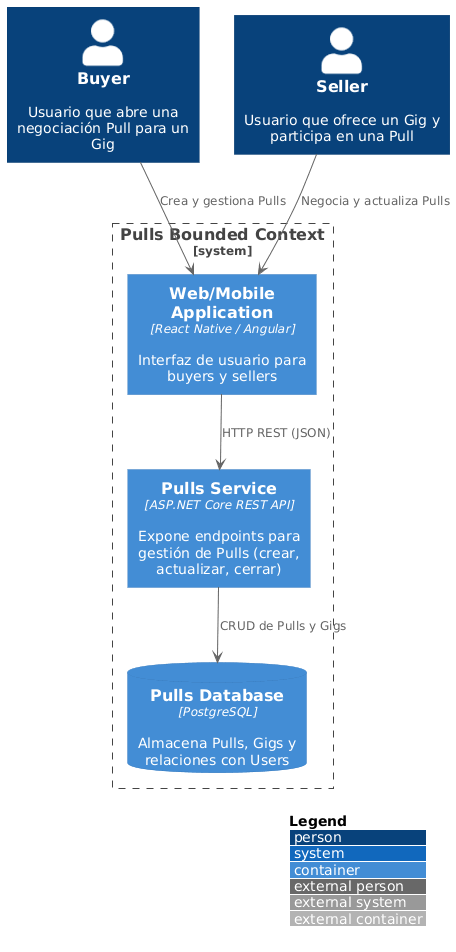

#### 2.6.2.6. Bounded Context Software Architecture Code Level Diagrams
##### 2.6.2.6.1. Bounded Context Domain Layer Class Diagrams
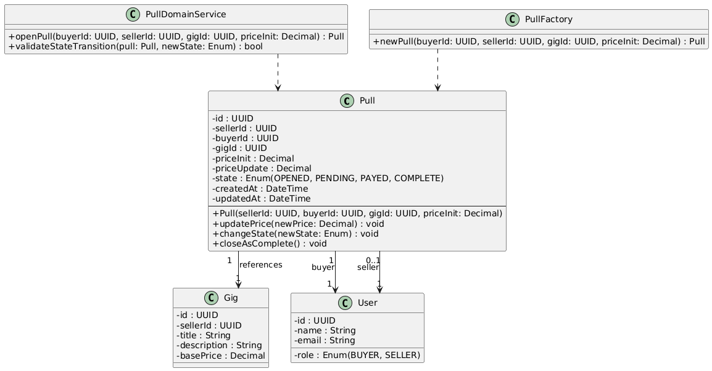

##### 2.6.2.6.2. Bounded Context Database Design Diagram
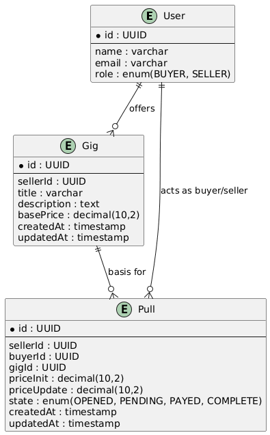

### 2.6.3. Bounded Context 3
Este bounded context permite a los usuarios de la plataforma intercambiar mensajes relacionados a un Pull o Gig contratado. Los chats facilitan la negociación y comunicación en tiempo real entre estudiantes freelancers y clientes, soportando texto y archivos adjuntos.

#### 2.6.3.1. Domain Layer
El Domain Layer contiene la lógica de negocio pura y las entidades principales relacionadas con la mensajería entre usuarios.

**Aggregate 1: Chat**

| Nombre | Categoría | Descripción |
| :---: | :---: | :---: |
| Chat Entity | Entidad | Representa un mensaje enviado dentro de un chat asociado a un Pull/Order. |

**Attributes**

| Nombre | Tipo de dato | Visibilidad | Descripción |
| :---: | :---: | :---: | :---: |
| id | int | Private | Identificador único del mensaje (heredado de BaseEntity). |
| senderId | int | Public | Identificador del usuario remitente. |
| receiverId | int | Public | Identificador del usuario destinatario. |
| content | String | Public | Contenido del mensaje. |
| sentAt | DateTime | Public | Marca de tiempo del envío. |
| isRead | bool | Public | Estado de lectura del mensaje. |
| createdDate | DateTime | Public | Fecha de creación del mensaje. |
| modifiedDate | DateTIme? | Public | Fecha de modificación (opcional). |

**Methods**

| Nombre | Tipo de retorno | Visibilidad | Descripción |
| :---: | :---: | :---: | :---: |
| Chat(...) (constructor) | Chat | Public | Crea un nuevo mensaje inicializando sender, receiver, contenido, fecha y estado de lectura. |
| markAsRead() | Void | Public | Permite cambiar el estado de IsRead a true cuando el receptor visualiza el mensaje. |
| updateContent(string newContent) | Void | Public | (Opcional) Permite actualizar el contenido de un mensaje antes de ser leído. |

#### 2.6.3.2. Interface Layer
El Interface Layer es responsable de la recepción de peticiones externas (REST), validación de entradas y conversión de datos para delegar al Application Layer.

**Controller: ChatController**

| Nombre | Categoría | Descripción |
| :---: | :---: | :---: |
| ChatController | Controller | Controlador que gestiona operaciones de creación y consulta de mensajes de chat. |

**Attributes**

| Nombre | Tipo de dato | Visibilidad | Descripción |
| :---: | :---: | :---: | :---: |
| chatService | ChatApplicationService | Private | Servicio de aplicación encargado de la gestión de mensajes. |

**Endpoints**

| Ruta | Método | Descripción |
| :---: | :---: | :---: |
| /api/v1/chat | POST | Permite a un usuario enviar un nuevo mensaje de chat. |
| /api/v1/chat/{userId} | GET | Devuelve todos los mensajes asociados a un usuario (como remitente o receptor). |
| /api/v1/chat/{id} | GET | Devuelve el detalle de un mensaje específico (por id). |

**DTOs**  
**Request DTOs**

| Nombre | Descripción |
| :---: | :---: |
| CreateChatRequestDto | Contiene los campos requeridos para registrar un nuevo mensaje (senderId, receiverId, content). |

**Response DTOs**

| Nombre | Descripción |
| :---: | :---: |
| ChatResponseDto | Representa un mensaje de chat con todos sus campos (equivalente a tu ChatResource). |
| ListChatsResponseDto | Contiene una lista de mensajes asociados a un usuario (completa o paginada). |

#### 2.6.3.3. Application Layer
Esta capa coordina la lógica de negocio entre las entidades del dominio, la infraestructura y los casos de uso externos.

**Service: ChatApplicationService**

| Nombre | Categoría | Descripción |
| :---: | :---: | :---: |
| ChatApplicationService | Service | Orquesta la creación y recuperación de mensajes desde la interfaz. |

**Dependencies**

| Nombre | Tipo de objeto | Visibilidad | Descripción |
| :---: | :---: | :---: | :---: |
| chatSchatRepositoryervice | ChatRepository | Private | Accede a la base de datos de mensajes de chat. |
| userRepository | UserRepository | Private | Permite validar la existencia de usuarios antes de enviar mensajes. |
| unitOfWork | UnitOfWork | Private | Gestiona la confirmación de transacciones. |

**Methods**

| Nombre | Tipo de retorno | Visibilidad | Descripción |
| :---: | :---: | :---: | :---: |
| createChat(...) | UUID / ChatResponseDto | Public | Crea un nuevo mensaje con los datos del remitente, receptor y contenido. |
| listChatsByUserId(userId) | List\<ChatResponseDto\> | Public | Retorna todos los mensajes en los que participa un usuario (como remitente o receptor). |
| getChatById(id) | ChatResponseDto | Public | Obtiene los detalles de un mensaje específico por su ID. |

#### 2.6.3.4. Infrastructure Layer
Incluye las implementaciones de acceso a la persistencia y servicios auxiliares utilizados por la capa de aplicación.

**ChatRepositoryImpl**

| Nombre | Categoría | Implementa | Descripción |
| :---: | :---: | :---: | :---: |
| ChatRepositoryImpl | Repository | ChatRepository | Implementación concreta para almacenar y consultar mensajes de chat. |

**Funcionalidades clave**  
**Crear mensajes de chat**

* Persisten nuevos mensajes enviados por usuarios.

* Asigna automáticamente fecha y estado inicial (IsRead \= false).

**Buscar mensajes por ID**

* Recupera un mensaje específico a partir de su identificador único (id).

**Buscar mensajes por usuario**

* Devuelve todos los mensajes en los que participa un usuario (como senderId o receiverId).

**Listar mensajes por conversación**

* Filtra mensajes entre dos usuarios específicos para reconstruir el historial de conversación.

**Actualizar estado de lectura**

* Marca mensajes como leídos (IsRead \= true) cuando el receptor los visualiza.

#### 2.6.3.5. Bounded Context Software Architecture Component Level Diagrams
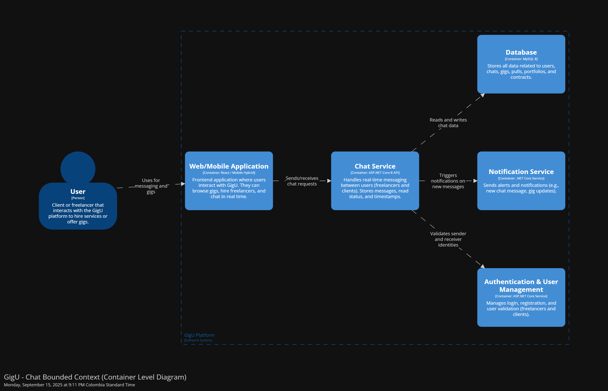
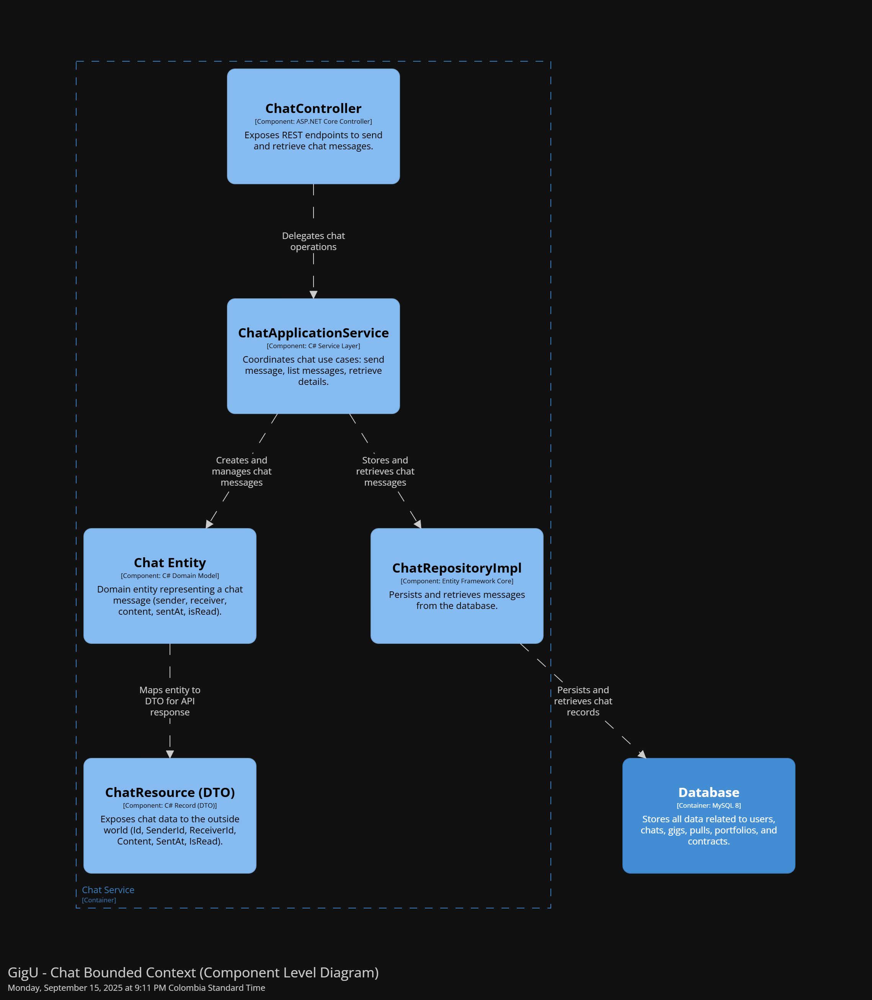

#### 2.6.3.6. Bounded Context Software Architecture Code Level Diagrams
##### 2.6.3.6.1. Bounded Context Domain Layer Class Diagrams
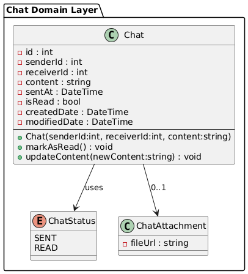

##### 2.6.3.6.2. Bounded Context Database Design Diagram
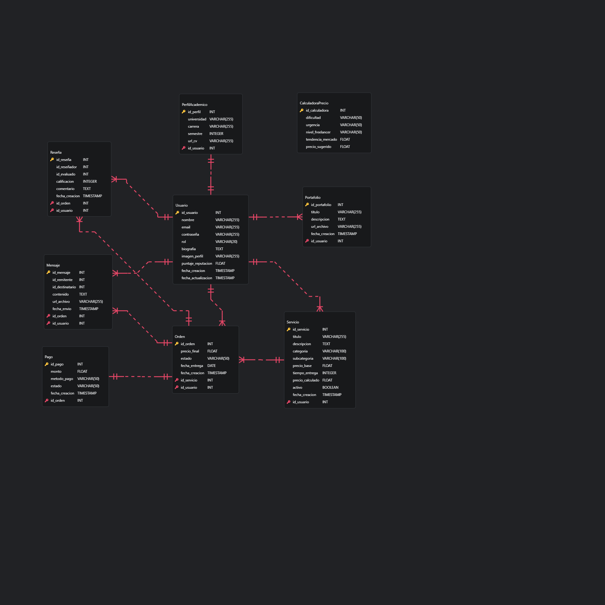

### 2.6.4. Bounded Context 4

Este bounded context administra identidad, autenticación y perfil de los usuarios. Asimismo, soporta registro, inicio de sesión, edición de perfil, rol activo y calificación visible. Así como también publica cambios relevantes para otros contextos. 

#### 2.6.4.1. Domain Layer
El Domain Layer contiene las reglas fundamentales del negocio relacionadas con los Users.  
**Aggregate**

| Nombre | Categoría | Descripción |
| :---: | :---: | :---: |
| UserAccount | Entity (Aggregate Root) | Cuenta de usuario unificada con nombre, email y contraseña. |

**Attributes**

| Nombre | Tipo de dato | Visibilidad | Descripción |
| ----- | ----- | ----- | ----- |
| id | Long | Private | Identificador único del usuario. |
| name | String | Private | Nombre público |
| email | String | Private | Único. Credencial de acceso y notificaciones. |
| passwordHash | String | Private | Hash seguro de contraseña. |
| role | Enum {BUYER, SELLER} | Private | Rol activo del usuario en la plataforma. |
| profilePicture | String | Private | URL de foto de perfil. |
| biografia | String | Private | Descripción corta del usuario. |
| calificacion | Decimal | Private | Promedio visible. |
| createdAt | DateTime | Public | Fecha/hora de creación del usuario. |
| updatedAt | DateTime | Public | Fecha/hora de última actualización. |

**Methods**

| Nombre | Retorno | Visibilidad | Descripción |
| ----- | ----- | ----- | ----- |
| UserAccount(name, email, passwordHash, role?) | UserAccount | Public | Construye la cuenta con email único y password ya hasheado. Si no se indica role, por defecto BUYER. |
| verifyPassword(raw, hashingService) | bool | Public | Compara raw con passwordHash usando hashingService.matches(...). |
| changePassword(newRaw, hashingService) | void | Public | Reemplaza passwordHash por hashingService.encode(newRaw) y actualiza updatedAt. |
| updateProfile(name?, email?, profilePicture?, biografia?) | void | Public | Actualiza datos del perfil. |
| changeRole(newRole: Role) | void | Public | Cambia el rol activo. |
| updateCalificacion(nuevoPromedio: Decimal) | void | public | Establece calificación validando el rango \[0,5\]. |
| issueToken(tokenService) | string | public | Devuelve un JWT tras autenticación exitosa. |

#### 2.6.4.2. Interface Layer
La Interface Layer expone las operaciones de User (IAM) mediante endpoints REST.  
Se encarga de recibir solicitudes externas, validar datos y delegar la lógica a los Command/Query Services del contexto.

**Controllers**

| Nombre | Categoría | Descripción |
| ----- | ----- | ----- |
| AuthController | Controller | Controlador para registro e inicio de sesión (emisión de JWT). |
| UsersController | Controller | Controlador para consultas y actualizaciones del perfil. |

**Attributes**

| Nombre | Tipo de dato | Visibilidad | Descripción |
| ----- | ----- | ----- | ----- |
| userQueryService | IUserQueryService | Private | Servicio de consulta de usuarios. |
| userCommandService | IUserCommandService | Private | Servicio de comandos de usuarios. |
| tokenService | ITokenService | Private | Generación y validación de JWT. |
| hashingService | IHashingService | Private | Hashing y verificación de contraseñas. |
| fileStorageService | IFileStorageService | Private | Manejo de uploads para profilePicture. |

**Endpoints**

| Ruta | Método | Descripción |
| ----- | ----- | ----- |
| /api/v1/auth/sign-up | POST | Registra un usuario nuevo con *name, email, password*. Devuelve token \+ usuario. |
| /api/v1/auth/sign-in | POST | Autentica con *email \+ password*. Devuelve token \+ usuario. |
| /api/v1/users/me | GET | Devuelve el perfil del usuario autenticado a partir del JWT. |
| /api/v1/users/{id} | GET | Devuelve un usuario por su identificador. |
| /api/v1/users | GET | Lista usuarios. |
| /api/v1/users/{id} | PUT | Actualiza el perfil. |
| /api/v1/users/{id}/role | PUT | Cambia el rol activo. |
| /api/v1/users/{id}/rating | PUT | Actualiza la calificación. |
| /api/v1/users/{id}/profile-picture | PUT | Sube/actualiza la foto de perfil. |

**DTOs**

**Request DTOs**

| Nombre | Descripción |
| ----- | ----- |
| SignUpRequestDto | Contiene los campos name, email, password. |
| SignInRequestDto | Contiene los campos email, password. |
| UpdateProfileRequestDto | Contiene los campos name, email, biografia. |
| ChangeRoleRequestDto | Solo contiene dos roles, BUYER y SELLER. |
| UpdateRatingRequestDto | Contiene el campo calificacion. |
| UploadProfilePictureRequestDto | Contiene el campo file (multipart/form-data) |

**Response DTOs**

| Nombre | Descripción |
| ----- | ----- |
| AuthResponseDto | Resultado de login/registro: { token, user: UserResponseDto } |
| UserResponseDto | Representa un usuario: { id, name, email, role, profilePicture, biografia, calificacion, createdAt, updatedAt } |
| ListUsersResource | Listado: { items: UserResponseDto\[\], page?, size?, total? } |

#### 2.6.4.3. Application Layer
Esta capa coordina la lógica de negocio entre el dominio, la infraestructura y los casos de uso expuestos por la Interface Layer.  
**Service 1: AuthApplicationService**

| Nombre | Categoría | Descripción |
| ----- | ----- | ----- |
| AuthApplicationService | Service | Orquesta registro e inicio de sesión. Aplica hashing de contraseña, verifica unicidad de email y emite JWT. |

**Dependencies**

| Nombre | Tipo de objeto | Visibilidad | Descripción |
| ----- | ----- | ----- | ----- |
| userRepository | UserRepository | Private | Acceso a persistencia de UserAccount. |
| hashingService | IHashingService | Private | Encargado de hashear y verificar contraseñas. |
| tokenService | ITokenService | Private | Genera JWT y arma el AuthResponse. |
| unitOfWork | UnitOfWork | Private | Maneja confirmación/rollback de transacciones |

**Methods**

| Nombre | Tipo de retorno | Visibilidad | Descripción |
| ----- | ----- | ----- | ----- |
| signUp(request: SignUpRequestDto) | AuthResponseDto | Public | Crea UserAccount con name, email (único) y password hasheado. Persiste y devuelve token con usuario. |
| signIn(request: SignInRequestDto) | AuthResponseDto | Public | Verifica email con password (hashing), y retorna token con usuario. |

**Service 2: UserApplicationService**

| Nombre | Categoría | Descripción |
| ----- | ----- | ----- |
| UserApplicationService | Service | Orquesta consultas y actualizaciones de perfil: nombre, email, biografía, rol, calificación y profile picture, además de listados y lecturas puntuales. |

**Dependencies**

| Nombre | Tipo de objeto | Visibilidad | Descripción |
| ----- | ----- | ----- | ----- |
| userRepository | UserRepository | Private | Acceso a UserAccount. |
| fileStorageService | IFileStorageService | Private | Guarda y obtiene archivos de profilePicture. |
| domainEventPublisher | DomainEventPublisher | Private | Publica eventos como ProfileUpdated para sincronizar otros BCs. |
| unitOfWork | UnitOfWork | Private | Maneja confirmación/rollback de transacciones. |

**Methods**

| Nombre | Tipo de retorno | Visibilidad | Descripción |
| ----- | ----- | ----- | ----- |
| getMe(currentUserId: Long) | UserResponseDto | Public | Retorna el perfil del usuario autenticado. |
| getById(id: Long) | UserResponseDto | Public | Retorna un usuario por su id. |
| listUsers(role?: Role, q?: String, page?: int, size?: int) | ListUsersResource | Public | Lista usuarios con filtros por rol y búsqueda por nombre/email |
| updateProfile(id: Long, request: UpdateProfileRequestDto) | UserResponseDto | Public | Actualiza name?, email? y biografia?. Publica ProfileUpdated. |
| changeRole(id: Long, request: ChangeRoleRequestDto) | UserResponseDto | Public | Cambia el rol activo. |
| updateRating(id: Long, request: UpdateRatingRequestDto) | UserResponseDto | Public | Actualiza calificacion validando rango. Al cerrar Pulls. |
| uploadProfilePicture(id: Long, request: UploadProfilePictureRequestDto) | UserResponseDto | Public | Sube/actualiza profilePicture, guarda URL y retorna el perfil actualizado. |

**Commands**

* RegisterUserCommand  
* AuthenticateUserCommand  
* UpdateUserProfileCommand  
* ChangeUserRoleCommand  
* UpdateUserRatingCommand  
* UploadProfilePictureCommand

**Queries**

* GetCurrentUserQuery  
* GetUserByIdQuery  
* ListUsersQuery  
* SearchUsersQuery  
* GetUserByEmailQuery

#### 2.6.4.4. Infrastructure Layer
En esta capa se implementan concretamente los contratos definidos en Domain/Application para persistencia, seguridad, almacenamiento de archivos y publicación de eventos. Aquí se integran servicios externos y componentes técnicos auxiliares.

**JpaUserRepositoryImpl**

| Nombre | Categoría | Implementa | Descripción |
| ----- | ----- | ----- | ----- |
| JpaUserRepositoryImpl | Repository Implementation | UserRepository | Implementación JPA/ORM para el agregado UserAccount. Mapea a tablas y gestiona consultas/actualizaciones. |

**Funcionalidad clave**

* findById(id), findByEmail(email).  
* existsByEmail(email).  
* save(user), update(user).  
* Filtro por rol y búsqueda por nombre/email: list(role?, q?, page?, size?).  
* Manejo de createdAt/updatedAt desde capa de persistencia.

**JwtTokenServiceImpl**

| Nombre | Categoría | Implementa | Descripción |
| ----- | ----- | ----- | ----- |
| JwtTokenServiceImpl | Security Service Implementation | ITokenService | Servicio de emisión/validación de JWT para autenticación. |

**Funcionalidad clave**

* generateToken(subject, claims).  
* validate(token).  
* getSubject(token) / getClaims(token).  
* Firma con clave secreta/keystore y expiración configurable.

**BCryptHashingServiceImpl**

| Nombre | Categoría | Implementa | Descripción |
| ----- | ----- | ----- | ----- |
| BCryptHashingServiceImpl | Security Service Implementation | IHashingService | Hash y verificación de contraseñas con BCrypt. |

**Funcionalidad clave**

* encode(rawPassword).  
* matches(rawPassword, passwordHash).

**ProfilePictureStorageImpl**

| Nombre | Categoría | Implementa | Descripción |
| ----- | ----- | ----- | ----- |
| ProfilePictureStorageImpl | Storage Service Implementation | IFileStorageService | Almacenamiento de profile pictures en proveedor externo. Devuelve URLs públicas o firmadas. |

**Funcionalidad clave**

* upload(file).  
* delete(key).  
* getUrl(key).

**DomainEventPublisherImpl**

| Nombre | Categoría | Implementa | Descripción |
| ----- | ----- | ----- | ----- |
| DomainEventPublisherImpl | Messaging/Event Implementation | DomainEventPublisher | Envía notificaciones automáticas cuando los usuarios hacen cambios importantes. |

**Funcionalidad clave**

* publish(ProfileUpdated|UserRoleChanged|UserRatingUpdated, payload).  
* Suscriptores en otros BCs.

**UnitOfWorkImpl**

| Nombre | Categoría | Implementa | Descripción |
| ----- | ----- | ----- | ----- |
| UnitOfWorkImpl | Transaction Management Impl | UnitOfWork | Garantiza que operaciones relacionadas se hagan todas juntas o ninguna, evitando que la base de datos quede en estado inconsistente. |

**Funcionalidad clave**

* Manejo de excepciones y rollback automático.

#### 2.6.4.5. Bounded Context Software Architecture Component Level Diagrams
El primer diagrama muestra a los tipos de usuario que interactúan con la plataforma y cómo utilizan el sistema para autenticarse y gestionar su perfil.

En el siguiente diagrama destaca tres piezas:

1. La **Web/Mobile App** que usan Buyer y Seller.  
2. La **User API** que expone endpoints de registro, login y perfil.   
3. La **Base de Datos** donde persiste la cuenta y metadatos de usuario.  
    La App consume la API vía HTTPS/JSON y la API persiste en la BD.

En el siguiente diagrama se detalla la estructura interna de la User API. Se ven:

* **Controllers** recibiendo solicitudes REST.  
* **Application Services** orquestando casos de uso.  
* **Infrastructure**: JpaUserRepositoryImpl (acceso a datos), JwtTokenServiceImpl (emisión/validación de JWT), BCryptHashingServiceImpl (hashing de contraseñas), entre otros.

En el siguiente diagrama se muestran los componentes del cliente para autenticación y perfil. Las pantallas delegan en el ApiService, cómo se maneja el token en el cliente y cómo se realizan las llamadas a la API de User:

* **Authentication Screens UI** (pantallas de login/registro) y **Profile Screens UI** (ver/editar perfil).  
* **ApiService** como cliente HTTP que inyecta el JWT en encabezados y llama a la User API.  
* **TokenService** para almacenamiento seguro del token.  
* **HTTP Client** base.

#### 2.6.4.6. Bounded Context Software Architecture Code Level Diagrams
##### 2.6.4.6.1. Bounded Context Domain Layer Class Diagrams

El Domain Layer del BC User (IAM) modela la identidad y el perfil de los usuarios. El agregado raíz UserAccount concentra nombre, email (único), contraseña hasheada, rol, foto de perfil, biografía y calificación, además de marcas de creación/actualización. Asimismo, los commands y queries representan las solicitudes del negocio; los Domain Services (interfaces) abstraen hashing y emisión de JWT que el agregado puede utilizar sin acoplarse a infraestructura, en otras palabras, solo sabe que existe un contrato que le permite generar tokens.

##### 2.6.4.6.2. Bounded Context Database Design Diagram

### 2.6.5. Bounded Context 5(Portfolio)

Se encarga de actuar como el espacio donde los sellers pueden gestionar y exhibir sus trabajos destacados.  
Permite añadir, editar y actualizar proyectos que reflejen sus competencias y experiencia.  
Los buyers pueden consultar los portafolios como criterio de decisión.  
Este bounded context asegura que la información creativa y profesional sea accesible, actualizada y confiable.

#### 2.6.5.1. Domain Layer

Contiene la lógica de negocio pura y los agregados representan los conceptos clave: Portfolio, Project(obra/proyecto), 
Media(Archivos, imágenes, enlaces), SkillTag(etiquetas de habilidad) y Review(comentario). Estos agregados encapsulan 
invariantes, reglas de negocio y operaciones que garantizan la consistencia.

##### Aggregate 1: Portfolio

**Nombre**: Portfolio  
**Categoría**: Entity  
**Descripción**: Representa el conjunto de trabajos públicos y privados de un seller. Mantiene consistencia sobre la visibilidad, orden y metadatos del portafolio.

**Attributes**  

| Nombre     | Tipo de datos     | Visibilidad | Descripción |
|------------|-------------------|-------------|-------------|
| id         | UUID              | Private     | Identificador único. |
| ownerId    | UUID              | Private     | Identificador del user/seller propietario. |
| title      | String            | Private     | Título público del portafolio. |
| description| String            | Private     | Descripción introductoria. |
| projects   | List              | Private     | Referencias a proyectos incluidos (ordenado). |
| createdAt  | LocalDateTime     | Private     | Fecha de creación. |
| updatedAt  | LocalDateTime     | Private     | Fecha de actualización. |

**Methods**  

| Nombre | Tipo de retorno | Visibilidad | Descripción |
|--------|-----------------|-------------|-------------|
| addProject(project: Project) | Void | Public | Añade un proyecto al portafolio, validando duplicados y permisos. |
| removeProject(projectId: UUID) | Void | Public | Remueve un proyecto por su identificador único. |
| updateMetadata(title: String, description: String) | Void | Public | Actualiza la metadata del portafolio. |

##### Aggregate 2: Project

**Nombre**: Project  
**Categoría**: Entity  
**Descripción**: Representa una pieza de trabajo que exhibe competencias (ej: desarrollo web, diseño gráfico, estudio de caso).

**Attributes**  

| Nombre          | Tipo de datos                  | Visibilidad | Descripción |
|-----------------|--------------------------------|-------------|-------------|
| id              | UUID                           | Private     | Identificador único. |
| ownerId         | UUID                           | Private     | Identificador del propietario. |
| title           | String                         | Private     | Título público del proyecto. |
| shortDescription| String                         | Private     | Descripción breve. |
| estimatedHours  | Integer                        | Private     | Tiempo en horas. |
| complexity      | Enum(LOW, MEDIUM, HIGH)        | Private     | Nivel de complejidad. |
| priceFrom       | Money (Value Object)           | Private     | Precio indicado. |
| media           | List                           | Private     | Lista de medios. |
| skillTags       | Set (Value Object)             | Private     | Colección de habilidades. |
| isPublished     | Boolean                        | Private     | Estado de publicación. |
| createdAt       | LocalDateTime                  | Private     | Fecha de creación. |
| updatedAt       | LocalDateTime                  | Private     | Fecha de actualización. |

**Methods**  

| Nombre | Tipo de retorno | Visibilidad | Descripción |
|--------|-----------------|-------------|-------------|
| publish(publish: Publish) | Void | Public | Publica un proyecto validando permisos. |
| unpublish(publish: Publish) | Void | Public | Despublica un proyecto. |
| updateContent(title: String, description: String) | Void | Public | Actualiza el contenido del proyecto. |
| addMedia(media: Media) | Void | Public | Agrega un archivo multimedia. |
| removeMedia(mediaId: UUID) | Boolean | Public | Elimina un archivo multimedia. |
| addSkillTag(tag: SkillTag) | Void | Public | Agrega una habilidad. |
| removeSkillTag(tag: SkillTag) | Void | Public | Elimina una habilidad. |
| estimatePrice(params: EstimationParams) | Money | Public | Estima un precio. |

---

##### Aggregate 3: Media

**Nombre**: Media  
**Categoría**: Entity/Value Object  
**Descripción**: Representa archivos multimedia o enlaces asociados a un proyecto.

**Attributes**  

| Nombre     | Tipo de datos | Visibilidad | Descripción |
|------------|---------------|-------------|-------------|
| id         | UUID          | Private     | Identificador único. |
| projectId  | UUID          | Private     | Identificador del proyecto. |
| type       | Enum (IMAGE, VIDEO, DOCUMENT, EXTERNAL_LINK) | Private | Tipo de medio. |
| url        | String        | Private     | URL del recurso. |
| uploadedAt | LocalDateTime | Private     | Fecha de carga. |

**Methods**  

| Nombre | Tipo de retorno | Visibilidad | Descripción |
|--------|-----------------|-------------|-------------|
| publish(publish: Publish) | Boolean | Public | Verifica accesibilidad del recurso. |

---

##### Aggregate 4: Review

**Nombre**: Review  
**Categoría**: Entity  
**Descripción**: Comentarios o valoraciones breves que un buyer puede dejar en un proyecto o portafolio.

**Attributes**  

| Nombre     | Tipo de datos | Visibilidad | Descripción |
|------------|---------------|-------------|-------------|
| id         | UUID          | Private     | Identificador único. |
| authorId   | UUID          | Private     | Identificador del autor. |
| targetType | Enum (PROJECT, PORTFOLIO) | Private | Define si aplica a un proyecto o portafolio. |
| targetId   | UUID          | Private     | Identificador del objetivo. |
| rating     | Integer       | Private     | Calificación. |
| comment    | String        | Private     | Opinión opcional. |
| createdAt  | LocalDateTime | Private     | Fecha de creación. |

**Methods**  

| Nombre | Tipo de retorno | Visibilidad | Descripción |
|--------|-----------------|-------------|-------------|
| show() | Void | Public | Muestra la reseña. |
| hide() | Void | Public | Oculta la reseña. |

---

#### 2.6.5.2. Interface Layer

Esta capa es responsable de exponer la API REST, recibir y formatear las peticiones externas, realizar validaciones 
básicas de entrada, mapear entre DTOs y objetos de dominio, manejar errores a nivel de API y delegar la lógica de 
negocio a la capa de Aplicación.

##### Controller 1: PortfolioController

###### Attributes
| Nombre | Tipo de dato | Visibilidad | Descripción |
| :---: | :---: | :---: | :--- |
| portfolioService | PortfolioService | Private | Lógica de gestión de portafolio. |
| portfolioMapper | PortfolioMapper | Private | Conversión entre DTOs y dominio. |

###### Endpoints
| Ruta | Método | Descripción |
| :--- | :---: | :--- |
| /api/portfolio/{sellerId} | GET | Recupera el portafolio público. |
| /api/portfolio/{sellerId}/projects | GET | Lista los proyectos del portafolio. |
| /api/portfolio/{sellerId} | PUT | Actualiza metadata del portafolio (dueño). |

---

##### Controller 2: ProjectController

###### Attributes
| Nombre | Tipo de dato | Visibilidad | Descripción |
| :---: | :---: | :---: | :--- |
| projectService | PortfolioService | Private | Gestión de proyectos. |
| projectMapper | ProjectMapper | Private | Conversión DTO/dominio. |
| mediaUploadService | MediaUploadService | Private | Gestión de carga multimedia. |

###### Endpoints
| Ruta | Método | Descripción |
| :--- | :---: | :--- |
| /api/projects | POST | Crea un nuevo proyecto. |
| /api/projects/{id} | PUT | Actualiza un proyecto existente. |
| /api/projects/{id} | GET | Obtiene detalles de un proyecto. |
| /api/projects/{id} | DELETE | Elimina un proyecto. |

---

##### Controller 3: MediaController

###### Attributes
| Nombre | Tipo de dato | Visibilidad | Descripción |
| :---: | :---: | :---: | :--- |
| mediaMapper | MediaMapper | Private | Conversión DTO/dominio. |

###### Endpoints
| Ruta | Método | Descripción |
| :--- | :---: | :--- |
| /api/media/{id} | GET | Devuelve o redirige al archivo multimedia. |
| /api/media/{id} | DELETE | Elimina un archivo multimedia. |

---

##### Controller 4: ReviewController

###### Attributes
| Nombre | Tipo de dato | Visibilidad | Descripción |
| :---: | :---: | :---: | :--- |
| reviewService | ReviewService | Private | Lógica de reseñas. |

###### Endpoints
| Ruta | Método | Descripción |
| :--- | :---: | :--- |
| /api/projects/{id}/reviews | POST | Agrega una reseña a un proyecto. |
| /api/projects/{id}/reviews | GET | Lista reseñas visibles. |

---

##### DTOs
| Nombre | Descripción |
| :---: | :--- |
| PortfolioResponseDto | { id, ownerId, title, description, visibility, projects: List } |
| ProjectCreateDto | { title, shortDescription, longDescription, estimatedHours, complexity, skillTags } |
| ProjectResponseDto | { id, title, shortDescription, longDescription, media: List, skillTags, isPublished } |
| MediaUploadResponseDto | { id, url, thumbnailUrl } |
| ReviewDto | { id, authorId, rating, comment, createdAt } |

---

##### Mappers
| Nombre | Descripción |
| :---: | :--- |
| portfolioMapper | Relación entre Portfolio y PortfolioResponseDto |
| projectMapper | Relación entre Project y ProjectResponseDto |
| mediaMapper | Relación entre Media y MediaDto |

---

#### 2.6.5.3. Application Layer

##### Servicio 1: PortfolioService

###### Dependencies
| Nombre | Tipo de objeto | Visibilidad | Descripción |
| :---: | :---: | :---: | :--- |
| portfolioRepository | PortfolioRepository | Private | Persistencia de portafolios. |
| projectRepository | ProjectRepository | Private | Persistencia de proyectos. |
| portfolioMapper | PortfolioMapper | Private | Conversión dominio/DTO. |

###### Methods
| Nombre | Tipo de retorno | Visibilidad | Descripción |
| :---: | :---: | :---: | :--- |
| createOrUpdatePortfolio(UpdatePortfolioCommand) | PortfolioResponseDto | Public | Crea o actualiza un portafolio. |
| getPortfolioBySeller(UUID sellerId, UUID viewerId) | PortfolioResponseDto | Public | Obtiene portafolio según permisos. |
| reorderPortfolioProjects(ReorderCommand) | Void | Public | Reordena proyectos en el portafolio. |

---

##### Servicio 2: ProjectService

###### Dependencies
| Nombre | Tipo de objeto | Visibilidad | Descripción |
| :---: | :---: | :---: | :--- |
| projectRepository | ProjectRepository | Private | Persistencia de proyectos. |
| projectMapper | ProjectMapper | Private | Conversión dominio/DTO. |

###### Methods
| Nombre | Tipo de retorno | Visibilidad | Descripción |
| :---: | :---: | :---: | :--- |
| createProject(CreateProjectCommand) | ProjectResponseDto | Public | Crea un nuevo proyecto. |
| updateProject(UpdateProjectCommand) | ProjectResponseDto | Public | Actualiza información de un proyecto. |
| deleteProject(DeleteProjectCommand) | Void | Public | Elimina un proyecto. |

---

##### Servicio 3: MediaService

###### Dependencies
| Nombre | Tipo de objeto | Visibilidad | Descripción |
| :---: | :---: | :---: | :--- |
| mediaRepository | MediaRepository | Private | Persistencia de Media. |
| mediaStorageGateway | MediaStorageGateway | Private | Comunicación con almacenamiento. |
| mediaMapper | MediaMapper | Private | Conversión dominio/DTO. |

###### Methods
| Nombre | Tipo de retorno | Visibilidad | Descripción |
| :---: | :---: | :---: | :--- |
| uploadMedia(UploadMediaCommand) | MediaDto | Public | Gestiona carga de media. |
| deleteMedia(DeleteMediaCommand) | Void | Public | Elimina un archivo multimedia. |

---

##### Servicio 4: ReviewService

###### Dependencies
| Nombre | Tipo de objeto | Visibilidad | Descripción |
| :---: | :---: | :---: | :--- |
| reviewRepository | ReviewRepository | Private | Persistencia de reseñas. |

###### Methods
| Nombre | Tipo de retorno | Visibilidad | Descripción |
| :---: | :---: | :---: | :--- |
| addReview(AddReviewCommand) | ReviewDto | Public | Agrega reseña (solo compradores válidos). |
| listReviews(ListReviewsQuery) | List | Public | Lista reseñas visibles. |

---

##### Commands & Queries
| Nombre |
| :---: |
| CreateProjectCommand |
| UpdateProjectCommand |
| PublishCommand |
| DeleteProjectCommand |
| UpdatePortfolioCommand |
| ReorderCommand |
| UploadMediaCommand |
| DeleteMediaCommand |
| SearchProjectsQuery |
| AddReviewCommand |
| ListReviewsQuery |

---

#### 2.6.5.4. Infrastructure Layer

##### JpaPortfolioRepositoryImpl

| Nombre | Categoría | Implementa | Descripción |
| :---: | :---: | :---: | :--- |
| JpaPortfolioRepositoryImpl | Repository Implementation | PortfolioRepository | Implementación con JPA/ORM para portfolios. |

**Funcionalidad clave**
- Busca portafolios por sellerId.
- Guarda (insert/update) portfolios.
- Elimina portfolios.

---

##### JpaProjectRepositoryImpl

| Nombre | Categoría | Implementa | Descripción |
| :---: | :---: | :---: | :--- |
| JpaProjectRepositoryImpl | Repository Implementation | ProjectRepository | Implementación con JPA/ORM para proyectos. |

**Funcionalidad clave**
- Busca proyectos por ownerId.
- Búsqueda filtrada por tags o keywords.
- Guarda proyectos.
- Elimina proyectos.

---

##### MediaStorageGatewayImpl

| Nombre | Categoría | Implementa | Descripción |
| :---: | :---: | :---: | :--- |
| MediaStorageGatewayImpl | Storage Service Implementation | MediaStorageGateway | Gestión de archivos multimedia. |

**Funcionalidad clave**
- `upload(file)`: Sube archivo y retorna `{url, thumbnailUrl}`.
- `delete(path)`: Elimina archivo del almacenamiento.

---

#### 2.6.5.5. Bounded Context Software Architecture Component Level Diagrams

El Component Diagram detalla la descomposición interna del container Portfolio BC en tres niveles principales: Interface
Layer (APIs REST), Application Layer (App Services) y Domain & Infrastructure Layer. Las relaciones entre componentes 
reflejan cómo los servicios de dominio coordinan portfolios, proyectos y reseñas, mientras que los repositorios JPA 
encapsulan la persistencia. La modularidad permite mantener la lógica de cada agregado separada pero conectada:

- PortfolioService gestiona la relación entre portfolios, proyectos y reseñas.
- ProjectService gestiona proyectos y su multimedia asociada.
- ReviewService centraliza la lógica de reseñas.

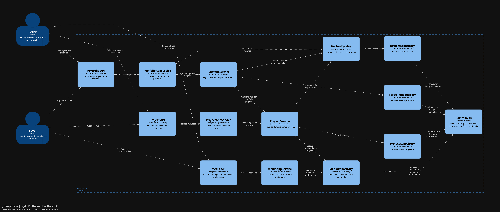

---

#### 2.6.5.6. Bounded Context Software Architecture Code Level Diagrams

##### 2.6.5.6.1. Bounded Context Domain Layer Class Diagrams

El diagrama de clases del dominio del Portfolio BC(Bounded Context) muestra las principales entidades y servicios de 
negocio. Mediante el bounded context Portfolio que contiene múltiples Projects, el cual puede tener múltiples Media y 
Reviews. Asimismo cuenta con servicios como PortfolioService, ProjectService y ReviewService, que aplican reglas de 
negocio, coordinan relaciones entre entidades y mantienen la consistencia del agregado.

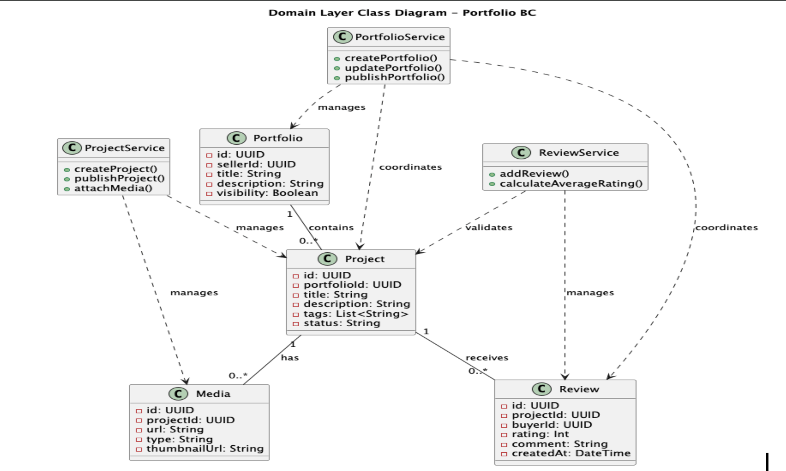

##### 2.6.5.6.2. Bounded Context Database Design Diagram

Este diagrama de base de datos detalla las tablas para el sistema de gestión de portafolios. Muestra la tabla central 
portfolios relacionada con projects, media y reviews, estableciendo la estructura para administrar portafolios de 
vendedores, proyectos publicados, archivos multimedia y reseñas de compradores.
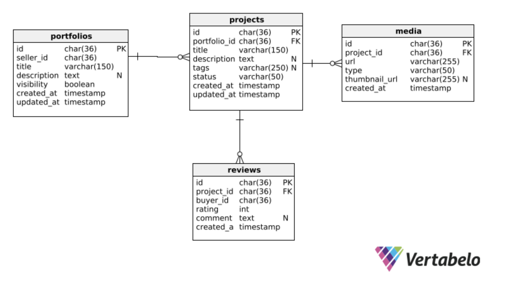

# Capítulo III: Solution UI/UX Design
## 3.1. Product design
### 3.1.1. Style Guidelines

En esta parte, presentaremos el plan que hemos creado para definir el diseño, los estilos y el aspecto visual de nuestro sitio web y de las páginas de la aplicación. Nuestro objetivo es ofrecer a los usuarios una interfaz intuitiva y agradable. Para lograrlo, hemos optado por incorporar elementos visuales que sean claros y visualmente atractivos, además de establecer límites que eviten el uso de gráficos que puedan resultar poco estéticos.

#### 3.1.1.1. General Style Guidelines

**Colores**

La selección de colores en esta guía tiene un papel clave en asegurar una identidad visual coherente, accesible y atractiva. Los tonos principales como GigU Primary (#16335A) y GigU Primary Light (#2F94DA) establecen una base sólida para la marca, mientras que colores como Semantic/Red (#DC1010) y los tonos neutros (White #FFFFFF, Neutral/White #F0F0F3, Empty/Gray #C4C4C4) refuerzan la jerarquía visual, la legibilidad y la claridad en la comunicación. Por su parte, los colores de texto como Text/DarkGray (#838383) y Text/Black (#1B1B1B) aseguran una lectura óptima. En conjunto, esta paleta está diseñada para facilitar una experiencia visual armoniosa y efectiva en todos los puntos de contacto.

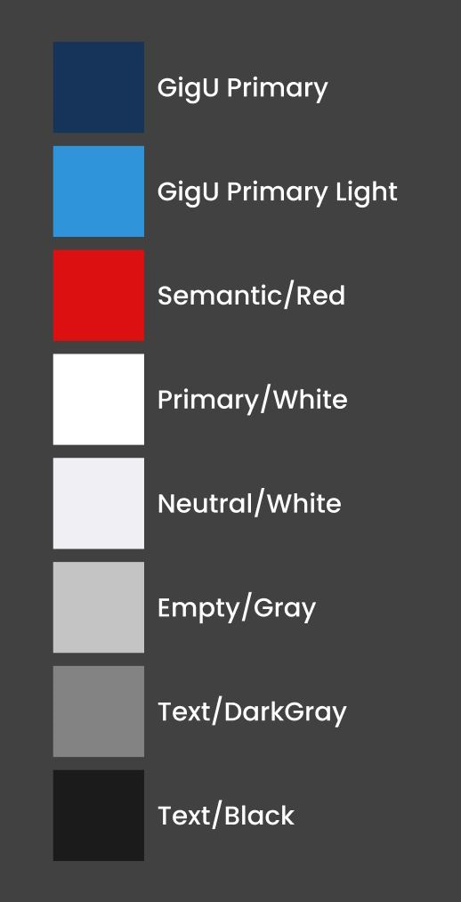

**Tipografía**

La tipografía seleccionada para esta identidad visual es Poppins, una fuente moderna y versátil que contribuye significativamente a la claridad, coherencia y estilo del contenido. Su diseño geométrico y equilibrado facilita la lectura en diferentes tamaños y dispositivos, al mismo tiempo que aporta una apariencia profesional y contemporánea. Definir su uso en términos de tamaños, pesos y espaciados permite mantener una jerarquía visual clara y una experiencia de usuario uniforme. En conjunto, el uso de Poppins refuerza la personalidad de la marca y mejora la comunicación visual de forma consistente y efectiva.

**Tono de comunicación y lenguaje aplicado**

El tono de comunicación es un elemento clave dentro del sistema de estilos, ya que define la forma en que la marca se expresa y se relaciona con su audiencia. Determinar si el tono será formal, cercano, técnico o amigable influye directamente en cómo se interpreta el mensaje y en la conexión emocional que se genera. Asimismo, el lenguaje utilizado —incluyendo la selección de palabras, la estructura de las frases y el nivel de complejidad— contribuye a lograr una comunicación clara, accesible y alineada con la identidad de la marca. Establecer estas pautas asegura una experiencia coherente y efectiva en todos los canales y puntos de contacto.

### 3.1.2. Information Architecture
#### 3.1.2.1. Organization Systems
- **Jerárquico:** La información está organizada de mayor a menor importancia  
* Encabezado (navegación)  
* Hero Section  
* Sección de confianza  
* Sobre Nosotros  
* Servicios  
* Clientes  
* Contacto

- **Modular y Seccional:** Cada área está contenida en su propio  
* Presenta clases semánticas (about-section, services-section, etc.)

#### 3.1.2.2. Labelling Systems

* **Menú principal:**  
  Inicio, Nosotros, Servicios, Clientes, Contacto.  
    
* **Botones de acción:**  
  “Explorar más”, “Ver más”, “Enviar correo”.  
    
* **Formulario:**  
  Campos etiquetados por placeholder: Nombre, Correo, Contraseña.

#### 3.1.2.3. SEO Tags and Meta Tags
**3.1.2.3. SEO Tags and Meta Tags**

* **Meta Tags presentes:**  
  HTML, CopiarEditar, \<title\>GigU \- Soluciones Web\</title\>  
    
* **Mejoras Sugeridas:**  
  Añadir una descripción clara del negocio. Etiquetas, og:image, entre otras para redes sociales. Uso de etiquetas semánticas como “,,,” para SEO técnico

#### 3.1.2.4. Searching Systems
**3.1.2.4. Searching Systems**

* **Buscador en la landing page y header:**  
  Filtro por tipo de aplicación o categoría (administrativas, educativas, gestión). Resultados ordenados por coincidencia y fecha

#### 3.1.2.5. Navigation Systems

* **Navegación superior:**  
  Menú fijo con links anclados (\#nosotros, \#servicios, etc.). Botón de llamada a la acción “Empezar”.  
    
* **Flujo lógico:**  
  Registro/Login primero → Página principal después.

* **Internacionalización:**  
  Sitio en español; estructura preparada para multilenguaje si se extiende.  
    
* **Footer con navegación secundaria:**  
  WhatsApp, Email, Dirección, y redes sociales como Facebook, Instagram y LinkedIn.  
    
* **Estructura modular:**  
  WhatsApp, Email, Dirección, y redes sociales como Facebook, Instagram y LinkedIn.

### 3.1.3. Landing Page UI Design
En esta sección se detalla la propuesta de diseño de interfaz de usuario (UI) para la Landing Page, alineada con las decisiones previas sobre diseño y arquitectura de información. La propuesta busca equilibrar estética, funcionalidad y accesibilidad, asegurando una experiencia intuitiva para distintos tipos de usuarios y dispositivos.

El diseño parte de una estructura jerárquica clara, que responde a los objetivos de comunicación y conversión del sitio. Se aplicaron principios de diseño visual como consistencia, contraste, alineación y proximidad. Además, se tuvo en cuenta el diseño inclusivo, implementando elementos accesibles y adaptativos, asegurando que todos los usuarios puedan interactuar de manera efectiva con la interfaz.

#### 3.1.3.1. Landing Page Wireframe

En esta sección se presentan los wireframes de la Landing Page.
Los wireframes representan la estructura funcional del sitio sin aplicar aún el diseño visual final. Se enfocan en mostrar la jerarquía de la información, la distribución de los bloques de contenido y la navegación esperada del usuario.

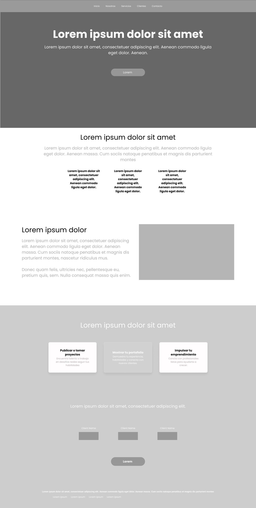

#### 3.1.3.2. Landing Page Mock-up

A partir de los wireframes, se desarrollaron los mock-ups con el diseño visual final, aplicando el Design System definido para los productos digitales del proyecto. 
Los mock-ups integran los elementos visuales (tipografías, colores, íconos, imágenes) y componentes interactivos, respetando la identidad visual y los principios de accesibilidad.

### 3.1.4. Mobile Applications UX/UI Design

Esta sección presenta la propuesta de diseño de experiencia de usuario (UX) e interfaz de usuario (UI) para las aplicaciones móviles que conforman la experiencia digital del producto. La propuesta busca ofrecer una navegación intuitiva, eficiente y accesible, que garantice una experiencia positiva desde cualquier dispositivo móvil.
Se tuvo en cuenta el comportamiento del usuario en entornos móviles, priorizando la usabilidad con una estructura de navegación clara, flujos de usuario optimizados, retroalimentación visual y componentes táctiles accesibles. El diseño también está basado en principios de diseño inclusivo y en el Design System establecido previamente para mantener coherencia visual entre todas las plataformas digitales del producto.

#### 3.1.4.1. Mobile Applications Wireframes

En esta sección se presentan los wireframes de las aplicaciones móviles en baja fidelidad, los cuales permiten visualizar la estructura y navegación de la app sin incluir aún el diseño visual definitivo.
Los wireframes muestran las principales pantallas y flujos de interacción clave dentro de la aplicación. Estos incluyen elementos fundamentales como la pantalla de inicio, login/register, navegación principal, pantalla de contenido o servicios, y los llamados a la acción (CTA) más relevantes.

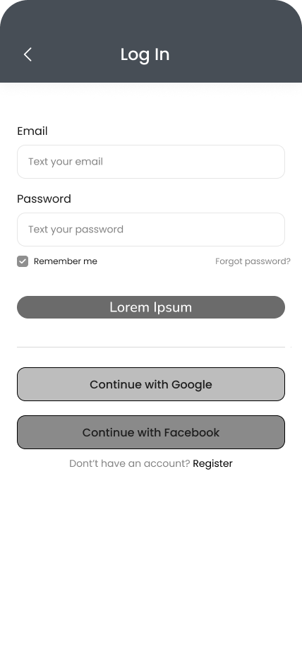
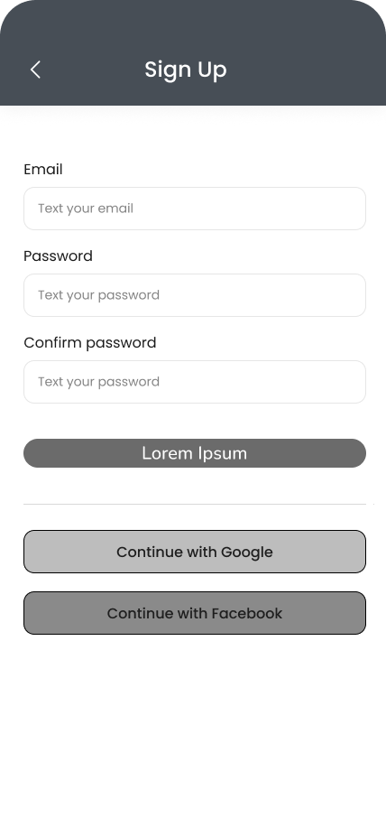
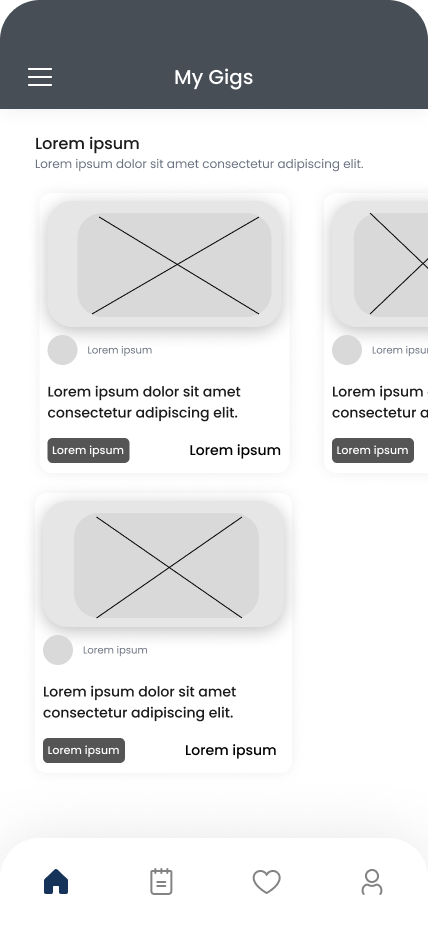
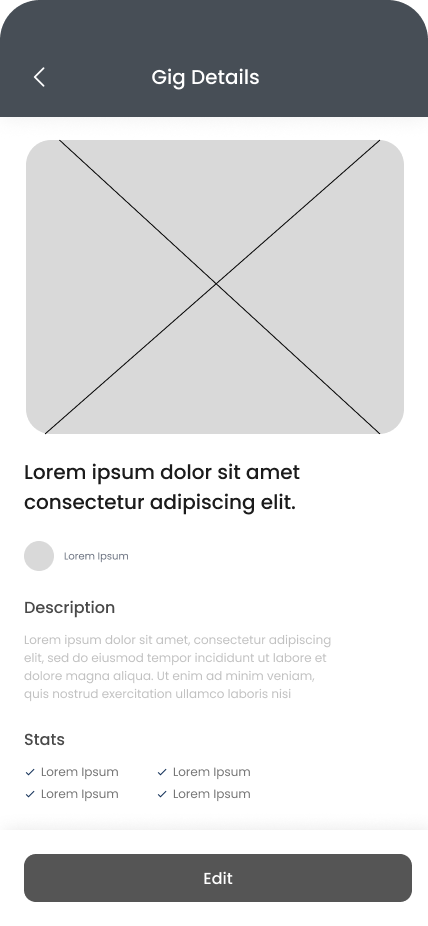

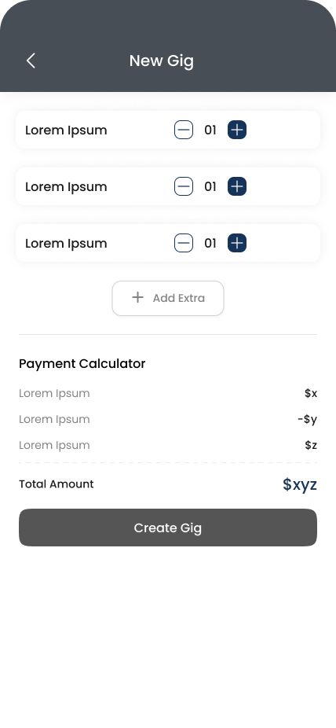
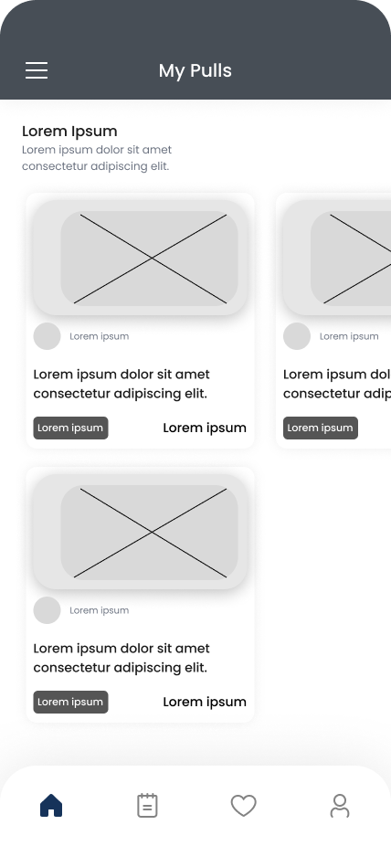
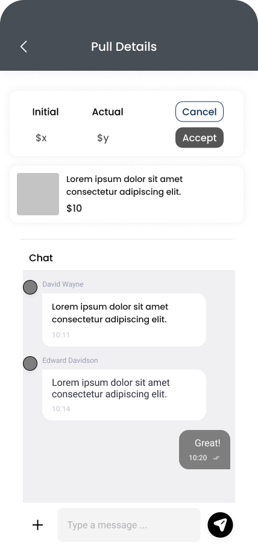


#### 3.1.4.2. Mobile Applications Wireflow Diagrams
En este espacio se muestran los flujos de navegación entre las pantallas de la Mobile Application, resaltando las interacciones de los usuarios con los elementos que se muestran en cada vista. Asimismo se detallan los cambios de pantalla y de estado que ocurre según las acciones realizadas en la interfaz.

**User goal:** Como nuevo usuario, quiero registrarme para usar GigU.


El usuario accede a la aplicación GigU e ingresa a la pantalla de inicio de sesión o registro. Luego selecciona en crear cuenta y se muestra un formulario para completar sus datos personales y es redirigido según su tipo de usuario

**User goal:** Como freelancer, quiero publicar y administrar mis servicios ofrecidos a los clientes


El usuario crea un nuevo servicio y es dirigido a un form de selección, donde completa datos adicionales al servicio y crea el servicio. Seguidamente puede revisar los servicios que publico anteriormente, así como ver los detalles de cada servicio.

**User goal:** Como freelancer, quiero personalizar mi perfil.


El usuario se dirige al botón del icono de user, donde es dirigido a su perfil, espacio donde encuentra la opción de personalizar perfil y es dirigido a un espacio donde edita sus datos personales.

**User goal:** Como freelancer, quiero visualizar las solicitudes de contratación y negociar en tiempo real.


El usuario recibe las solicitudes de contratación por parte de un cliente, entonces visualiza los detalles de la solicitud, además de poder aceptar o cancelar. Asimismo puede tener una conversación mediante un chat con el cliente, de esta forma acordar detalles o negociar mediante un diálogo a tiempo real.

**User goal:** Como cliente, quiero visualizar las distintas opciones sobre servicios publicados y seleccionarlas para evaluar su contratación.


El usuario al estar en la pantalla principal puede visualizar los servicios publicados por los freelancers que pueda considerar adecuados según sus necesidades, al seleccionar en un servicio es dirigido a una pantalla donde puede ver los detalles y realizar la contratación del servicio.

**User goal:** Como cliente, quiero negociar un servicio ofrecido por un freelancer.


El usuario, al seleccionar un servicio tiene opción de negociar, por lo que es dirigido a una pantalla donde modifica el precio recomendado según su presupuesto y puede dialogar con el freelancer para llegar a un acuerdo. Además, puede cancelar el servicio si lo considera necesario.

#### 3.1.4.3. Mobile Applications Mock-ups

En esta sección se presentan los mock-ups finales de la aplicación móvil, tanto en alta fidelidad como aplicando el Design System definido para los productos digitales. Los mock-ups muestran la apariencia visual definitiva de la interfaz, incorporando elementos gráficos, tipografías, iconografía, colores, y estilos interactivos, todos alineados con los principios de usabilidad y diseño inclusivo.
Los diseños están optimizados para dispositivos móviles, priorizando la accesibilidad, la estética visual, la consistencia entre pantallas y la facilidad de navegación por parte del usuario.


#### 3.1.4.4. Mobile Applications User Flow Diagrams
Las siguiente User Flow se desarrollaron según los Wireflows anteriormente definidos y muestran la secuencia de pasos que los usuario realizarán en la aplicación.

**User goal:** Como nuevo usuario, quiero registrarme para usar GigU.


El usuario ingresa a la aplicación GigU e ingresa a la plataforma como usuario registrado si tiene una cuenta, si en caso no lo tiene, ingresa a registrarse. Seguidamente se registra completando un form con sus datos y escoge un rol, si es cliente, es dirigido a la pantalla de perfil Cliente, si no es cliente, es dirigido a la pantalla de perfil Freelancer.

**User goal:** Como freelancer, quiero publicar y administrar mis servicios ofrecidos a los clientes


El Freelancer puede visualizar y gestionar sus servicios publicados, si quiere agregar uno más, crea un nuevo gig y es dirigido a una pantalla donde completa la información relacionada al servicio, así como agrega información adicional. Como siguiente paso debe decidir si confirmar la creación del servicio, dando oportunidad de rehacer sus decisiones si lo considera pertinente, si cancela es dirigido a la primera pantalla para verificar que cambió hacer o cancelar completamente, si acepta la creación es dirigido a una pantalla donde se muestra el gig publicado

**User goal:** Como freelancer, quiero personalizar mi perfil.


El Freelancer accede a la plataforma y es dirigido a la pantalla inicial, selecciona el botón con icono de user y se muestra el perfil del usuario, toma la decisión de editar su información personal, así como la configuración de la información pública como los servicios.

**User goal:** Como freelancer, quiero visualizar las solicitudes de contratación y negociar en tiempo real.


El Freelancer navega en sus gigs y puede visualizar las pulls que tiene seleccionando la opción de My Pulls, donde visualiza las solicitudes de contratación y al seleccionar en alguna, se le dirige a un pull, donde un cliente negocia el precio, así como negociar si el caso lo requiere. Si el Freelancer acepta, continúa con la negociación, pero si el Freelancer cancela, es dirigido a la pantalla My Pulls

**User goal:** Como cliente, quiero visualizar las distintas opciones sobre servicios publicados y seleccionarlas para evaluar su contratación.


El cliente ingresa a la plataforma y visualiza los diversos gigs publicados por los Freelancer en la pantalla Gigs, donde puede buscar a un Freelancer en específico o escoger un servicio publicado por algun Freelancer, si encuentra a un usuario, es dirigido a la pantalla Seller Account, donde puede visualizar el perfil del Freelancer y sus servicios publicados. Si no lo encuentra, regresa a la pantalla Gigs, donde al seleccionar un servicio publicado, es dirigido a la información del Gig, para conocer más sobre el servicio .

**User goal:** Como cliente, quiero negociar un servicio ofrecido por un freelancer.


El cliente al seleccionar en comprar un gig, es dirigido a la pantalla My Pulls, donde visualiza los pulls que ha iniciado, así como el pull que se realiza al escoger un servicio, al seleccionar el pull que inicio, es dirigido a la pantalla Pull Details, donde modifica el precio recomendado según su presupuesto, si en caso llega a negociar, continua con el chat iniciado con el Freelancer involucrado, si en caso cancela la negociación, es redirigido a la pantalla My Pulls para seleccionar otro pull que inicio anteriormente y poder ver el estado de la misma.

#### 3.1.4.5. Mobile Applications Prototyping

Tenemos 3 starting points:

Register/Login

SellerPath

BuyerPath

[Figma Prototyping](https://www.figma.com/proto/e9rRUYfYEnuXsDprZFbRJh/GigU-Mobile?node-id=1-807&p=f&t=2Hq2t1l8xhwXIZt4-0&scaling=min-zoom&content-scaling=fixed&page-id=0%3A1&starting-point-node-id=1%3A1330&show-proto-sidebar=1)

# Capítulo IV: Product Implementation & Validation
## 4.1. Software Configuration Management
### 4.1.1. Software Development Environment Configuration
Se detallan las herramientas de software utilizadas durante el desarrollo de nuestro proyecto.

* Gestión de Proyectos  
- **WhatsApp**: [https://www.whatsapp.com](https://www.whatsapp.com)   
  Utilizamos WhatsApp como canal principal de comunicación para coordinar tareas, compartir ideas y brindar soporte entre los miembros del equipo durante todo el proceso de desarrollo.

* Diseño UX/UI del Producto  
- **Miro:** [https://miro.com/es/](https://miro.com/es/)   
  Se empleó Miro para la elaboración del Lean UX Canvas y To-Be Scenario Mapping, el cual nos ayudó a visualizar los aspectos estratégicos del diseño centrado en el usuario.  
    
- **Uxpressia:** [https://uxpressia.com/](https://uxpressia.com/)   
  Con esta herramienta desarrollamos las User Personas, Mapas de Empatía y Journey Maps, facilitando así el entendimiento profundo de nuestros usuarios.  
    
- **Figma:** [https://www.figma.com/](https://www.figma.com/)   
  Figma fue nuestra herramienta principal para crear wireframes, wireflows, prototipos y maquetas de la landing page y las aplicaciones web.

* Desarrollo de Software  
- **Landing Page**:  
  La página principal del proyecto fue desarrollada utilizando tecnologías estándar como HTML5, CSS y JavaScript.

* Pruebas de Software  
- **Navegador**:  
  Las pruebas del sitio web y la aplicación se llevaron a cabo mediante las herramientas de desarrollo integradas en los navegadores Google Chrome, Brave, Opera y Edge.

* Entornos de Desarrollo (IDE)  
- **Android Studio:** [https://developer.android.com/?hl=es-419](https://developer.android.com/?hl=es-419)   
  Android Studio fue nuestro IDE utilizado para el desarrollo de nuestra aplicación móvil.

* Despliegue de Software  
- **GitHub Pages**: [https://pages.github.com/](https://pages.github.com/)   
  Nuestra landing page fue desplegada a través de GitHub Pages, lo que permitió una publicación automatizada desde el repositorio.

* Documentación de Software  
- **Google Docs**: [https://docs.google.com/document](https://docs.google.com/document)   
  Google Docs nos permitió hacer seguimiento de tareas y compartir información relevante entre los integrantes del equipo.  
    
- **GitHub**: [https://github.com/](https://github.com/)   
  GitHub fue clave para la documentación colaborativa del proyecto, permitiendo la trazabilidad de cambios mediante commits y GitFlow.

### 4.1.2. Source Code Management
Establecimos un repositorio en GitHub para lograr un avance centralizado de nuestro proyecto, la estructura del repositorio fue la siguiente.

* Organización  
- **Repositorio en GitHub**: [https://github.com/1ACC0238-14649-Final-Project](https://github.com/1ACC0238-14649-Final-Project)   
    
- **Landing Page:** 

* Ramas Principales  
- **Rama main**:  
  Contiene la versión estable del proyecto, lista para ser puesta en producción.  
    
- **Rama docs/**:  
  Rama destinada a la integración de nuevas funcionalidades antes de ser lanzadas.

### 4.1.3. Source Code Style Guide & Conventions
Se adoptaron una serie de convenciones específicas para cada tecnología utilizada en el proyecto con el objetivo de mantener legibilidad, coherencia y calidad del código.

* Landing Page  
- HTML  
- Tipo de Documento: Cada archivo HTML inicia con \<\!DOCTYPE html\> para asegurar su correcta interpretación por los navegadores.  
    
- Etiquetas en Minúsculas: Todas las etiquetas y atributos se escriben en minúscula.  
    
- Cierre Correcto de Etiquetas: Nos aseguramos de cerrar todas las etiquetas, incluso las opcionales, para mantener una estructura clara y evitar errores.  
    
- Atributos entre Comillas: Los valores de los atributos siempre están entre comillas dobles.  
    
- Imágenes Accesibles: Incluimos los atributos alt, width y height en las imágenes, lo cual mejora tanto la accesibilidad como el diseño adaptable.  
    
- Formato Limpio en Atributos: No se colocan espacios alrededor del signo igual, por ejemplo.  
    
- Uso del Elemento \<title\>: No se omite el título de la página, ya que es fundamental para el SEO y la accesibilidad.  
    
- Idioma y Codificación: Se declara el idioma con el atributo lang.  
    
- CSS  
- **Recursos Seguros**: Todos los recursos externos, como fuentes y multimedia, se cargan mediante HTTPS.  
    
- **Nombres en minúsculas**: Los selectores, propiedades y valores se escriben en minúsculas para mantener un estilo uniforme.  
    
- **Nombres de Clase Descriptivos**: Las clases CSS reflejan su función usando palabras clave separadas por guiones.  
    
- **Propiedades Abreviadas**: Se aplican propiedades abreviadas siempre que sea posible para optimizar el tamaño del código.  
    
- **Orden Alfabético**: Las propiedades CSS dentro de un bloque se ordenan alfabéticamente para facilitar la lectura y mantenimiento.  
    
- **Uso Consistente del Punto y Coma**: Cada línea termina con un punto y coma para evitar errores de interpretación.  
    
- **Espaciado Uniforme**: Se mantiene un espacio después de los dos puntos y dentro de las llaves de los bloques.  
    
- **Comillas en Atributos**: Los valores como fuentes están entre comillas simples.

### 4.1.4. Software Deployment Configuration

## 4.2. Landing Page & Mobile Application Implementation
### 4.2.1. Sprint 1
#### 4.2.1.1. Sprint Planning 1

*  Sprint Details

| Field | Value |
| :---: | :---: |
| Sprint Number | Sprint 1 |
| Date | 13 de Septiembre de 2025 |
| Time | 17:20 PM |
| Location | Modalidad remota |
| Prepared By | GigU |
| Attendees | Todos los miembros del equipo |

* Sprint Overview

**Previous Sprint Summary:**  
Para el Sprint 0, el equipo organizó reuniones para coordinar el tema a elegir y recolectar la información necesaria para la documentación del trabajo del curso.

**Sprint Goal:**  
Para el Sprint 1, buscamos desarrollar y desplegar una landing page funcional que cumpla con todas las historias de usuario especificadas para la interacción inicial con clientes y presentación del producto.

**Technical Specifications:**

| Aspect | Details |
| :---: | :---: |
| Duration | 25 de Agosto \- 20 de Septiembre de 2025 |
| Team Capacity | 120 horas totales |
| Tech Stack |  |
| Velocity | \# |
| Total Story Points | \# |

#### 4.2.1.2. Sprint Backlog 1
**Objetivo:** Desarrollar y desplegar una landing page funcional que cumpla con todas las historias de usuario especificadas para la interacción inicial con clientes y presentación del producto.

**Alcance:**

* Implementar barra de navegación responsive  
* Crear componentes de llamada a la acción (CTA)  
* Desarrollar sección de beneficios del servicio  
* Construir tarjetas interactivas de servicios  
* Implementar funcionalidad de preguntas frecuentes (FAQ)  
* Colocar los nuevos puntos a la documentación del trabajo

**Duración:** 25 de Agosto \- 20 de Septiembre de 2025

**Capacidad de equipo:** 120 horas totales \- 5 integrantes

**Requisitos técnicos:** Android Studio, JetPack Compose, Figma

| Task ID | User Story | Description | Assigned To | Estimated Hours | Status | Epic |
| :---: | :---: | :---: | :---: | :---: | :---: | :---: |
| T01 | US01 | Implementar barra de navegación responsive | Mariano Moises Oblitas Davila | 5 | Completed | EP01 |
| T02 | US01 | Diseñar componentes de navegación en Figma	 | Diego Alonso Cacho Seminario | 3 | Completed | EP01 |
| T03 | US02 | Desarrollar botones CTA principales | Carlos Fredy Fernández Camayo | 4 | Completed | EP02 |
| T04 | US08 | Crear contenido de sección de beneficios | Irving Washington Allcca Guerrero | 2 | Completed | EP04 |
| T05 | US08 | Implementar interfaz de tarjetas de beneficios | Adrian Ricardo Donayre Alvarez | 6 | Completed | EP04 |
| T06 | US11 | Diseñar tarjetas de servicios | Mariano Moises Oblitas Davila | 4 | Completed | EP04 |
| T07 | US11 | Programar interactividad de tarjetas | Diego Alonso Cacho Seminario | 5 | Completed | EP04 |
| T08 | US12 | Investigar y compilar preguntas frecuentes	 | Irving Washington Allcca Guerrero | 3 | Completed | EP05 |
| T09 | US12 | Implementar acordeón de FAQ | Irving Washington Allcca Guerrero | 5 | Completed | EP05 |

#### 4.2.1.3. Development Evidence for Sprint Review
En el alcance del sprint 1 se ha desarrollado el landing page como primera instancia, por lo que no se evidencia testeo de servicios o interacciones.

#### 4.2.1.4. Testing Suite Evidence for Sprint Review
En la presente entrega del Sprint 1 no se incluye esta sección debido a que se realizó principalmente la Landing Page. Este se consiguió realizar correctamente teniendo en cuenta las necesidades de nuestros usuarios.

#### 4.2.1.5. Execution Evidence for Sprint Review

#### Sección principal: Conecta, Colabora y Crea

#### Sección “Por qué elegir GigU”

#### Sección “Qué puedes hacer en GigU”

#### 4.2.1.6. Services Documentation Evidence for Sprint Review
En el primer Sprint solamente se ha desarrollado la Landing Page por lo que no se ha hecho uso de servicios web.

#### 4.2.1.7. Software Deployment Evidence for Sprint Review
En nuestro primer sprint logramos desplegar la landing page. Esto lo logramos en la herramienta Firebase.

**Landing page desplegada**: [https://1acc0238-14649-final-project.github.io/landing/#inicio](https://1acc0238-14649-final-project.github.io/landing/#inicio)

#### 4.2.1.8. Team Collaboration Insights during Sprint
\*img git flow\*

### 4.2.2. Sprint 2
#### 4.2.2.1. Sprint Planning 2
*  Sprint Details

| Field | Value |
| :---: | :---: |
| Sprint Number | Sprint 1 |
| Date | 01 de Octubre de 2025 |
| Time | 14:40 PM |
| Location | Modalidad remota |
| Prepared By | GigU |
| Attendees | Todos los miembros del equipo |

* Sprint Overview

**Previous Sprint Summary:**  
Para el Sprint 1, buscamos desarrollar y desplegar una landing page funcional que cumpla con todas las historias de usuario especificadas para la interacción inicial con clientes y presentación del producto.

**Sprint Goal:**  
Para el Sprint 2, buscamos desarrollar y desplegar una nuestro backend y frontend funcional que cumpla con todas las historias de usuario especificadas para la interacción inicial con clientes y presentación del producto.

**Technical Specifications:**

| Aspect | Details |
| :---: | :---: |
| Duration | 01 de octubre \- 10 deoctubre de 2025 |
| Team Capacity | 130 horas totales |
| Tech Stack | Android Studio, Kotlin, Jetpack Compose (M3), Navigation, Hilt, Coroutines/Flow, DataStore, Retrofit (stub), Coil, FCM (mock), JUnit/MockK, ktlint/detekt, GitHub Actions |
| Velocity | 38 |
| Total Story Points | 38 |
#### 4.2.2.2. Sprint Backlog 2
| Task ID | User Story |                            Description                            |            Assigned To            | Estimated Hours |   Status  | Epic |
| :-----: | :--------: | :---------------------------------------------------------------: | :-------------------------------: | :-------------: | :-------: | :--: |
|   T01   |    US01    |             Implementar barra de navegación responsive            |   Mariano Moises Oblitas Davila   |        5        | Completed | EP01 |
|   T02   |    US01    |             Diseñar componentes de navegación en Figma            |    Diego Alonso Cacho Seminario   |        3        | Completed | EP01 |
|   T03   |    US02    |                Desarrollar botones CTA principales                |   Carlos Fredy Fernández Camayo   |        3        | Completed | EP02 |
|   T04   |    US08    |              Crear contenido de sección de beneficios             | Irving Washington Allcca Guerrero |        2        | Completed | EP04 |
|   T05   |    US08    |           Implementar interfaz de tarjetas de beneficios          |   Adrian Ricardo Donayre Alvarez  |        5        | Completed | EP04 |
|   T06   |    US11    |                   Diseñar tarjetas de servicios                   |   Mariano Moises Oblitas Davila   |        3        | Completed | EP04 |
|   T07   |    US11    |                Programar interactividad de tarjetas               |    Diego Alonso Cacho Seminario   |        5        | Completed | EP04 |
|   T08   |    US12    |             Investigar y compilar preguntas frecuentes            | Irving Washington Allcca Guerrero |        3        | Completed | EP05 |
|   T09   |    US12    |                    Implementar acordeón de FAQ                    | Irving Washington Allcca Guerrero |        5        | Completed | EP05 |
|   T10   |    US03    |         Both_Sign Up: UI + validaciones, errores y loading        |   Mariano Moises Oblitas Davila   |        5        |   Completed  | EP01 |
|   T11   |    US03    |     Persistencia de sesión (DataStore) + interceptor de sesión    |   Mariano Moises Oblitas Davila   |        3        |   Completed   | EP01 |
|   T12   |    US04    |        Both_Log In: selector de rol y routing a Buyer_Gigs        |   Mariano Moises Oblitas Davila   |        6        |   Completed   | EP01 |
|   T13   |    US06    |           Flujo “Olvidé mi contraseña” (mock) + feedback          |   Mariano Moises Oblitas Davila   |        3        |   Completed   | EP01 |
|   T14   |    US07    |        Restablecer contraseña (mock) + estados éxito/error        |   Mariano Moises Oblitas Davila   |        3        |   Completed   | EP01 |
|   T15   |    US25    |     Buyer_Gigs: búsqueda por keyword con lista paginada (mock)    |   Adrian Ricardo Donayre Alvarez  |        6        |   Completed   | EP02 |
|   T16   |    US26    |                  Chips de filtros por habilidades                 |   Adrian Ricardo Donayre Alvarez  |        4        |   Completed   | EP02 |
|   T17   |    US29    |         Ordenar por relevancia/calificación (client-side)         |   Adrian Ricardo Donayre Alvarez  |        3        |   Completed   | EP02 |
|   T18   |      —     |            Data layer: interfaces de repos + mocks JSON           | Irving Washington Allcca Guerrero |        6        |   Completed   | EP02 |
|   T19   |      —     |    Diseño Figma: Buyer_Gigs, Gig_Detail, Peek_Seller (estados)    |    Diego Alonso Cacho Seminario   |        4        |   Completed   | EP02 |
|   T20   |    US30    |  CTA **Contratar** en Buyer_Gig_Detail con sheet de confirmación  |   Adrian Ricardo Donayre Alvarez  |        6        |   Completed   | EP03 |
|   T21   |    US31    |   Pantalla de **Confirmación** con ID de orden y estado inicial   |   Adrian Ricardo Donayre Alvarez  |        4        |   Completed   | EP03 |
|   T22   |    US24    |       Uploader (máx 3 imágenes/archivos) previo a contratar       |   Adrian Ricardo Donayre Alvarez  |        5        |   Completed   | EP03 |
|   T23   |    US27    |       Slider de **precio** + rango persistente en Buyer_Gigs      |   Adrian Ricardo Donayre Alvarez  |        4        |   Completed   | EP02 |
|   T24   |    US28    |      Chips de **experiencia** (Junior/Mid/Senior) combinables     |   Adrian Ricardo Donayre Alvarez  |        3        |   Completed   | EP02 |
|   T25   |    US39    |             Sección **Ratings** en Peek_Seller_Account            | Irving Washington Allcca Guerrero |        5        |   Completed   | EP06 |
|   T26   |    US41    |         **Calificar al Cliente** desde cierre de proyecto         | Irving Washington Allcca Guerrero |        4        |   Completed   | EP06 |
|   T27   |    US33    |           Buyer_Account: **Historial de contrataciones**          |    Diego Alonso Cacho Seminario   |        4        |   Completed   | EP07 |
|   T28   |    US34    | **Proyectos activos** con estado (Solicitado/En curso/Finalizado) |    Diego Alonso Cacho Seminario   |        5        |   Completed   | EP07 |
|   T29   |      —     |       Buyer_Pull_Detail: vista mínima de orden con timeline       | Irving Washington Allcca Guerrero |        4        |   Completed   | EP03 |
#### 4.2.2.3. Development Evidence for Sprint Review
Durante el Sprint 2, se completó el desarrollo de múltiples funcionalidades clave del sistema, tanto en el backend como en el frontend. Todo el equipo participó activamente en la implementación, asegurando la entrega de 38 puntos de historia.

**Evidencias de desarrollo:**

* **Frontend (Android Studio):**

  * Pantallas desarrolladas: `Buyer_Gigs`, `Gig_Detail`, `Buyer_Account`, `Buyer_Pull_Detail`, entre otras.
  * Funcionalidades implementadas: login, registro, carga de gigs y pulls.
  * Interactividad, navegación y persistencia de sesión fueron programadas exitosamente.

* **Backend (Desplegado en Azure):**

  * Módulos implementados y documentados vía Swagger:
    * Briefcase
    * Chat
    * Gig
    * Pull
    * User
  * API REST disponible: [Backend API - Swagger](https://gigu-backend-webapp-hzbrd3guaghphmam.canadacentral-01.azurewebsites.net/index.html)

* **Diseño UI/UX en Figma:**
  [Figma Mobile Applications Prototyping](https://www.figma.com/proto/e9rRUYfYEnuXsDprZFbRJh/GigU-Mobile?node-id=1-807&p=f&t=2Hq2t1l8xhwXIZt4-0&scaling=min-zoom&content-scaling=fixed&page-id=0%3A1&starting-point-node-id=1%3A1330&show-proto-sidebar=1)
    
#### 4.2.2.4. Testing Suite Evidence for Sprint Review
En esta entrega aun no se realizo aun ya que solo es el avanze de las pantallas core para nuestro sector Buyer.

#### 4.2.2.5. Execution Evidence for Sprint Review
Todas las tareas del backlog del Sprint 2 fueron completadas dentro del periodo establecido (01 al 10 de octubre de 2025), alcanzando una **velocidad de 38 puntos**, lo que representa una cobertura del 100% del backlog planeado.

**Evidencias de ejecución:**

* Registro completo en la tabla de backlog (T01-T29), todas las tareas marcadas como **Completed**.
* Coordinación efectiva en modalidad remota.
* Participación activa de todos los miembros según sus roles asignados.
* El backend fue desplegado exitosamente en Azure con base de datos funcional conectada.
* El frontend fue actualizado integrando múltiples funcionalidades listas para la demo.

#### 4.2.2.6. Services Documentation Evidence for Sprint Review
Para el segundo sprint planemos desplegar el backend en su totalidad para poder avanzar con el frontend. 
A continuación, la documentación de la API REST de GigU, implementada con Swagger.

#### Módulo Briefcase

#### Módulo Chat

#### Módulo Gig

#### Módulo Pull

#### Módulo User

**API REST**: [https://gigu-backend-webapp-hzbrd3guaghphmam.canadacentral-01.azurewebsites.net/index.html](https://gigu-backend-webapp-hzbrd3guaghphmam.canadacentral-01.azurewebsites.net/index.html)

#### 4.2.2.7. Software Deployment Evidence for Sprint Review
En nuestro segundo sprint logramos desplegar el backend. Esto lo logramos realizar en Azure.

#### 4.2.2.8. Team Collaboration Insights during Sprint
La colaboración del equipo durante el Sprint 2 fue activa, estructurada y enfocada en cumplir los objetivos definidos.

**Aportes clave por miembro:**

* **Irving Allcca Guerrero:**

  * Desarrollo de las vistas `buyer_pull_detail` y `peek_seller_account`.
  * Implementación de acordeón de FAQ y ratings.
  * Participación en la documentación del data layer con mocks JSON.

* **Mariano Moisés Oblitas Dávila:**

  * Encargado del desarrollo de las pantallas de login, registro, restablecimiento de contraseña, y navegación.
  * Despliegue del backend y la base de datos en Azure.
  * Grabación del video de la demo y elaboración de Keynote.
  * Diseño y desarrollo de la landing page: [Landing Page](https://1acc0238-14649-final-project.github.io/landing/)

* **Diego Alonso Cacho Seminario:**

  * Desarrollo de `Buyer_Account` y diseño de componentes en Figma.
  * Corrección de observaciones de TB1 y documentación de capítulos teóricos.

* **Carlos Fredy Fernández Camayo:**

  * Desarrollo de la vista `buyer_my_pulls`.
  * Apoyo en wireframes, wireflows y user flows.

* **Adrián Ricardo Donayre Álvarez:**

  * Desarrollo completo del flujo `Gigs`, incluyendo filtros, chips, slider de precios, paginación, y flujo de contratación.
  * Encargado de la documentación final del Sprint 2 y revisión del TB1.

### 4.2.3. Sprint 3
#### 4.2.3.1. Sprint Planning 3

| Sprint \# | Sprint 3 |
| :---: | :---: |
| **Sprint Planning Background** |  |
| Date | 2025-10-30 |
| Time | 4:30 PM |
| Location | Modalidad remota |
| Prepared By | Equipo GigU |
| Attendees (to planning meeting) | Todos los miembros del equipo |
| Sprint 3 \- 1 Review Summary | Para el Sprint anterior, se desarrolló y desplegó nuestro backend y frontend funcional que cumpla con todas las historias de usuario especificadas para la interacción inicial con clientes y presentación del producto dentro del entorno de Android. |
| Sprint 3 \- 1 Retrospective Summary | Respecto al Sprint anterior, logramos alcanzar el resultado que esperábamos para ese Sprint, sin embargo, consideramos que hubieron secciones que se podrían mejorar. |
| **Sprint Goal & User Stories** |  |
| Sprint 3 Goal | Para el Sprint 3, buscamos desarrollar y desplegar la segunda sección de nuestra aplicación en el entorno de Flutter, buscamos conectar ambas secciones de manera que se puedan comunicar entre sí. |
| Sprint 3 Velocity | \# |
| Sum of Story Points | \# |

#### 4.2.3.2. Sprint Backlog 3

| Sprint \# | Sprint 3 |  |  |  |  |  |  |
| :---: | ----- | :---: | ----- | ----- | :---: | :---: | :---: |
| **User Story** |  | **Work-Item / Task** |  |  |  |  |  |
| Id | Title | Id | Title | Description | Estimation (Hours) | Assigned To | Status (To-do / In-Process / To-Review / Done) |
|  |  |  |  |  |  |  |  |
|  |  |  |  |  |  |  |  |
|  |  |  |  |  |  |  |  |
|  |  |  |  |  |  |  |  |
|  |  |  |  |  |  |  |  |

#### 4.2.3.3. Development Evidence for Sprint Review

| Repository | Branch | Commit ID | Commit Message | Commit Message Body | Committed on (Date) |
| :---: | :---: | :---: | ----- | ----- | :---: |
|  |  |  |  |  |  |
|  |  |  |  |  |  |
|  |  |  |  |  |  |
|  |  |  |  |  |  |
|  |  |  |  |  |  |
|  |  |  |  |  |  |

#### 4.2.3.4. Testing Suite Evidence for Sprint Review

| Repository | Branch | Commit ID | Commit Message | Commit Message Body | Committed on (Date) |
| :---: | :---: | :---: | ----- | ----- | :---: |
|  |  |  |  |  |  |
|  |  |  |  |  |  |
|  |  |  |  |  |  |
|  |  |  |  |  |  |
|  |  |  |  |  |  |
|  |  |  |  |  |  |

#### 4.2.3.5. Execution Evidence for Sprint Review
#### 4.2.3.6. Services Documentation Evidence for Sprint Review
#### 4.2.3.7. Software Deployment Evidence for Sprint Review
#### 4.2.3.8. Team Collaboration Insights during Sprint

### 4.2.4. Sprint 4
#### 4.2.4.1. Sprint Planning 4
#### 4.2.4.2. Sprint Backlog 4
#### 4.2.4.3. Development Evidence for Sprint Review
#### 4.2.4.4. Testing Suite Evidence for Sprint Review
#### 4.2.4.5. Execution Evidence for Sprint Review
#### 4.2.4.6. Services Documentation Evidence for Sprint Review
#### 4.2.4.7. Software Deployment Evidence for Sprint Review
#### 4.2.4.8. Team Collaboration Insights during Sprint

## 4.3. Validation Interviews
### 4.3.1. Diseño de Entrevistas
#### **Segmento objetivo #1: Estudiantes Universitarios Freelancers**

##### **Preguntas personales:**

* ¿Cuál es tu nombre?
* ¿Cuántos años tienes?
* ¿Qué carrera estás estudiando y en qué ciclo te encuentras?
* ¿Qué tipo de servicio ofreces como freelancer?
* ¿Cuánto tiempo llevas trabajando como freelancer?

##### **Preguntas principales:**

* ¿La aplicación te pareció visualmente atractiva? ¿Por qué?
* ¿El diseño se siente moderno y adecuado para usar en un celular?
* ¿Te resultó fácil entender de qué trata la app desde la pantalla principal?
* ¿Hubo alguna parte de la app que te confundió o te hizo dudar?
* ¿Te pareció intuitiva la navegación (botones, menús, gestos)?
* ¿Sentiste que la app responde a tus necesidades como freelancer?
* ¿Qué funciones agregarías o eliminarías para mejorar la experiencia móvil?
* Como freelancer, ¿usarías la aplicación? ¿Por qué sí o por qué no?

#### **Segmento objetivo #2: Personas y Emprendimientos que buscan contratar servicios freelance**

##### **Preguntas personales:**

* ¿Cuál es tu nombre?
* ¿Cuántos años tienes?
* ¿Cuántos años llevas como emprendedor?
* ¿A qué se dedica tu empresa?
* ¿Has contratado previamente a algún freelancer?

##### **Preguntas principales:**

* ¿Qué opinas del diseño general de la aplicación?
* ¿La app te inspira confianza para contratar freelancers? ¿Por qué?
* ¿La navegación te pareció clara y sencilla desde un dispositivo móvil?
* ¿Qué parte de la app te resultó más útil o destacada?
* ¿Qué mejorarías en la organización del contenido o en las funciones?
* ¿Consideras que la app brinda suficiente información para tomar una decisión de contratación?
* ¿Recomendarías la app a otros emprendedores o personas que necesiten contratar freelancers?

### 4.3.2. Registro de Entrevistas

#### **Segmento objetivo #1: Estudiantes Universitarios Freelancers**

Entrevistado N°1: Mario André Cacho Seminario

* Sexo: Masculino  
* Edad: 22  
* Ubicación en la que vive: Lima, Surco

Acerca de la entrevista:

* Instante en el que inicia:   
* Duración: 5:51

Resumen:  
Para Mario, la aplicación es funcional, atractiva y considera que le ayudará mucho en su trabajo al querer realizar publicaciones más generales con el objetivo de tener un alcance mayor al público que busca. Los colores, las posiciones de los botones y el diseño le parece moderno y le agrada la posibilidad de negociar el precio.

Entrevistado N°2: María Fernanda Salazar Vega

* Sexo: Femenino  
* Edad: 30
* Ubicación en la que vive: Lima, San Borja

Acerca de la entrevista:

* Instante en el que inicia: 0:03
* Duración: 8:35

Resumen:  
Para María Fernanda, la aplicación resulta visualmente atractiva, moderna y bien organizada, con un diseño limpio que facilita la lectura y evita la saturación visual. Considera que la navegación es intuitiva y que la distribución de botones e íconos está bien pensada para uso móvil. Destaca que la app comunica claramente su propósito desde la pantalla principal, permitiéndole entender rápidamente que se trata de una plataforma para gestionar y publicar gigs.

Se sintió cómoda explorando las funcionalidades, aunque mencionó una ligera confusión al diferenciar entre elementos informativos y elementos interactivos dentro de los gigs, lo cual sugiere mejorar la distinción visual entre ambos. Aun así, afirma que la aplicación responde adecuadamente a sus necesidades como consultora de marketing digital, especialmente por la facilidad para editar gigs, una tarea frecuente en su campo.

Propone agregar una sección de portafolio más completa y estadísticas de visualización para potenciar el valor profesional de la app. Señala que no eliminaría ninguna función, ya que todas cumplen un rol claro. En general, usaría la aplicación porque le ofrece un canal confiable, sencillo y profesional para conectar con potenciales clientes y mostrar sus servicios.

Entrevistado N°3: Luis Alberto Medina Flores 

* Sexo: Masculino  
* Edad: 43
* Ubicación en la que vive: Lima, San Borja

Acerca de la entrevista:

* Instante en el que inicia: 0:03
* Duración: 8:18

Resumen:  
Para Luis Alberto, la aplicación es visualmente atractiva debido a su diseño sobrio, profesional y bien organizado, lo cual considera fundamental para quienes ofrecen servicios de consultoría. Destaca que los colores, la tipografía y la distribución de elementos transmiten orden y confianza, evitando que la interfaz se sienta cargada.

Señala que el diseño es moderno y muy adecuado para su uso en dispositivos móviles, con botones claramente visibles y una estructura que facilita la lectura. Desde la pantalla principal entendió de inmediato que la app sirve para publicar servicios y conectar con clientes, lo que demuestra claridad en la propuesta de valor.

Aunque tuvo una ligera duda al distinguir entre elementos informativos y elementos interactivos dentro del detalle del gig, comenta que no fue un obstáculo significativo, pero sí una oportunidad de mejora para hacer más evidente esa diferencia. En general, considera que la navegación es intuitiva, con menús simples y respuestas rápidas.

Percibe que la aplicación responde bien a sus necesidades como freelancer, pues permite presentar sus servicios de manera clara y ordenada. Sugiere agregar un portafolio más amplio para fortalecer la credibilidad profesional, pero no eliminaría ninguna función existente porque todas cumplen su propósito.

#### **Segmento objetivo #2: Personas y Emprendimientos que buscan contratar servicios freelance**

### 4.3.3. Evaluaciones según heurísticas
**SITE o APP A EVALUAR:** GIG U

**TAREAS A EVALUAR:**  
El alcance de la siguiente evaluación presenta la revisión de la usabilidad de las presentes tareas:

1. Presentación y Funcionalidad del Landing Page  
2. Registro de un usuario nuevo  
3. Revisión de un Pull  
4. Sección de Perfil

No están incluidas en esta versión de evaluaciones las siguientes tareas:

1. Sistema de mensajería en un Pull  
2. Inicio de Sesión por medio de Terceros  
3. Sistema de Precio Automático

**ESCALA DE SEVERIDAD**  
Se presenta una lista de puntuación para la calificación de las tareas.

| Nivel | Descripción |
| ----- | :---- |
| **1** | Problema superficial: Puede ser fácilmente superado por el usuario y ocurre con muy poca frecuencia. No necesita ser arreglado a no ser que exista disponibilidad de tiempo. |
| **2** | Problema menor: Puede ocurrir un poco más frecuentemente o es un poco más difícil de superar para el usuario. Se le debería asignar una prioridad baja resolverlo de cara al siguiente reléase |
| **3** | Problema mayor: Ocurre frecuentemente o los usuarios no son capaces de resolverlos. Es importante que sean corregidos y se les debe asignar una prioridad alta. |
| **4** | Problema muy grave: Un error de gran impacto que impide al usuario continuar con el uso de la herramienta. Es imperativo que sea corregido antes del lanzamiento. |

**TABLA RESUMEN**

| \# | Problema | Escala de severidad | Heurística/Principio violada(o) |
| :---: | ----- | :---: | ----- |
| **1** | El contenido mostrado en pantalla al presionar el botón de “Nosotros” no se encuentra centrado correctamente. | 1 | Aesthetic and minimalist design. |
| **2** | El contenido mostrado en pantalla al presionar el botón de “Servicios” no se encuentra centrado correctamente. | 1 | Aesthetic and minimalist design. |
| **3** | No se presentan ejemplos de clientes que utilizan “GigU” en la sección de “Clientes”. | 1 | Aesthetic and minimalist design. |
| **4** | Los enlaces al presionar los botones de “Contacto” no redireccionan a otra página. | 2 | Information Architecture: Is it usable? |
| **5** | No existe una validación con caracteres mínimos y/o incompletos para los datos de registro. | 3 | Information Architecture: Is it usable? |
| **6** | Bloqueo lógico en la sección de “Iniciar sesión” luego de registrar un usuario. | 3 | Information Architecture: Is it usable? |
| **7** | No es posible eliminar o cancelar un pull luego de haberlo comprado. | 2 | Information Architecture: Is it usable? |
| **8** | Los botones de “Edit Personal Information” y “Language” en la sección de “Account” no funcionan. | 2 | Information Architecture: Is it usable? |

**DESCRIPCIÓN DE PROBLEMAS**

*PROBLEMA \#1: El contenido mostrado en pantalla al presionar el botón de “Nosotros” no se encuentra centrado correctamente.*

*Severidad: 1*  
*Heurística violada: Aesthetic and minimalist design.*

*Problema:*  
*Al momento de seleccionar el botón de “Nosotros” en el Landing Page, el contenido que se ejemplifica en la sección de “Sobre Nosotros” no se encuentra centrado en la pantalla, cortando parte del subtítulo.*

*Recomendación:*  
*Ajustar el movimiento y/o posición de la cámara al momento de presionar el botón de “Nosotros” para mantener el contenido a mostrar centrado correctamente en la pantalla del usuario.*

*PROBLEMA \#2: El contenido mostrado en pantalla al presionar el botón de “Servicios” no se encuentra centrado correctamente.*

*Severidad: 1*  
*Heurística violada: Aesthetic and minimalist design.*

*Problema:*  
*Al momento de seleccionar el botón de “Servicios” en el Landing Page, el contenido que se ejemplifica en la sección de “Qué puedes hacer en GigU” no se encuentra centrado en la pantalla, cortando parte del subtítulo.*

*Recomendación:*  
*Ajustar el movimiento y/o posición de la cámara al momento de presionar el botón de “Servicios” para mantener el contenido a mostrar centrado correctamente en la pantalla del usuario.*

*PROBLEMA \#3: No se presentan ejemplos de clientes que utilizan “GigU” en la sección de “Clientes”.*

*Severidad: 1*  
*Heurística violada: Aesthetic and minimalist design.*

*Problema:*  
*Al dirigirse hacia la sección de “Emprendimientos y freelancers que ya forman parte de nuestra red” no se presentan ejemplos reales y/o ficticios que demuestran los clientes de la plataforma de GigU.*

*Recomendación:*  
*Colocar el nombre y logo de los clientes reales y/o ficticios que demuestren a los usuarios de GigU que la plataforma es confiable y útil.*

*PROBLEMA \#4: Los enlaces al presionar los botones de “Contacto” no redireccionan a otra página.*

*Severidad: 2*  
*Heurística violada: Information Architecture: Is it usable?*

*Problema:*  
*Al dirigirse hacia la sección de “Emprendimientos y freelancers que ya forman parte de nuestra red” y luego de presionar los enlaces de “Try For Free”, “Facebook”, “Instagram”, “Linkedin” y “Youtube”, estos enlaces no redireccionan hacia alguna página real o de prueba.*

*Recomendación:*  
*Redireccionar al usuario hacia las páginas indicadas en los botones ya sea creando páginas ficticias para demostrar el uso de la aplicación o redireccionar a los usuarios a la sección de “Home” de las aplicaciones mostradas en pantalla.*

*PROBLEMA \#5: No existe una validación con caracteres mínimos y/o incompletos para los datos de registro.*

*Severidad: 3*  
*Heurística violada: Information Architecture: Is it usable?*

*Problema:*  
*Al momento de ingresar nuestros datos en la sección de “Registro”, no existe una validación para la cantidad mínima de caracteres y formato de datos en las entradas de “Nombre", “Apellido”, “Correo electrónico” y “Contraseña”, lo que permite al usuario crear una cuenta con datos inválidos y sin una dirección de correo con el formato de “@[empresa.com](http://empresa.com) ”.*

*Recomendación:*  
*Implementar un sistema de validación para los caracteres válidos y/o mínimos para el registro además de un sistema que verifique que el correo tenga el formato válido.*

*PROBLEMA \#6: Bloqueo lógico en la sección de “Iniciar sesión” luego de registrar un usuario.*

*Severidad: 3*  
*Heurística violada:* Information Architecture: Is it usable?

*Problema:*  
*Luego de registrar un usuario en la sección de “Registro”, al presionar el botón de “¿No tienes cuenta? Regístrate” en la sección de “Iniciar sesión”, la aplicación intentará llevar al usuario al registro, sin embargo, este fallara y lo volverá a llevar al Inicio de sesión, lo que causa un bloqueo lógico.* 

*Recomendación:*  
*Implementar una revisión de errores que permitan al usuario poder volver a ingresar al registro luego de haber registrado sus datos con anterioridad. Lo que evitaría que el usuario tenga que reiniciar la aplicación.*

*PROBLEMA \#7: No es posible eliminar o cancelar un pull luego de haberlo comprado.*

*Severidad: 2*  
*Heurística violada: Information Architecture: Is it usable?*

*Problema:*  
*Al realizar la compra de un Gig, no es posible efectuar una cancelación de la compra en caso haya sido realizada por accidente.*

*Recomendación:*  
*Implementar la posibilidad de cancelar una compra que haya sido realizada por accidente.*

*PROBLEMA \#8: Los botones de “Edit Personal Information” y “Language” en la sección de “Account” no funcionan.*

*Severidad: 2*  
*Heurística violada: Information Architecture: Is it usable?*

*Problema:*  
*Al ingresar a la sección de “Account”, cuando se interactúa con los botones de “Edit Personal Information” y “Language”, estos no funcionan y dejan al usuario en la misma pestaña.*

*Recomendación:*  
*Desarrollar la funcionalidad de ambos botones para que el usuario pueda editar su información personal y cambiar el idioma de la aplicación.*

# Conclusiones y recomendaciones

* TB1:

GigU atiende una necesidad concreta en el entorno universitario y emprendedor, ofreciendo una solución que permite a los estudiantes monetizar sus habilidades mientras adquieren experiencia profesional en un entorno real. A la vez, brinda a los emprendedores y pequeños empresarios acceso a talento joven, creativo y accesible, que puede cubrir tareas específicas sin los altos costos de una agencia o empleados fijos.

La propuesta de valor de GigU va más allá de conectar usuarios, ya que incorpora funcionalidades clave como cotización inteligente, visibilidad mediante portafolios, acuerdos formales y un sistema de pagos seguro. Esto no solo aumenta la confianza entre las partes, sino que también profesionaliza la experiencia freelance desde etapas tempranas, promoviendo relaciones laborales más justas, eficientes y formativas.

* TP1:

El equipo logró completar de manera integral las fases de diseño UI/UX de la solución GigU, consolidando una visión coherente y funcional del producto. 

El desarrollo de wireframes, wireflows, user flows, mock-ups y prototipos permitió traducir los requerimientos funcionales en experiencias de usuario intuitivas y centradas en las necesidades detectadas durante el proceso de Needfinding. Asimismo, se fortaleció la colaboración entre los integrantes al combinar habilidades de diseño, desarrollo y análisis de experiencia, logrando un sistema visual uniforme y una guía de estilo sólida para los siguientes sprints de implementación.

* TB2:

# Video App Validation

# Video About the product

# Video About the team

# Glosario

# Bibliografía

# Anexos

[Landing Page](https://1acc0238-14649-final-project.github.io/landing/)

[Figma Mobile Applications Prototyping](https://www.figma.com/proto/e9rRUYfYEnuXsDprZFbRJh/GigU-Mobile?node-id=1-807&p=f&t=2Hq2t1l8xhwXIZt4-0&scaling=min-zoom&content-scaling=fixed&page-id=0%3A1&starting-point-node-id=1%3A1330&show-proto-sidebar=1)

[API REST (Swagger - Backend)](https://gigu-backend-webapp-hzbrd3guaghphmam.canadacentral-01.azurewebsites.net/index.html)
